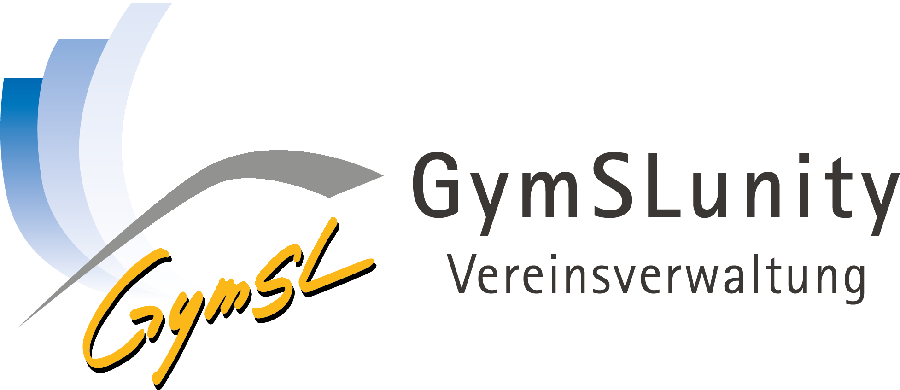

# GymSLunity - Vereinsverwaltung
<div align="center">

[](https://github.com/Abiturientia-am-GymSL-e-V/GymSLunity/releases)
[](LICENSE)
</div>
<hr>
GymSLunity ist eine webbasierte Komplettlösung für die tägliche Vereinsverwaltung. Die Anwendung verbindet Mitgliederverwaltung, Finanzen, Kalender, Kommunikation und Dokumente in einer gemeinsamen, rollenbasierten Arbeitsumgebung.

Das Projekt ist aus den praktischen Anforderungen eines Schulvereins entstanden und wird von Schülerinnen und Schülern getragen. Ziel ist eine offene, selbst betreibbare Alternative zu kostenpflichtigen SaaS-Angeboten, die Vereine verstehen, anpassen und gemeinsam weiterentwickeln können.

## Funktionsbereiche

- **Mitgliederverwaltung:** Mitglieds- und Kontaktdaten, konfigurierbare Zusatzfelder, Suche, Filter, Massenbearbeitung, CSV-Import, Export, Dokumente und Änderungshistorie.
- **Beiträge:** Beitragskonten, Forderungsläufe, Rechnungen, SEPA-Mandate und -Exporte, Bankimport, Rücklastschriften und manuelle Buchungen.
- **Buchhaltung:** Eigenständiges Rechnungswesen mit offenen Forderungen, mehreren Zahlungsarten, GiroCode, konfigurierbarer Kleinunternehmerregelung, revisionssicher verknüpften Stornorechnungen, unveränderlicher Dokumentablage, PDF/A-3 mit eingebetteter XRechnung sowie E-Mail-Versand.
- **Spenden:** Geld- und Sachzuwendungen, Spendenbuch sowie Erstellung, Ablage und Versand von Zuwendungsbestätigungen.
- **Formulare:** Quittungen erfassen, digital oder per Faksimile unterzeichnen, unverändert archivieren, als PDF ausgeben und per E-Mail versenden.
- **Kommunikation:** Personalisierte Serien-E-Mails und Serienbriefe mit Empfängerfiltern, Platzhaltern, Anhängen und Versandverlauf.
- **Auswertungen:** Mitgliederentwicklung und -struktur, Bestandsmeldung, Finanzstatistik und Prüfung der Datenqualität.
- **Inventar:** Inventarnummern, Standorte, Verantwortliche, Anschaffungswerte, Abschreibung und dokumentierte Abgänge.
- **Kalender:** Gemeinsame Monatsansicht mit mehreren farblich unterscheidbaren Kalendern, automatisch erzeugten Geburtstagen sowie ein- und mehrtägigen Terminen. Kalender lassen sich über öffentliche iCal-Links oder anhand konfigurierbarer Mitgliedseigenschaften freigeben.
- **Selfservice:** Sicherer Mitgliederzugang per Einmallink, Pflege persönlicher Daten, digitaler Beitritt und SEPA-Mandat sowie ein persönlicher iCal-Sammellink für alle freigegebenen Vereinskalender.
- **Konfiguration:** Vereinsstammdaten, Benutzer und Rollen, optional aktivierbare Softwaremodule, E-Mail-Versand, Formulartexte, Spenden- und Systemeinstellungen.

## Technik

- PHP 8.3 oder neuer und Laravel 13
- Vue 3, TypeScript, Inertia 3 und Vite 8
- Tailwind CSS 4 und editierbare shadcn-vue-Komponenten
- MariaDB/MySQL oder SQLite
- optional Redis für Cache, Sitzungen und Warteschlangen

Die gesperrten Versionen stehen in `composer.lock` und `package-lock.json`. Für den Frontend-Build wird Node.js 24 benötigt.

## Installation

Die vollständige Anleitung einschließlich MariaDB, Redis, Queue-Worker, Dateirechten, Updates und Produktivbetrieb steht in [docs/installation.md](docs/installation.md). Eine gehärtete Ausgangskonfiguration für Nginx liegt unter [docs/nginx.conf.example](docs/nginx.conf.example).

### Fertiges Release-Archiv

Das bei jedem Release angehängte Archiv gymslunity-v…tar.gz enthält bereits die PHP-Abhängigkeiten und das gebaute Frontend. Composer und Node.js werden auf dem Zielserver nicht benötigt.

Nach Prüfung der SHA-256-Datei entpackst du das Archiv unter /var/www, benennst den enthaltenen Ordner in gymslunity um und setzt deploy:www-data als Eigentümer und Gruppe. storage/, bootstrap/cache/ und für SQLite database/ müssen für PHP beschreibbar sein. Das Projektverzeichnis selbst benötigt nur während des ersten Schritts Schreibrecht, damit .env erzeugt werden kann.

Richte Nginx mit public/ als Document Root und HTTPS ein und öffne danach https://deine-domain.example/install. Der Browser-Installer erzeugt .env, prüft die Datenbank, führt Migrationen aus und legt das erste Administratorkonto an. Entziehe anschließend das temporäre Schreibrecht am Projektverzeichnis.

### Installation per Git

Kurzfassung für eine neue Installation per Git:

```bash
git clone https://github.com/Abiturientia-am-GymSL-e-V/GymSLunity.git
cd GymSLunity

composer install --no-dev --optimize-autoloader
cp .env.example .env
# .env bearbeiten und eine leere Datenbank konfigurieren

npm ci
npm run build
php artisan app:install
```

`app:install` prüft PHP, erforderliche Erweiterungen, Schreibrechte und die Datenbankverbindung. Es erzeugt nur dann einen Anwendungsschlüssel, wenn noch keiner vorhanden ist, führt Migrationen aus, legt den Storage-Link an und fragt bei einer leeren Benutzerliste ein Administratorkonto ab.

Für einen lokalen Checkout mit Entwicklungsserver:

```bash
composer install
cp .env.example .env
# SQLite-Datei anlegen oder MariaDB in .env konfigurieren
npm ci
php artisan app:install
composer run dev
```

## Konfiguration und Redis

Serverzugänge und Infrastrukturparameter gehören ausschließlich in die nicht versionierte `.env`. Die Anwendung verändert diese Datei nicht über den Browser. Unter **Konfiguration → System** sehen Administratoren die wirksamen, nicht sensitiven Einstellungen und Hinweise für den Produktivbetrieb.

Die Standardkonfiguration verwendet die Datenbank für Cache, Sitzungen und Queue. Das ist für eine typische Einzelserver-Installation ausreichend. Redis ist optional und lohnt sich insbesondere bei höherer Last oder mehreren Anwendungsservern:

```dotenv
REDIS_CLIENT=phpredis
REDIS_HOST=127.0.0.1
REDIS_PASSWORD=null
REDIS_PORT=6379
REDIS_DB=0
REDIS_CACHE_DB=1

CACHE_STORE=redis
SESSION_DRIVER=redis
QUEUE_CONNECTION=redis
```

Nach Änderungen an `.env` den Konfigurationscache neu erzeugen:

```bash
php artisan optimize:clear
php artisan optimize
```

Passkeys verwenden WebAuthn und benötigen im Produktivbetrieb HTTPS sowie eine exakt passende APP_URL. PASSKEYS_USER_HANDLE_SECRET wird bei der Browser-Installation separat erzeugt und darf bei Updates oder einer Rotation von APP_KEY nicht geändert werden.

## Warteschlange

E-Mail- und Hintergrundaufgaben benötigen bei `QUEUE_CONNECTION=database` oder `redis` einen dauerhaft laufenden Worker:

```bash
php artisan queue:work --sleep=3 --tries=3 --max-time=3600
```

Im Produktivbetrieb sollte dieser Prozess durch systemd, Supervisor oder einen vergleichbaren Prozessmanager überwacht und nach Deployments mit `php artisan queue:restart` neu gestartet werden.

## Updates

Vor jedem Update Datenbank und hochgeladene Dateien sichern. Anschließend im Wartungsmodus aktualisieren:

```bash
php artisan down
git pull --ff-only
composer install --no-dev --optimize-autoloader
npm ci
npm run build
php artisan migrate --force
php artisan optimize
php artisan queue:restart
php artisan up
```

## Entwicklung und Tests

Aufbau des Codes, Konventionen und Regeln für Mitwirkende stehen in [docs/entwicklung.md](docs/entwicklung.md).

```bash
npm run check
npm run types:check
composer test
npm run build
```

Tests müssen eine separate Datenbank verwenden. Bei MariaDB/MySQL muss deren Name auf `_testing` enden; alternativ kann SQLite `:memory:` verwendet werden. Eine Vorlage liegt in `.env.testing.example`.

Wichtige Verzeichnisse:

| Aufgabe                      | Ort                                   |
| ---------------------------- | ------------------------------------- |
| HTTP-Routen                  | `routes/`                             |
| Controller und Requests      | `app/Http/`                           |
| Fachlogik                    | `app/`                                |
| Datenmodelle und Migrationen | `app/Models/`, `database/migrations/` |
| Vue-Seiten und Komponenten   | `resources/js/`                       |
| PDF- und E-Mail-Vorlagen     | `resources/views/`                    |
| Automatische Tests           | `tests/`                              |

## Sicherheit und Verantwortung

GymSLunity verarbeitet personenbezogene und gegebenenfalls finanzielle Daten. Betreiber sind unter anderem für HTTPS, Server- und PHP-Updates, restriktive Dateirechte, Firewall, die externe Sicherung der mit `php artisan app:backup` erzeugten Archive, regelmäßige Wiederherstellungstests, Datenschutz, Löschfristen und die Prüfung erzeugter Dokumente verantwortlich.

Nach jedem Deployment prüft `php artisan security:check` die wirksame Produktivkonfiguration. Das [Lösch-, Anonymisierungs- und Aufbewahrungskonzept](docs/datenschutz-aufbewahrung.md) beschreibt die technischen Fristen und den täglich geplanten Bereinigungslauf.

Vorlagen und Textbausteine – beispielsweise für Zuwendungsbestätigungen – ersetzen keine rechtliche, steuerliche oder datenschutzrechtliche Beratung. Inhalte und Pflichtangaben müssen vor einer verbindlichen Verwendung anhand der aktuell geltenden Vorgaben geprüft werden.

Sicherheitsprobleme sollten nicht als öffentliches Issue mit Echtdaten oder Zugangsinformationen gemeldet werden. Verwende einen privaten Kontaktweg der Projektverantwortlichen.

## Herkunft und Lizenz

Die Oberfläche basiert auf dem [Laravel Vue Starter Kit](https://github.com/laravel/vue-starter-kit). Weitere Abhängigkeiten und deren Lizenzen sind über Composer und npm dokumentiert.

GymSLunity steht unter der [European Union Public Licence, Version 1.2 (EUPL-1.2)](LICENSE) (deutsche Fassung: [LICENSE.de.md](LICENSE.de.md)). Wer eine veränderte Fassung als Onlinedienst betreibt, muss deren Quellcode zugänglich machen.
