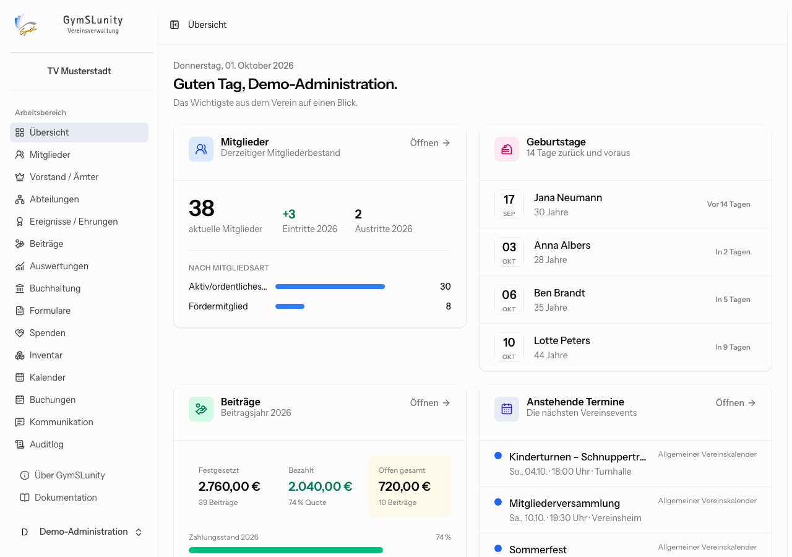

# GymSLunity-Handbuch

Dieses Handbuch erklärt die tägliche Arbeit mit GymSLunity: für den Vorstand und alle, die in der Vereinsverwaltung mitarbeiten, und für Mitglieder, die den Mitgliederbereich nutzen. Wie GymSLunity installiert und betrieben wird, steht in der [technischen Dokumentation](https://github.com/Abiturientia-am-GymSL-e-V/GymSLunity/tree/main/docs).

> [!TIP]
> Alles lässt sich gefahrlos in der [Live-Demo](https://demo.gymslunity.de) ausprobieren. Die Zugangsdaten stehen auf der Anmeldeseite, und die Daten werden jede Nacht zurückgesetzt. Die Bilder in diesem Handbuch stammen aus derselben Demo mit dem fiktiven „Turnverein Musterstadt e. V.“.

## Inhalt

**Grundlagen**

- [Erste Schritte](erste-schritte.md): Anmeldung, Aufbau der Oberfläche, eigenes Konto und Anmeldeschutz
- [Rollen und Rechte](rollen-und-rechte.md): wer welche Bereiche sieht und bearbeiten darf

**Vereinsverwaltung**

- [Mitglieder](mitglieder.md): Verzeichnis, Mitgliedsakte, Anträge, Kündigungen, Import und Export
- [Vorstand, Abteilungen und Ehrungen](aemter-abteilungen-ehrungen.md): Ämter mit Amtszeiten, Abteilungen, Ehrungen und Jubiläen
- [Beiträge](beitraege.md): Beiträge festsetzen, abrechnen, per SEPA einziehen und verbuchen
- [Buchhaltung](buchhaltung.md): Rechnungen mit XRechnung, Stornos, Erstattungen und Lastschriften
- [Spenden](spenden.md): Spendenbuch und Zuwendungsbestätigungen
- [Formulare](formulare.md): Quittungen, Unterschriftslisten und SEPA-Mandate
- [Inventar](inventar.md): Vereinsvermögen, Abschreibung und Abgänge
- [Kalender](kalender.md): Vereinstermine, Geburtstage und Kalender-Abos
- [Buchungen](buchungen.md): Räume und Geräte verwalten und buchen lassen
- [Kommunikation](kommunikation.md): Serien-E-Mails und Serienbriefe
- [Auswertungen](auswertungen.md): Statistiken, Bestandsmeldung und Datenqualität
- [Auditlog](auditlog.md): Wer hat wann was getan?

**Einrichtung**

- [Konfiguration](konfiguration.md): Vereinsdaten, Mitgliedsfelder, Benutzer, Module, E-Mail-Versand und Sicherungen
- [Platzhalter](platzhalter.md): Vereins- und Mitgliedsdaten in Texten und Vorlagen

**Für Mitglieder**

- [Mitgliederbereich](mitgliederbereich.md): Anmeldung, eigene Daten, Beitragskonto, Buchungen und Online-Beitritt

## Begriffe

| Begriff           | Bedeutung                                                                                                                     |
| ----------------- | ----------------------------------------------------------------------------------------------------------------------------- |
| Verwaltung        | Der geschützte Arbeitsbereich für Benutzerkonten mit Rollen, erreichbar über **Verwaltung** auf der Startseite oder `/login`. |
| Mitgliederbereich | Der Selfservice für Mitglieder, erreichbar über **Mitgliederportal**. Mitglieder brauchen dafür kein Passwort.                |
| Benutzer          | Eine Person mit Zugang zur Verwaltung. Benutzer sind unabhängig von Mitgliedern und werden unter Konfiguration angelegt.      |
| Kontakt           | Eine Person ohne aktive Mitgliedschaft, etwa nach einem noch nicht freigegebenen Beitrittsantrag.                             |
| Modul             | Ein optionaler Funktionsbereich wie Beiträge oder Inventar. Abgeschaltete Module verschwinden aus der Navigation.             |

## Hilfe und Rückmeldungen

Fehler und Verbesserungsvorschläge nimmt das Projekt als [Issue auf GitHub](https://github.com/Abiturientia-am-GymSL-e-V/GymSLunity/issues) entgegen. Sicherheitslücken bitte nicht öffentlich melden, sondern wie in der [Sicherheitsrichtlinie](https://github.com/Abiturientia-am-GymSL-e-V/GymSLunity/blob/main/SECURITY.md) beschrieben.
