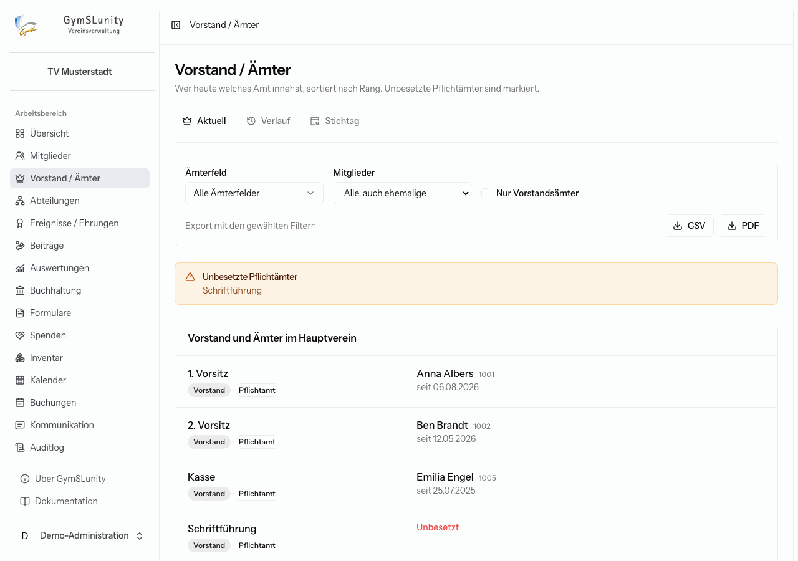
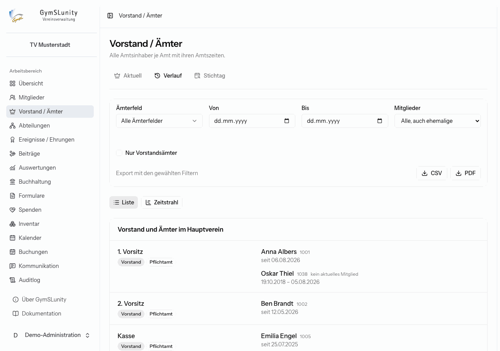
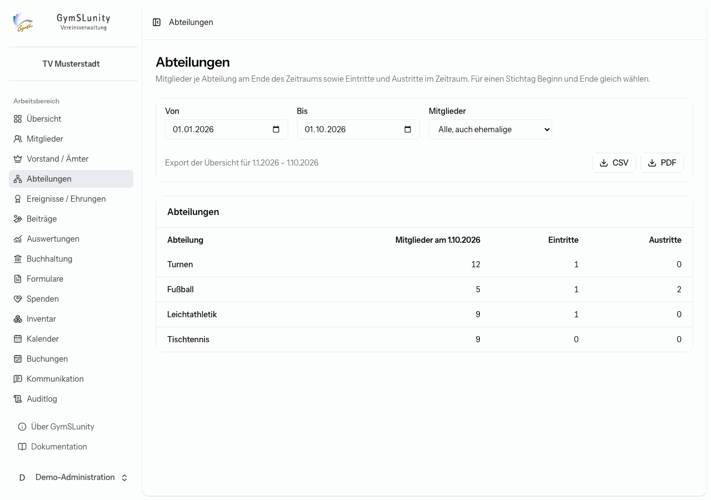
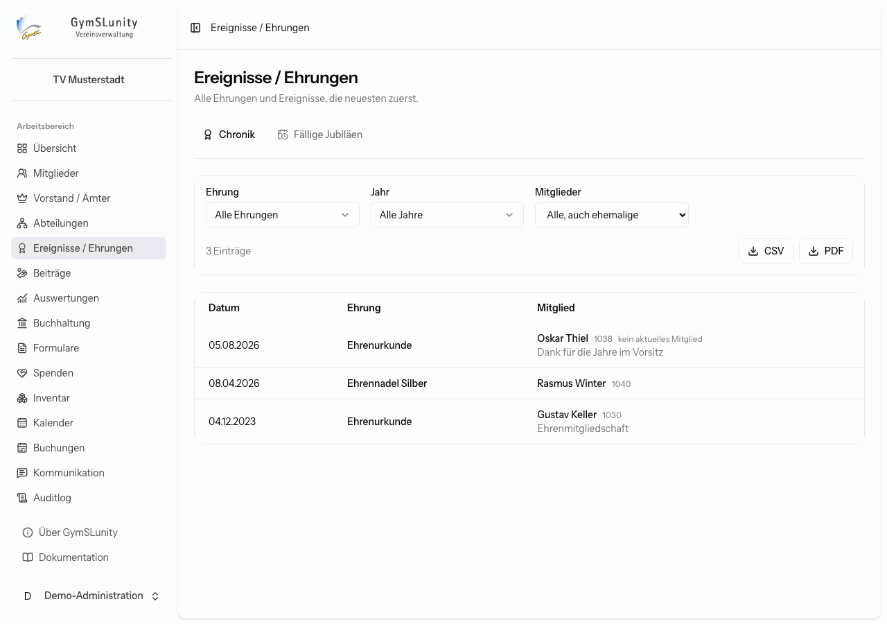
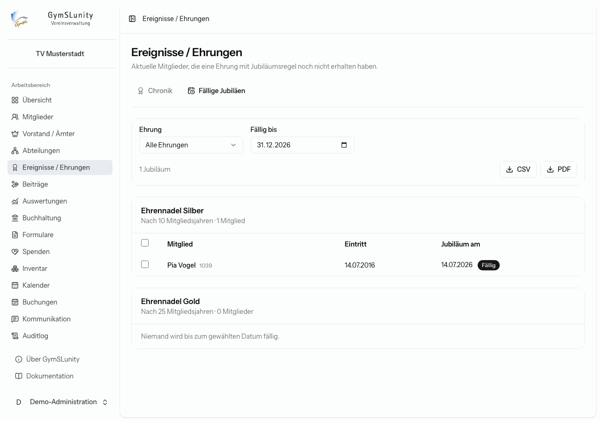

# Vorstand, Abteilungen und Ehrungen

Ämter, Abteilungen und Ehrungen sind besondere Mitgliedsfelder mit Zeitbezug. Gepflegt werden sie in der [Mitgliedsakte](mitglieder.md#abteilungen-ämter-und-ehrungen), per [Sammelaktion](mitglieder.md#mehrere-mitglieder-auf-einmal) oder per [Import](mitglieder.md#zuordnungen-importieren). Die drei Bereiche in der Navigation werten sie aus.

Damit ein Bereich erscheint, braucht es unter [Konfiguration → Mitgliedsfelder](konfiguration.md#mitgliedsfelder) mindestens ein Feld des passenden Typs:

| Bereich in der Navigation | Feldtyp                       |
| ------------------------- | ----------------------------- |
| Vorstand / Ämter          | Funktion / Amt (mit Zeitraum) |
| Abteilungen               | Abteilung (mit Zeitraum)      |
| Ereignisse / Ehrungen     | Ereignis / Ehrung (mit Datum) |

## Vorstand / Ämter

### Aktuell

Zeigt, wer heute welches Amt innehat, sortiert nach dem in der Konfiguration festgelegten Rang. Ämter mit der Kennzeichnung **Vorstand** sind markiert. Unbesetzte **Pflichtämter** erscheinen oben als Warnung und in der Liste in Rot. Hat ein Amt mehr Inhaber als vorgesehen, weist GymSLunity ebenfalls darauf hin.

Über die Filter grenzt du auf ein Ämterfeld, nur aktuelle Mitglieder oder **Nur Vorstandsämter** ein. **CSV** und **PDF** exportieren die gefilterte Liste, etwa für das Vereinsregister.

### Verlauf

Listet alle Amtsinhaber je Amt mit ihren Amtszeiten in einem wählbaren Zeitraum. Die Darstellung **Zeitstrahl** zeigt die Amtszeiten als Balken.

### Stichtag

Beantwortet die Frage „Wer war am … im Vorstand?“, etwa für Protokolle oder Haftungsfragen.

## Abteilungen

Zeigt je Abteilung die Zahl der Mitglieder am Ende des gewählten Zeitraums sowie die Eintritte und Austritte im Zeitraum. Für einen Stichtag wählst du Beginn und Ende gleich. Ein Klick auf eine Abteilung listet ihre Mitglieder im Zeitraum.

## Ereignisse / Ehrungen

### Chronik

Alle vergebenen Ehrungen und Ereignisse, die neuesten zuerst, filterbar nach Ehrung und Jahr und exportierbar als CSV oder PDF.

### Fällige Jubiläen

Ist bei einer Ehrung in der Konfiguration **Fällig nach … Mitgliedsjahren** eingetragen, etwa 25 für die Ehrennadel in Silber, listet dieser Reiter alle aktuellen Mitglieder, die diese Ehrung bis zum gewählten Datum erreichen und noch nicht erhalten haben.

Wähle die Mitglieder aus und klicke auf **Ehrung vergeben**. GymSLunity trägt die Ehrung dann in deren Mitgliedsakten ein. Mit der Liste lässt sich zum Beispiel die Ehrung in der Mitgliederversammlung vorbereiten.
