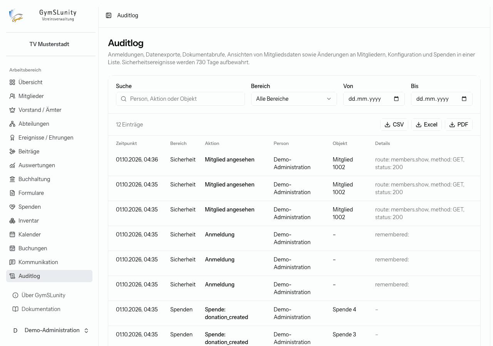

# Auditlog

Das **Auditlog** beantwortet die Frage „Wer hat wann was getan?“. Es ist für Administratoren, Prüfer und die Kassenprüfung sichtbar und lässt sich nicht bearbeiten.

Protokolliert werden unter anderem:

- Anmeldungen und weitere Sicherheitsereignisse,
- Ansichten von Mitgliedsakten,
- Datenexporte und Abrufe von Dokumenten wie Karteiblättern, Mandaten oder Belegen,
- Änderungen an Mitgliedern, an der Konfiguration und an Spenden.

Jeder Eintrag zeigt Zeitpunkt, Bereich, Aktion, handelnde Person, betroffenes Objekt und Details. Über **Suche**, **Bereich** und Zeitraum findest du einzelne Vorgänge. Die gefilterte Liste lässt sich als CSV, Excel oder PDF exportieren.

Sicherheitsereignisse werden standardmäßig 730 Tage aufbewahrt. Die Aufbewahrungsdauer legt der Betreiber auf dem Server fest (siehe [Konfiguration der `.env`](https://github.com/Abiturientia-am-GymSL-e-V/GymSLunity/blob/main/docs/konfiguration.md)).

## Weitere Protokolle

Neben dem Auditlog gibt es Protokolle an der Stelle, an der sie gebraucht werden:

- die **Änderungshistorie** in jeder [Mitgliedsakte](mitglieder.md#mitgliedsakte),
- der **Versandverlauf** unter [Kommunikation → Verlauf](kommunikation.md#verlauf),
- das **Versandprotokoll** jeder [Quittung](formulare.md#quittungsbuch),
- das [Sicherheitsprotokoll](konfiguration.md#sicherheitsprotokoll) der Konfiguration mit pseudonymisierten technischen Kennungen.
