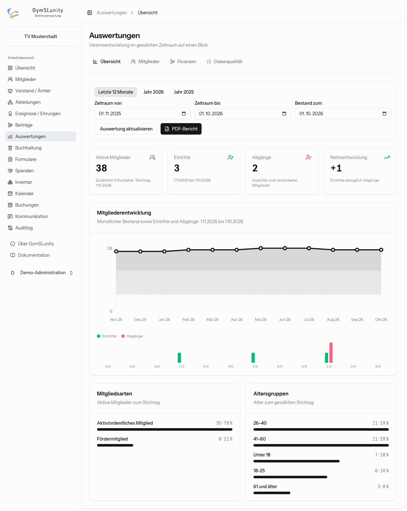
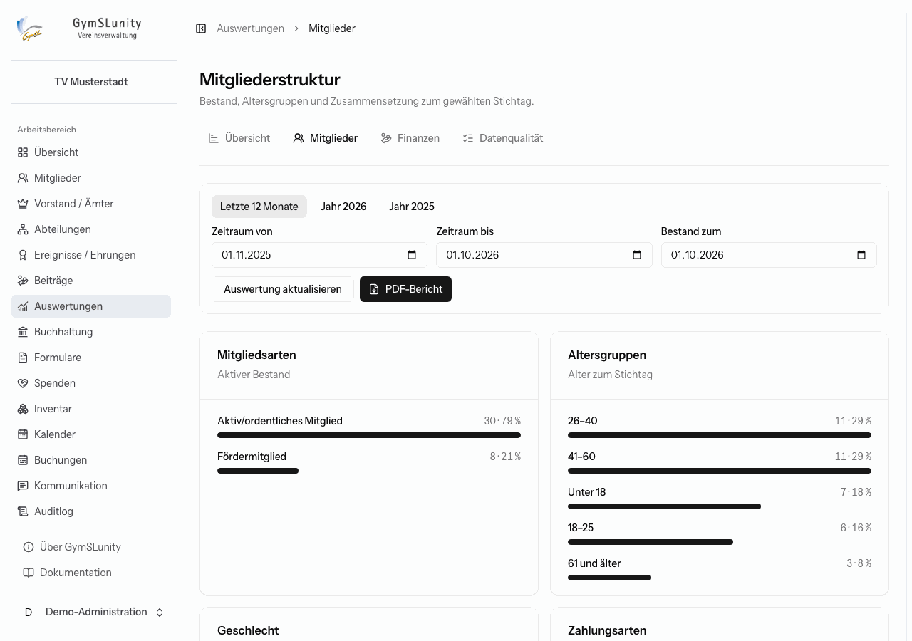
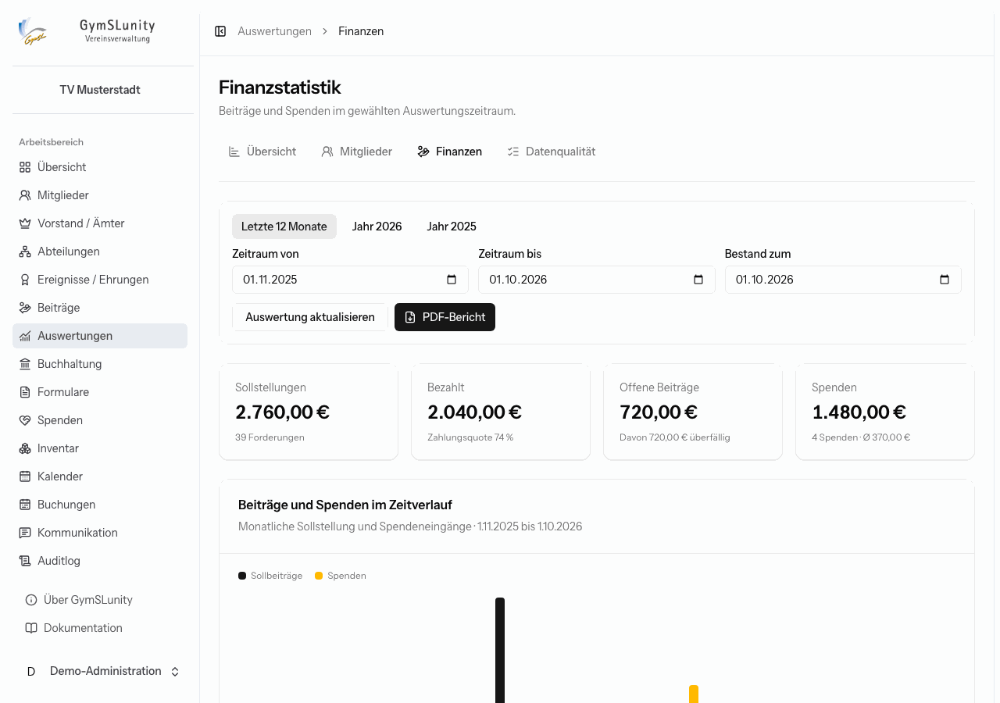
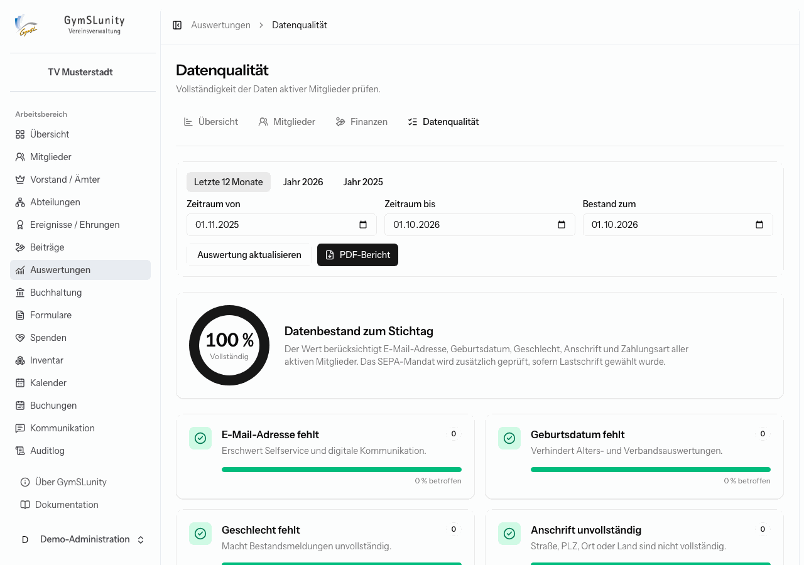

# Auswertungen

Das Modul **Auswertungen** zeigt die Entwicklung des Vereins in Zahlen und Diagrammen. Alle Reiter teilen sich die Zeitraumauswahl:

- **Schnellwahl** wie „Letzte 12 Monate“, „Jahr 2026“ oder „Jahr 2025“,
- oder **Zeitraum von / bis** frei wählen,
- **Bestand zum** legt den Stichtag für Bestandszahlen fest.

**Auswertung aktualisieren** übernimmt die Auswahl. **PDF-Bericht** fasst alle Auswertungen in einem Dokument zusammen, etwa für den Jahresbericht in der Mitgliederversammlung.

## Übersicht

Aktive Mitglieder zum Stichtag, Eintritte, Abgänge (Austritte und Verstorbene) und die Nettoentwicklung im Zeitraum. Darunter stehen der monatliche Mitgliederbestand mit Ein- und Abgängen, die Entwicklung je Abteilung sowie Mitgliedsarten und Altersgruppen.

Zu jedem Diagramm lassen sich die Werte über **Werte als Tabelle anzeigen** auch als Zahlen ablesen.

## Mitglieder

Die Struktur des aktiven Bestands zum Stichtag: Mitgliedsarten, Altersgruppen, Geschlecht, Zahlungsarten, die häufigsten Wohnorte und die Verteilung auf Abteilungen.

### Bestandsmeldung

Unten auf der Seite steht die **Bestandsstruktur nach Geburtsjahr**, aufgeteilt nach weiblich, männlich, divers und ohne Angabe. Das ist die übliche Grundlage für die jährliche Bestandsmeldung an Landessportbund oder Fachverband. **CSV exportieren** lädt die Tabelle herunter. Sie enthält nur Summen, keine Namen.

## Finanzen

Sollstellungen, bezahlte und offene Beiträge mit Zahlungsquote und überfälligem Anteil sowie die Spenden im Zeitraum. Diagramme zeigen den monatlichen Verlauf, den Beitragsstatus, überfällige Forderungen und die Spendenarten.

## Datenqualität

Prüft, wie vollständig die Daten der aktiven Mitglieder sind: E-Mail-Adresse, Geburtsdatum, Geschlecht, Anschrift und Zahlungsart. Bei Lastschrift kommt das SEPA-Mandat dazu. Der Prozentwert oben fasst alles zusammen. Jede Kachel zeigt, wie viele Mitglieder betroffen sind und wozu die Angabe gebraucht wird.

Fehlende Angaben ergänzt du in der Mitgliedsakte, oder du bittest die Mitglieder per [Serien-E-Mail](kommunikation.md), ihre Daten im [Mitgliederbereich](mitgliederbereich.md) zu vervollständigen.
