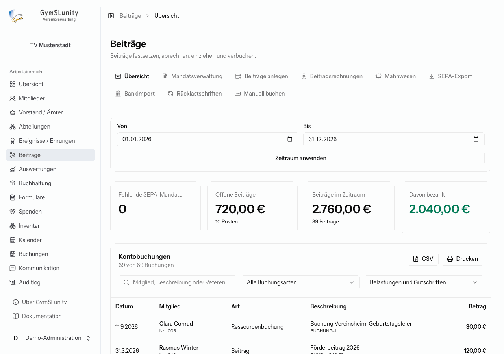
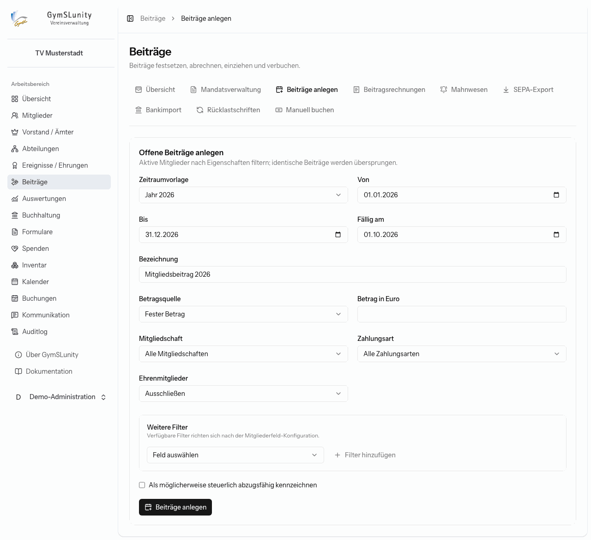
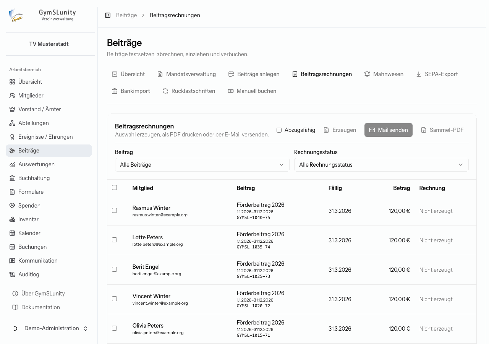
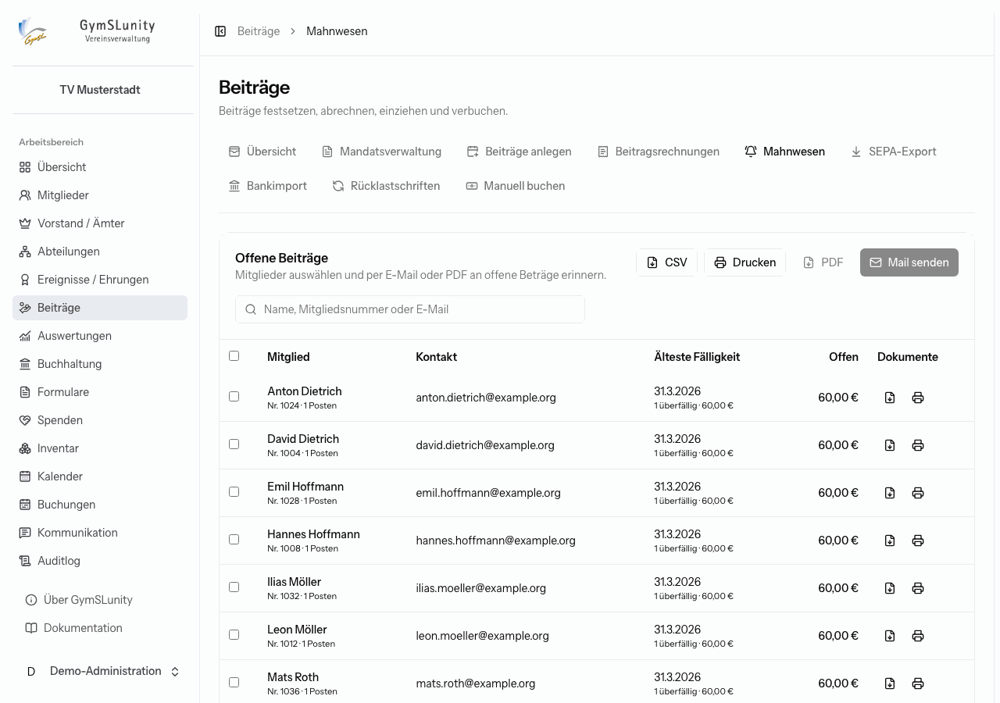
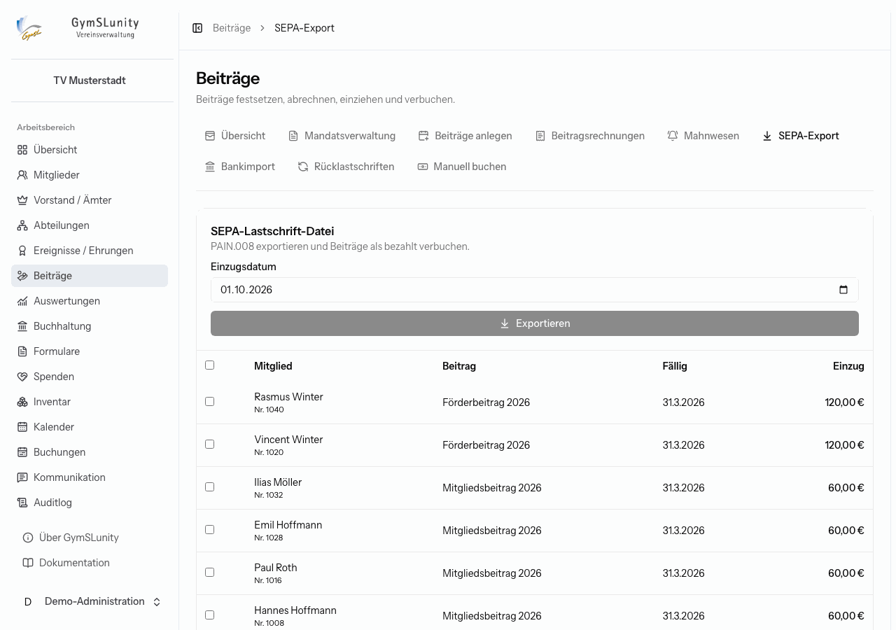
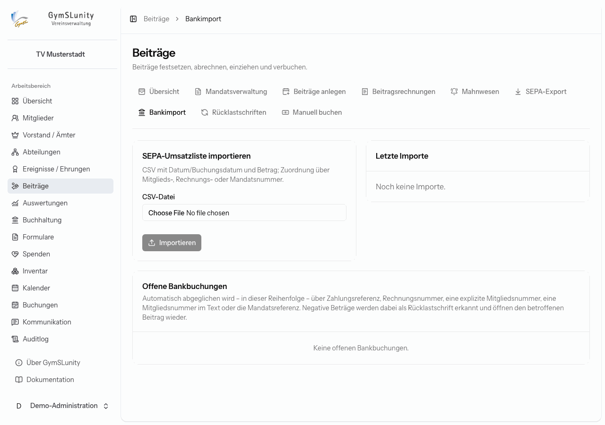
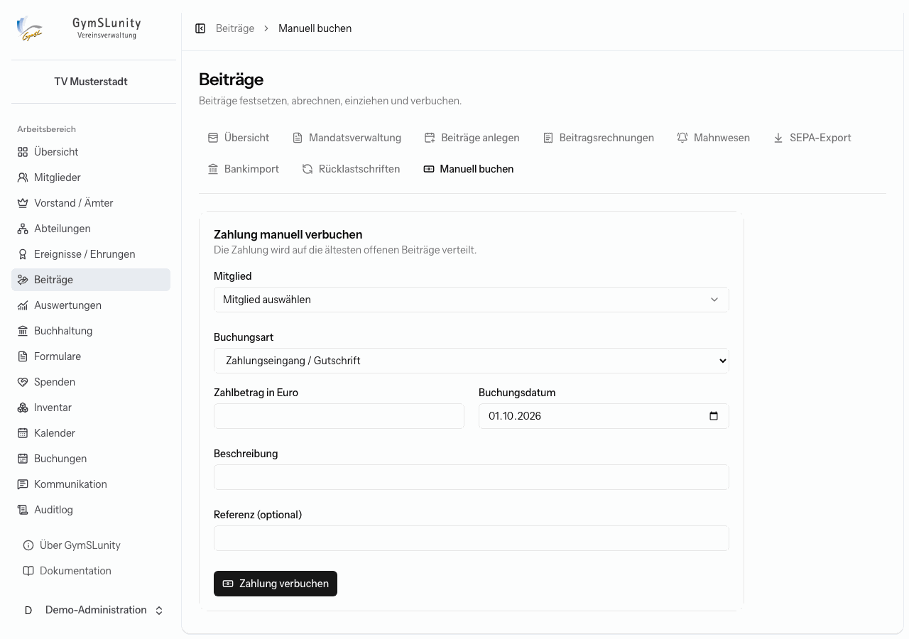

# Beiträge

Das Modul **Beiträge** führt für jedes Mitglied ein Beitragskonto. Forderungen, etwa der Jahresbeitrag, erhöhen den Saldo, Zahlungen senken ihn. Ein positiver Saldo ist offen. Das Konto steht in der [Mitgliedsakte](mitglieder.md#mitgliedsakte) und im [Mitgliederbereich](mitgliederbereich.md#beitragskonto).

Der typische Jahresablauf:

1. [Beiträge anlegen](#beiträge-anlegen) für das neue Beitragsjahr,
2. bei Bedarf [Beitragsrechnungen](#beitragsrechnungen) erzeugen und versenden,
3. Lastschriften per [SEPA-Export](#sepa-export) einziehen,
4. Überweisungen per [Bankimport](#bankimport) oder [manuell](#manuell-buchen) verbuchen,
5. [Rücklastschriften](#rücklastschriften) bearbeiten und säumige Mitglieder über das [Mahnwesen](#mahnwesen) erinnern.

## Übersicht

Die Übersicht zeigt für einen wählbaren Zeitraum fehlende SEPA-Mandate, offene Beiträge, die festgesetzten Beiträge und den bezahlten Anteil. Darunter stehen alle **Kontobuchungen** des Zeitraums, durchsuchbar und filterbar nach Buchungsart und nach Belastungen oder Gutschriften. Die Liste lässt sich als CSV exportieren oder drucken.

## Mandatsverwaltung

Listet alle Mitglieder mit der Zahlungsart SEPA-Lastschrift, deren Mandatsdaten unvollständig sind, und was jeweils fehlt. Ohne vollständiges Mandat kann ein Beitrag nicht eingezogen werden. Ergänze die Daten in der Mitgliedsakte, oder bitte das Mitglied, das Mandat im Mitgliederbereich nachzureichen.

## Beiträge anlegen

Hier setzt du offene Beiträge für viele Mitglieder auf einmal fest.

1. **Zeitraum:** Wähle eine Vorlage wie „Jahr 2026“ oder trage Beginn und Ende selbst ein. Lege das **Fälligkeitsdatum** fest.
2. **Bezeichnung:** erscheint auf Kontoauszug, Rechnung und Lastschrift, zum Beispiel „Mitgliedsbeitrag 2026“.
3. **Betragsquelle:**
    - **Fester Betrag**: für alle gleich, zum Beispiel 60,00 €.
    - **Förderbeitrag des Mitglieds**: der im Mitglied hinterlegte individuelle Betrag.
4. **Auswahl der Mitglieder:** nach Mitgliedschaft, Zahlungsart und Ehrenmitgliedern (ausschließen, einschließen oder nur Ehrenmitglieder). Unter **Weitere Filter** grenzt du nach jedem filterbaren Mitgliedsfeld weiter ein, etwa nach Abteilung.
5. Optional: **Als möglicherweise steuerlich abzugsfähig kennzeichnen**. Die Beitragsrechnung erhält dann einen Hinweis, dass der Beitrag nach Maßgabe der steuerlichen Voraussetzungen als Spende abzugsfähig sein kann. Sie ersetzt aber keine Zuwendungsbestätigung.
6. **Beiträge anlegen.**

Berücksichtigt werden alle Mitglieder, deren Mitgliedschaft in den Zeitraum fällt, also auch wer erst im Laufe des Jahres eintritt oder austritt. Identische Beiträge (gleiches Mitglied, gleicher Zeitraum, gleiche Bezeichnung) werden übersprungen. Ein versehentlich doppelter Lauf legt also nichts doppelt an. Für unterschiedliche Beitragssätze legst du nacheinander mehrere Läufe mit passenden Filtern an.

## Beitragsrechnungen

Für Mitglieder, die eine Rechnung brauchen, etwa Überweiser oder Firmen als Fördermitglieder:

1. Filtere nach Beitrag und Rechnungsstatus und wähle die Beiträge aus.
2. **Erzeugen** erstellt die Rechnungen. Sind Mitgliedsbeiträge laut [Spendenkonfiguration](konfiguration.md#spenden) abzugsfähig, erscheint zusätzlich das Kästchen **Abzugsfähig** für den entsprechenden Hinweis.
3. **Mail senden** verschickt sie an die hinterlegten Adressen, **Sammel-PDF** lädt alle als eine Datei zum Drucken herunter.

## Mahnwesen

Listet alle Mitglieder mit offenen Beiträgen, die älteste Fälligkeit und den offenen Betrag. Wähle Mitglieder aus und erinnere sie:

- **Mail senden**: Zahlungserinnerung per E-Mail,
- **PDF** oder **Drucken**: Zahlungserinnerung als Brief,
- je Zeile über die Symbole: PDF herunterladen oder drucken.

Ist die Postanschrift unvollständig, weist die Liste darauf hin. Über **CSV** exportierst du die Liste, etwa für die Vorstandssitzung.

## SEPA-Export

Erzeugt eine Lastschriftdatei im Format PAIN.008 für das Online-Banking.

1. Wähle das **Einzugsdatum**.
2. Wähle die Beiträge aus. Angeboten werden nur offene Beiträge von Mitgliedern mit vollständigem Mandat.
3. **Exportieren** lädt die Datei herunter und verbucht die Beiträge als bezahlt.
4. Lade die Datei im Online-Banking des Vereinskontos hoch.

Voraussetzung sind Vereinsname, Vereins-IBAN und Gläubiger-ID unter [Konfiguration → Vereinsdaten](konfiguration.md#vereinsdaten).

> [!IMPORTANT]
> Der Export bucht die Beiträge sofort als bezahlt. Wird eine Lastschrift später zurückgegeben, erfasse das als [Rücklastschrift](#rücklastschriften). Dann ist der Beitrag wieder offen.

## Bankimport

Verbucht Zahlungseingänge aus dem Kontoauszug. Exportiere dazu die Umsätze im Online-Banking als CSV-Datei.

Die Datei braucht eine Kopfzeile mit den Spalten **Buchungsdatum** (oder **Datum**) und **Betrag**. Optional sind **Mitgliedsnummer**, **Verwendungszweck** (oder **Buchungstext**) und **Referenz** (oder **End-to-End-ID**).

GymSLunity ordnet jede Buchung automatisch zu, in dieser Reihenfolge über die Zahlungsreferenz, die Rechnungsnummer, eine Spalte Mitgliedsnummer, eine Mitgliedsnummer im Verwendungszweck oder die Mandatsreferenz. Negative Beträge werden als Rücklastschrift erkannt und öffnen den betroffenen Beitrag wieder.

Was sich nicht zuordnen ließ, steht unter **Offene Bankbuchungen**. Wähle dort das passende Mitglied und klicke auf **Zuordnen**, oder **Ignorieren** für Buchungen, die nichts mit Beiträgen zu tun haben. Eine bereits importierte Datei lehnt GymSLunity ab. Exportiere die Umsätze deshalb am besten lückenlos und ohne Überschneidung, etwa jeweils für einen Monat. Einzelne Umsätze, die in zwei verschiedenen Dateien vorkommen, würden sonst doppelt verbucht.

## Rücklastschriften

Eine zurückgegebene Lastschrift öffnet den Beitrag wieder, beim Bankimport automatisch. Die Bankgebühr dafür lastest du hier dem Mitglied an: Mitglied, Gebühr, Buchungsdatum und Beschreibung eingeben und **Gebühr anlasten**. Die Gebühr erscheint als offener Posten im Beitragskonto.

## Manuell buchen

Für Barzahlungen, Korrekturen oder Sonderforderungen:

- **Zahlungseingang / Gutschrift**: Die Zahlung wird auf die ältesten offenen Beiträge verteilt.
- **Forderung / Belastung**: erhöht den offenen Betrag, zum Beispiel für eine Kursgebühr.

Gib Mitglied, Betrag, Buchungsdatum, Beschreibung und optional eine Referenz ein.
