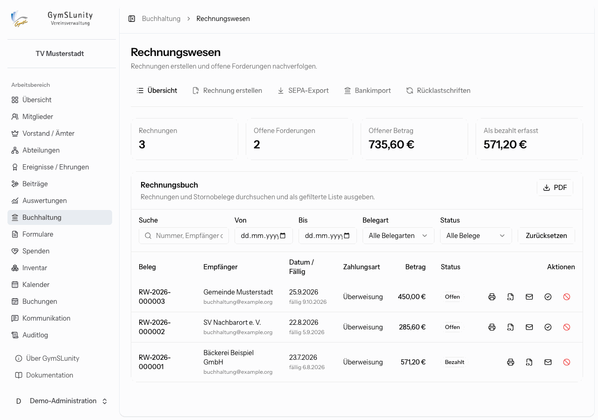
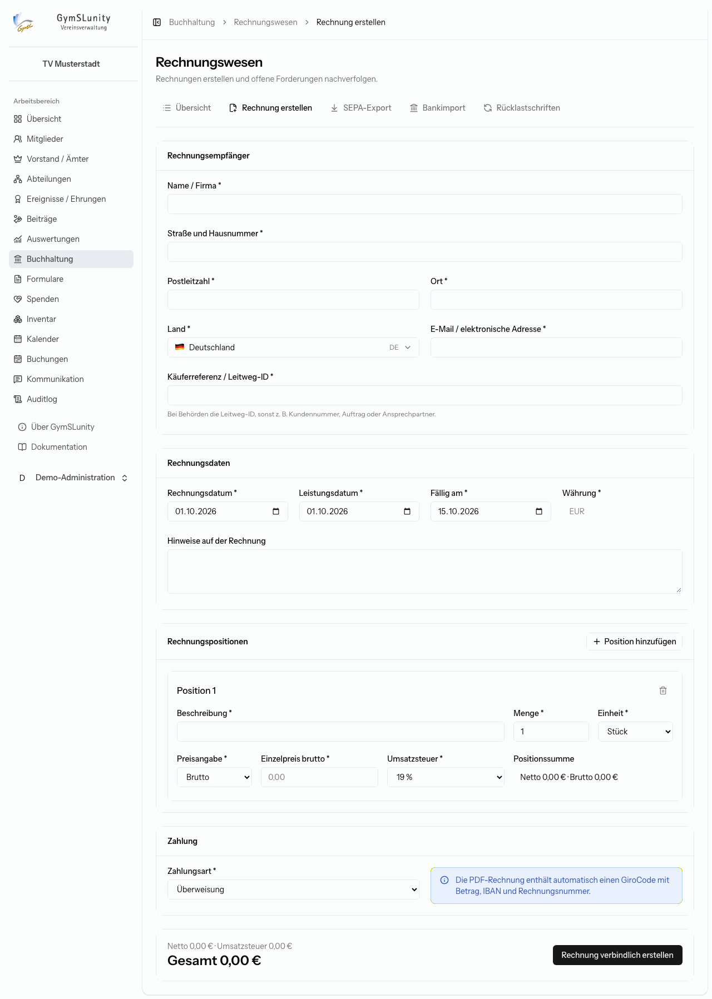
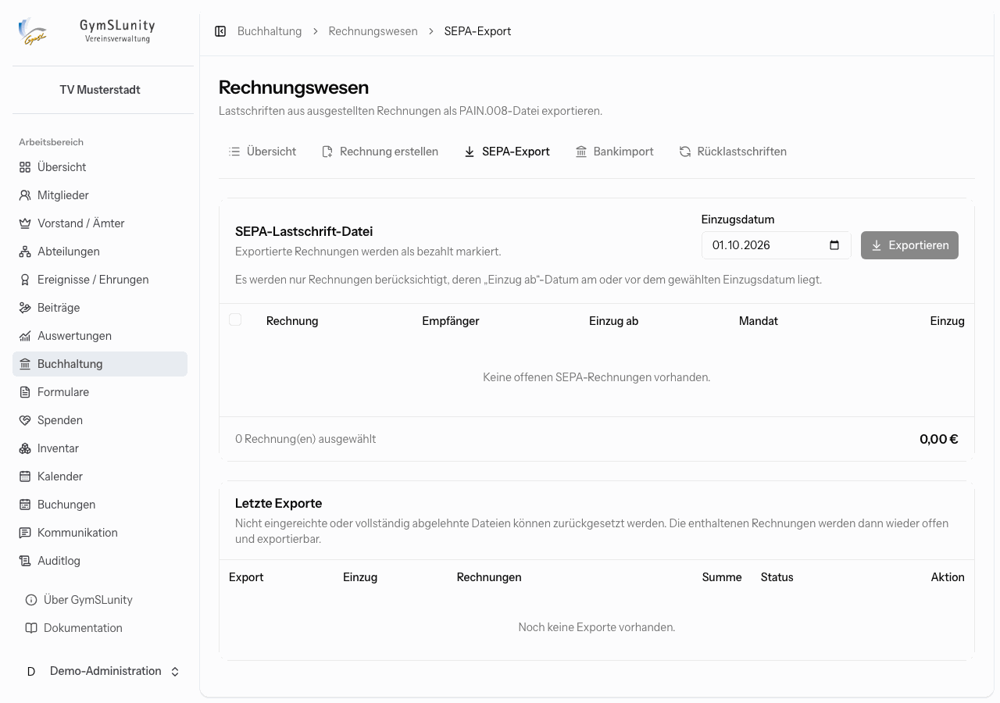

# Buchhaltung

Das Modul **Buchhaltung** enthält das **Rechnungswesen** des Vereins für alles außerhalb der Mitgliedsbeiträge: Bandenwerbung, Hallenvermietung, Startgelder, Kurse für Externe und Ähnliches. Rechnungen gibt es als PDF/A-3 mit eingebetteter XRechnung. Sie lassen sich per E-Mail versenden und per Überweisung, SEPA-Lastschrift, bar, mit Karte oder anders bezahlen.

> [!NOTE]
> Mitgliedsbeiträge laufen über das Modul [Beiträge](beitraege.md), nicht über die Buchhaltung.

## Rechnungsbuch

Die Startseite zeigt die Zahl der Rechnungen, die offenen Forderungen, den offenen Betrag und die als bezahlt erfassten Beträge. Darunter steht das **Rechnungsbuch** mit allen Rechnungen und Stornobelegen, durchsuchbar und filterbar nach Zeitraum, Belegart und Status. **PDF** gibt die gefilterte Liste aus, etwa für die Kassenprüfung.

Die Symbole in der Spalte **Aktionen**:

| Aktion                  | Wirkung                                                                               |
| ----------------------- | ------------------------------------------------------------------------------------- |
| PDF ansehen und drucken | öffnet die archivierte Rechnung                                                       |
| XRechnung herunterladen | die XML-Datei für Empfänger, die eine elektronische Rechnung verlangen, etwa Behörden |
| Per E-Mail versenden    | schickt die Rechnung an die Empfängeradresse                                          |
| Als bezahlt markieren   | erfasst den Zahlungseingang von Hand                                                  |
| Erstattung erfassen     | dokumentiert die Rückzahlung bei einer Stornorechnung                                 |
| Rechnung stornieren     | erstellt eine Stornorechnung (siehe unten)                                            |

## Rechnung erstellen

1. **Rechnungsempfänger:** Name oder Firma, Anschrift, E-Mail und eine **Käuferreferenz**. Bei Behörden ist das die Leitweg-ID, sonst zum Beispiel eine Kundennummer, ein Auftrag oder ein Ansprechpartner.
2. **Rechnungsdaten:** Rechnungs-, Leistungs- und Fälligkeitsdatum, Währung und optionale Hinweise.
3. **Positionen:** Beschreibung, Menge, Einheit, Einzelpreis netto oder brutto und Umsatzsteuersatz. Bei 0 % gibst du den Steuerbefreiungsgrund an, etwa „Steuerfreie Leistung nach § 4 Nr. 22 Buchst. b UStG“. Mit **Position hinzufügen** ergänzt du weitere Zeilen.
4. **Zahlung:** Zahlungsart wählen. Bei Überweisung enthält die PDF automatisch einen GiroCode mit Betrag, IBAN und Rechnungsnummer. Für SEPA-Lastschrift wählst du ein unterschriebenes Mandat aus [Formulare → SEPA-Mandate](formulare.md#sepa-mandate) oder legst ein neues an.
5. **Rechnung erstellen.** GymSLunity vergibt die nächste Rechnungsnummer (`RW-Jahr-Nummer`) und archiviert die Rechnung unveränderlich.

Fehlen Vereinsdaten, die für die XRechnung nötig sind, zeigt GymSLunity oben, welche, und verlinkt auf die [Vereinsdaten](konfiguration.md#vereinsdaten).

Ist unter [Konfiguration → Buchhaltung](konfiguration.md#buchhaltung) die **Kleinunternehmerregelung** eingeschaltet, erhalten alle Positionen 0 % Umsatzsteuer, und PDF und XRechnung tragen automatisch den Hinweis nach § 19 UStG.

## Stornieren und erstatten

Eine ausgestellte Rechnung wird nie geändert. Zur Korrektur stornierst du sie:

1. Klicke auf **Rechnung stornieren**.
2. Wähle die zu stornierenden Positionen aus. Ein Teilstorno ist möglich, bereits stornierte Positionen werden nicht erneut angeboten.
3. Gib einen **Stornierungsgrund** an. Er erscheint auf der Stornorechnung und in der XRechnung.
4. **Stornorechnung erstellen**: Es entsteht ein eigenständiger Beleg mit neuer Nummer, der mit der ursprünglichen Rechnung verknüpft ist.

War die Rechnung schon bezahlt, zahlt die Stornierung nichts automatisch zurück. Überweise den Betrag und erfasse anschließend an der Stornorechnung **Erstattung erfassen** mit Datum und optionaler Referenz.

## SEPA-Export

Rechnungen mit Zahlungsart SEPA-Lastschrift ziehst du hier ein. Das funktioniert wie bei den [Beiträgen](beitraege.md#sepa-export), aber getrennt davon.

- Angeboten werden Rechnungen, deren Datum **Einzug ab** am oder vor dem gewählten Einzugsdatum liegt.
- Exportierte Rechnungen gelten als bezahlt.
- Unter **Letzte Exporte** lässt sich eine Datei **zurücksetzen**, wenn sie nicht bei der Bank eingereicht oder vollständig abgelehnt wurde. Die enthaltenen Rechnungen sind dann wieder offen und exportierbar. Bereits eingezogene Einzelbuchungen werden dabei als Rücklastschrift verarbeitet.

## Bankimport

Ordnet Zahlungseingänge aus einer CSV-Umsatzliste offenen Rechnungen zu. Benötigt werden die Spalten Buchungsdatum (oder Datum) und Betrag. Automatisch zugeordnet wird nur über Rechnungsnummern und Mandatsreferenzen aus dem Rechnungswesen. Beitragsmandate spielen hier keine Rolle.

Nicht erkannte positive Umsätze erscheinen unter **Offene Zahlungseingänge** und lassen sich einer betragsgleichen offenen Rechnung zuordnen oder ignorieren. Negative Umsätze landen unter **Rücklastschriften**.

## Rücklastschriften

Wird eine Lastschrift zurückgegeben:

1. Wähle die ursprüngliche, per SEPA bezahlte Rechnung. Sie wird wieder geöffnet.
2. Trage die tatsächlich weiterzuberechnenden Kosten ein, mit Fälligkeit, Rechnungsposition, Steuersatz (in der Regel 0 % als nicht steuerbarer Schadensersatz) und Begründung.
3. **Rücklastschrift verarbeiten und Rechnung erstellen**: Für die Kosten entsteht eine eigene Rechnung.

Bei einem **Einmalmandat** wird die Forderung zwar wieder geöffnet, aber nicht erneut für den SEPA-Export freigegeben. Hier muss der Empfänger auf anderem Weg zahlen.

## Buchungen in Rechnung stellen

Kostenpflichtige Buchungen von Räumen oder Geräten durch Externe lassen sich aus der Buchung heraus in eine Rechnung übernehmen (siehe [Buchungen](buchungen.md#buchung-bearbeiten)).
