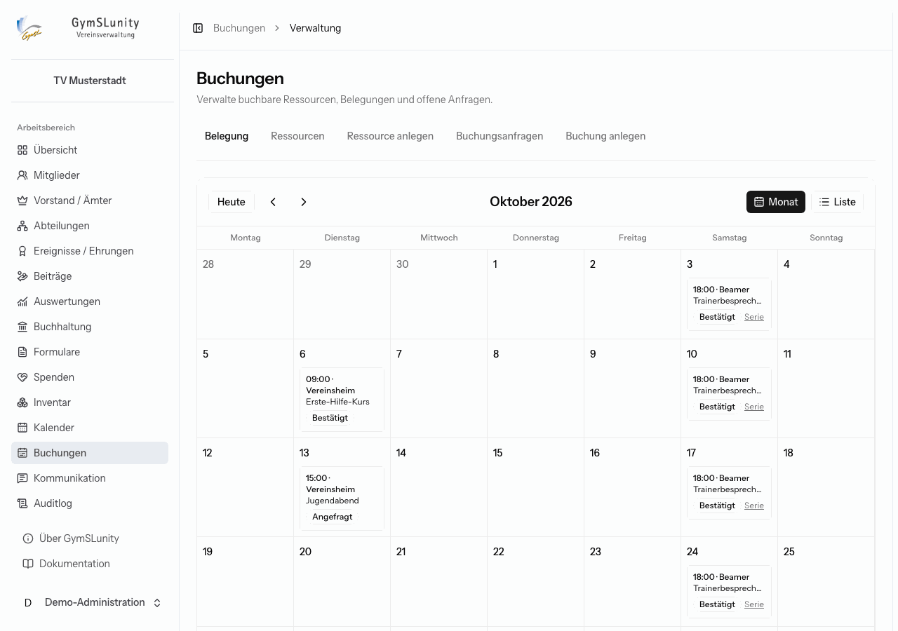
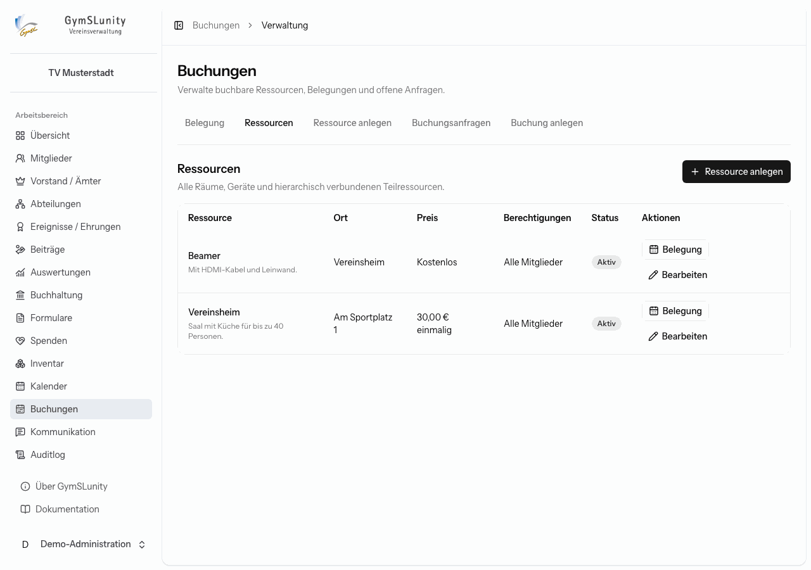
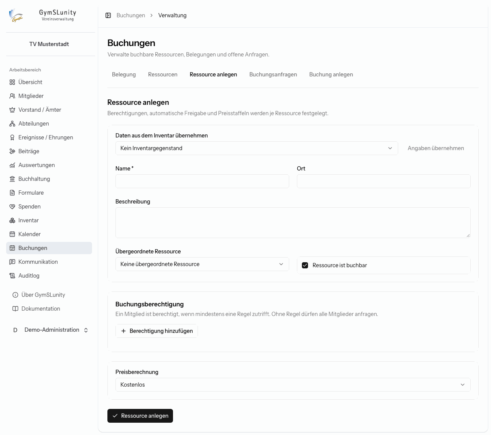
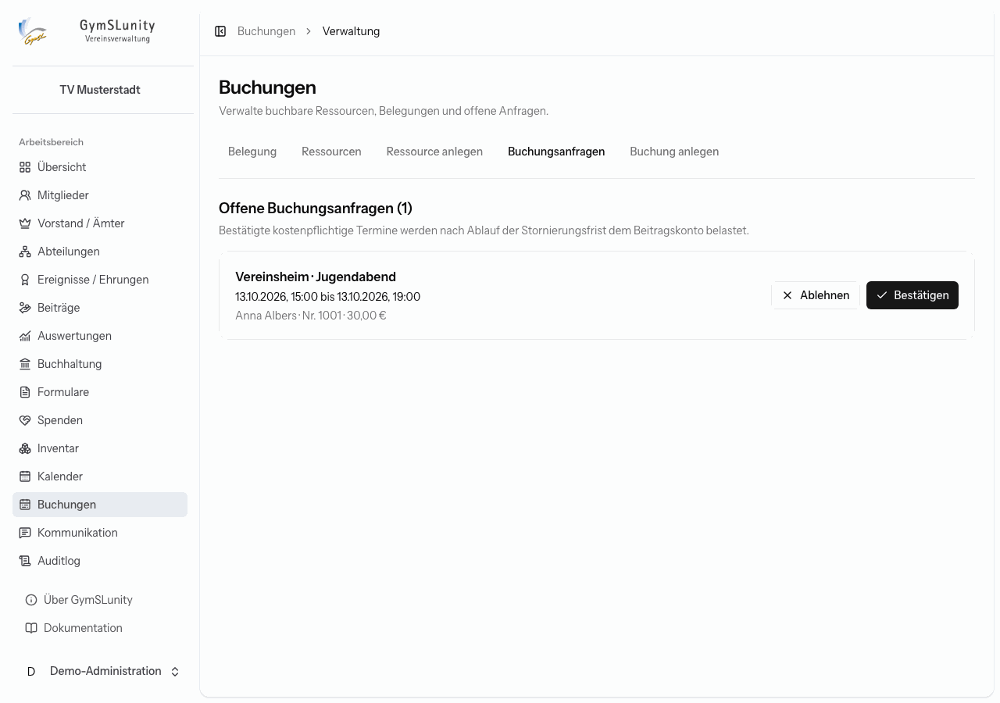
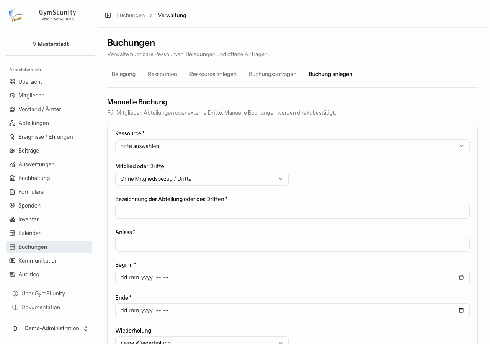

# Buchungen

Mit dem Modul **Buchungen** verwaltet der Verein Räume, Geräte und andere Ressourcen, die Mitglieder, Abteilungen oder Externe nutzen können: Vereinsheim, Beamer, Vereinsbus und Ähnliches. Mitglieder fragen Buchungen im [Mitgliederbereich](mitgliederbereich.md#ressourcen-buchen) an, der Vorstand bestätigt sie hier oder trägt sie selbst ein.

## Belegung

Der Reiter **Belegung** zeigt alle aktiven Buchungen im Monat oder als Liste mit Ressource, Anlass, buchender Person, Preis und Status. Serientermine sind gekennzeichnet. Ein Klick öffnet die Buchung.

## Ressourcen

Die Liste zeigt alle Ressourcen mit Ort, Preis, Berechtigungen und Status. **Belegung** zeigt den Kalender einer einzelnen Ressource, einschließlich der Termine verbundener Ober- und Teilressourcen.

### Ressource anlegen

- **Daten aus dem Inventar übernehmen:** Wähle einen [Inventargegenstand](inventar.md), um Name, Ort und Beschreibung zu übernehmen.
- **Übergeordnete Ressource:** baut Hierarchien auf, zum Beispiel „Turnhalle“ mit den Teilen „Hallendrittel 1–3“. Ist die ganze Halle gebucht, sind auch die Teile belegt, und umgekehrt.
- **Ressource ist buchbar:** schaltet die Buchbarkeit ein oder aus, ohne die Ressource zu löschen.
- **Buchungsberechtigung:** Regeln nach Mitgliedseigenschaften, etwa „Abteilung = Fußball“. Ein Mitglied darf anfragen, wenn mindestens eine Regel zutrifft. Ohne Regel dürfen alle Mitglieder anfragen.
- **Automatische Bestätigung:** Für ausgewählte, bereits berechtigte Gruppen werden Anfragen sofort bestätigt, etwa für Übungsleitungen.
- **Preisberechnung:** **Kostenlos**, **Einmaliger Preis** pro Termin oder **Preis nach Dauer / Staffel** mit Abrechnung nach Minuten, Stunden oder Tagen.

## Buchungsanfragen

Anfragen aus dem Mitgliederbereich, die nicht automatisch bestätigt wurden, warten hier auf eine Entscheidung: **Bestätigen** oder **Ablehnen**. Das Mitglied sieht die Entscheidung in seinem Mitgliederbereich.

Bestätigte kostenpflichtige Termine werden nach Ablauf der **Stornierungsfrist** dem Beitragskonto des Mitglieds belastet. Bis dahin kann das Mitglied selbst stornieren. Die Frist legst du unter [Konfiguration → Vereinsdaten → Buchungssystem](konfiguration.md#vereinsdaten) fest.

## Buchung anlegen

Für Buchungen, die der Vorstand selbst einträgt, etwa für eine Abteilung oder einen externen Mieter. Solche manuellen Buchungen sind sofort bestätigt.

- **Mitglied oder Dritte:** Wähle ein Mitglied oder **Ohne Mitgliedsbezug / Dritte** und gib dann die Bezeichnung der Abteilung oder des Dritten an.
- **Anlass**, **Beginn** und **Ende**.
- **Wiederholung:** keine, alle X Tage oder alle X Wochen, mit Intervall und Anzahl der Termine. So entsteht eine Serie, etwa das wöchentliche Training.

GymSLunity verhindert Überschneidungen mit bestehenden Buchungen derselben Ressource und ihrer Ober- und Teilressourcen.

## Buchung bearbeiten

Die Detailansicht einer Buchung zeigt alle Angaben, bei Serien zusätzlich alle Termine der Serie. Änderungen und Stornierungen gelten wahlweise für den **Einzeltermin** oder die **gesamte Serie** (alle zukünftigen Termine). Abgelehnte oder stornierte Buchungen lassen sich nicht mehr ändern.

Unter **Rechnungsstellung** übernimmst du kostenpflichtige Buchungen externer Dritter mit **In Rechnung übernehmen** in die [Buchhaltung](buchhaltung.md).
