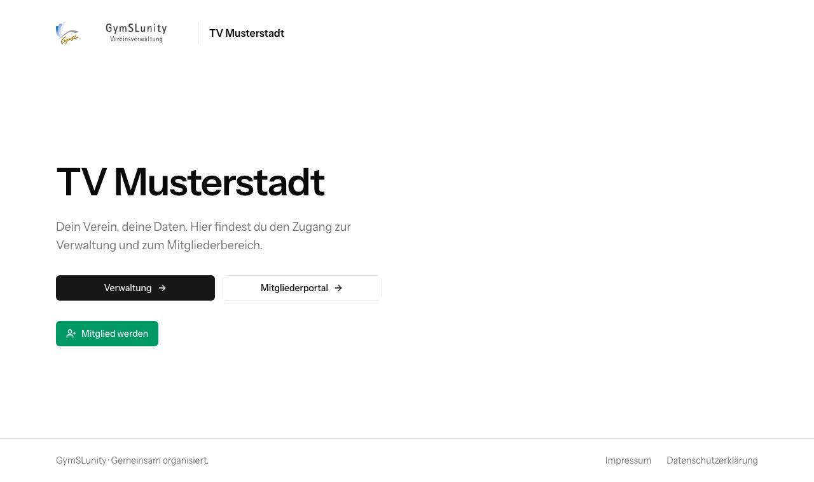
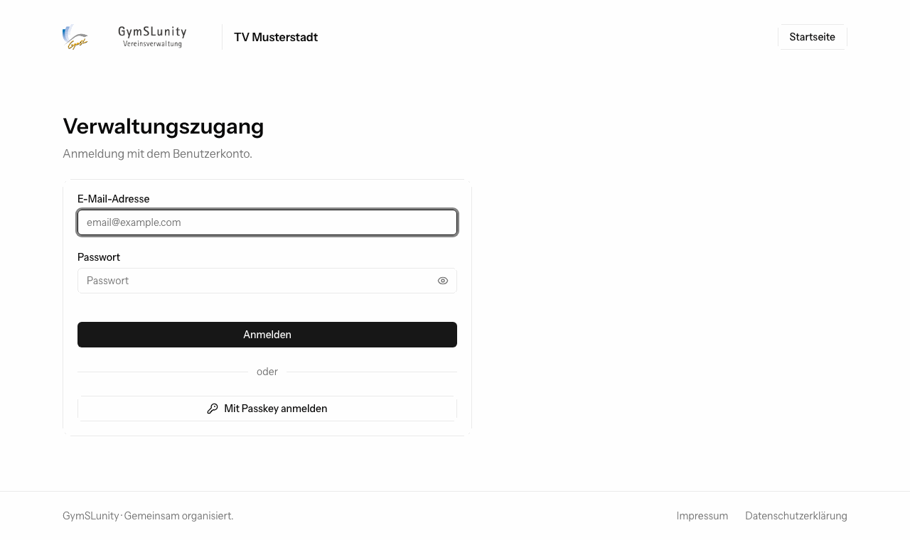
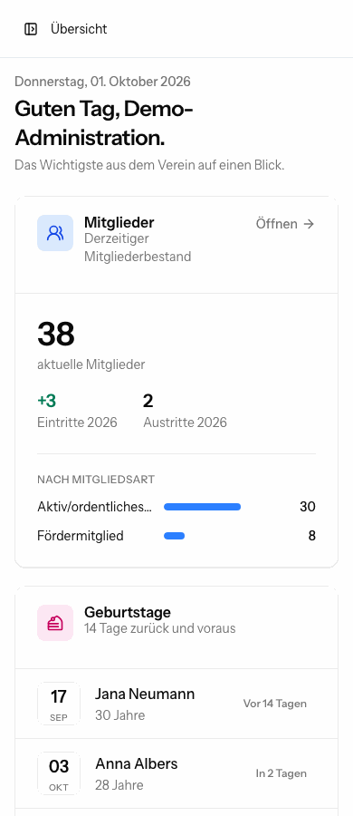
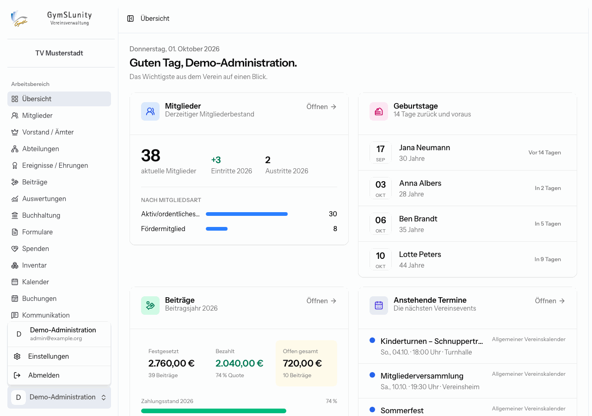
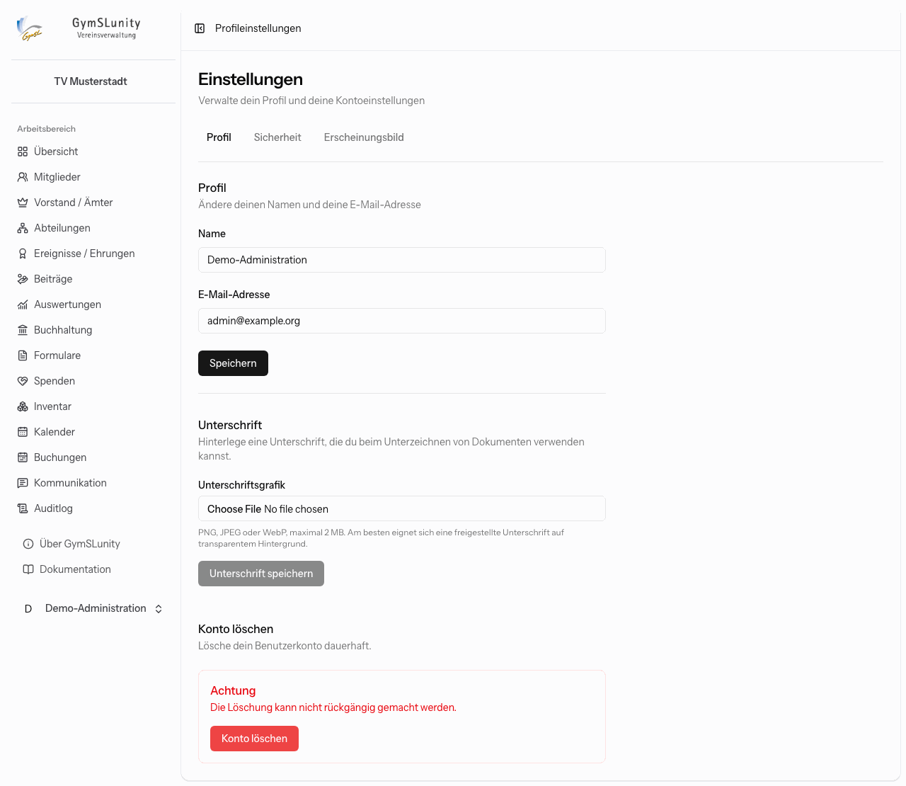
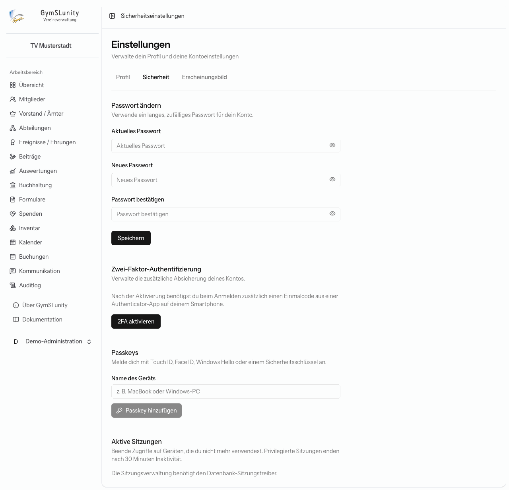
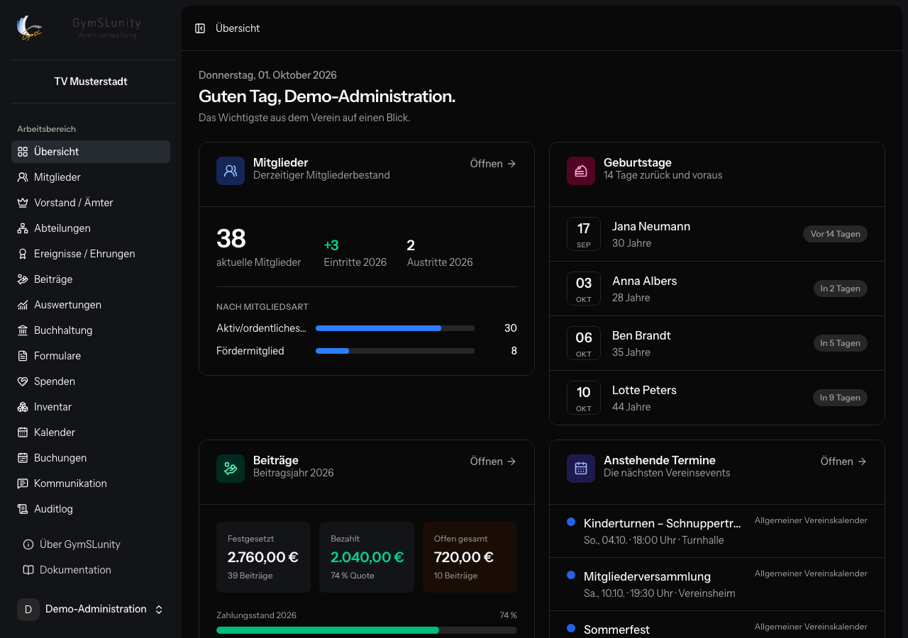

# Erste Schritte

## Startseite

Die öffentliche Startseite des Vereins führt zu den beiden Zugängen:

- **Verwaltung**: Anmeldung für Benutzerkonten mit Rollen, also Vorstand, Kasse, Mitgliederverwaltung und so weiter.
- **Mitgliederportal**: der [Mitgliederbereich](mitgliederbereich.md) für Mitglieder.
- **Mitglied werden** erscheint, wenn der Online-Beitritt eingeschaltet ist.

Impressum und Datenschutzerklärung sind in der Fußleiste verlinkt. Ihre Texte pflegt die Administration unter [Konfiguration → Startseite](konfiguration.md#startseite).

## Anmelden

Die Verwaltung meldet sich mit E-Mail-Adresse und Passwort an, alternativ mit einem Passkey.

Ein neues Benutzerkonto legt die Administration an (siehe [Benutzer und Rechte](konfiguration.md#benutzer-und-rechte)). Mit der **Zugangsmail** erhältst du einen zeitlich begrenzten Link, über den du dein Passwort selbst festlegst. Passwörter verschickt GymSLunity nie per E-Mail.

Hast du dein Passwort vergessen, fordere über **Passwort vergessen?** einen Link zum Zurücksetzen an.

### Zweiter Faktor ist Pflicht

Alle Verwaltungskonten haben Zugriff auf personenbezogene Daten. Deshalb verlangt GymSLunity nach der ersten Anmeldung eine zusätzliche Anmeldemethode:

- **Passkey** (empfohlen): Touch ID, Face ID, Windows Hello oder ein Sicherheitsschlüssel.
- **Authenticator-App (TOTP)**: eine App, die alle 30 Sekunden einen neuen Code erzeugt.

Bis eine der beiden Methoden eingerichtet ist, öffnet sich nach jeder Anmeldung nur die Einrichtungsseite. Danach bestätigst du jede Anmeldung mit dem Passkey oder dem Code aus der App. Bewahre die Wiederherstellungscodes der Authenticator-App sicher auf. Mit ihnen kommst du auch ohne Smartphone wieder in dein Konto.

> [!NOTE]
> Verwaltungssitzungen enden nach 30 Minuten ohne Aktivität. Eine dauerhafte Anmeldung („angemeldet bleiben“) gibt es für Verwaltungskonten bewusst nicht. Läuft die Sitzung während einer Bearbeitung ab, weist GymSLunity beim Speichern darauf hin. Sichere dann längere Eingaben, bevor du dich neu anmeldest.

Für besonders sensible Aktionen, etwa Exporte von Mitgliederdaten oder Sicherungen, fragt GymSLunity dein Passwort zur Bestätigung erneut ab.

## Aufbau der Oberfläche

- **Navigation (links):** Hier stehen alle Bereiche, auf die du mit deinen [Rollen](rollen-und-rechte.md) zugreifen darfst, und nur die Module, die der Verein eingeschaltet hat. Oberhalb stehen Logo und Name des Vereins. Das Symbol oben links neben dem Seitentitel klappt die Navigation zu einer schmalen Symbolleiste ein.
- **Seitenkopf:** Die Pfadangabe (zum Beispiel „Mitglieder › Verzeichnis“) zeigt, wo du gerade bist.
- **Reiter:** Größere Bereiche haben unterhalb der Überschrift Reiter für ihre Unterseiten, zum Beispiel **Verzeichnis**, **Beitrittsanträge** und **Kündigungen** bei den Mitgliedern.
- **Benutzermenü (links unten):** führt zu den Einstellungen deines Kontos und zum Abmelden.

### Übersicht

Die **Übersicht** ist die Startseite nach der Anmeldung. Sie fasst das Wichtigste zusammen: Mitgliederbestand mit Ein- und Austritten des Jahres, Geburtstage der letzten und nächsten 14 Tage, den Stand der Beiträge und die nächsten Termine. Jede Kachel enthält nur Bereiche, die du sehen darfst. Über **Öffnen** gelangst du direkt in den jeweiligen Bereich.

### Auf dem Smartphone

GymSLunity passt sich an kleine Bildschirme an. Die Navigation öffnest du dann über das Symbol oben links. Breite Tabellen lassen sich seitlich wischen.

## Eigenes Konto

Über das Benutzermenü links unten erreichst du **Einstellungen** und **Abmelden**.

Die Einstellungen haben drei Reiter.

### Profil

Hier änderst du Namen und E-Mail-Adresse. Außerdem kannst du eine **Unterschriftsgrafik** hinterlegen (PNG, JPEG oder WebP, am besten freigestellt auf transparentem Hintergrund). GymSLunity setzt sie auf Wunsch als Faksimile in Quittungen und Zuwendungsbestätigungen ein.

### Sicherheit

- **Passwort ändern**: Verwende ein langes, zufälliges Passwort mit mindestens 12 Zeichen.
- **Zwei-Faktor-Authentifizierung**: Authenticator-App einrichten oder entfernen und Wiederherstellungscodes neu erzeugen.
- **Passkeys**: weitere Geräte hinzufügen, zum Beispiel Laptop und Smartphone, und nicht mehr genutzte entfernen.
- **Aktive Sitzungen**: zeigt, auf welchen Geräten du angemeldet bist. Fremde oder vergessene Sitzungen kannst du hier beenden.

### Erscheinungsbild

Wähle zwischen **Hell**, **Dunkel** und **System**. Bei **System** folgt GymSLunity der Einstellung deines Geräts.

## Allgemeine Bedienmuster

Diese Muster kommen in vielen Bereichen vor:

- **Suchen und filtern:** Listen haben oben ein Suchfeld und Filter. Auswahlfelder mit vielen Einträgen, zum Beispiel Länder, Mitglieder oder Felder, sind durchsuchbar: Tippe einfach los.
- **Exportieren und drucken:** Viele Listen lassen sich als PDF, CSV oder Excel ausgeben. Exportiert wird immer der aktuell gefilterte Stand.
- **Pflichtfelder** sind mit `*` markiert.
- **Ungespeicherte Änderungen:** Wenn du eine Seite mit ungespeicherten Eingaben verlassen willst, fragt GymSLunity nach.
- **Unveränderliche Belege:** Rechnungen, Quittungen, Zuwendungsbestätigungen und unterschriebene Mandate werden beim Ausstellen unverändert archiviert. Fehler korrigierst du über Storno oder Widerruf. Beides wird protokolliert, nichts wird stillschweigend überschrieben.
- **Nachvollziehbarkeit:** Änderungen an Mitgliedern, Konfiguration und Spenden, Exporte und Dokumentabrufe landen im [Auditlog](auditlog.md).
