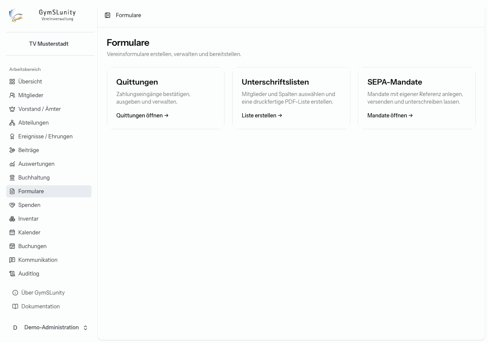
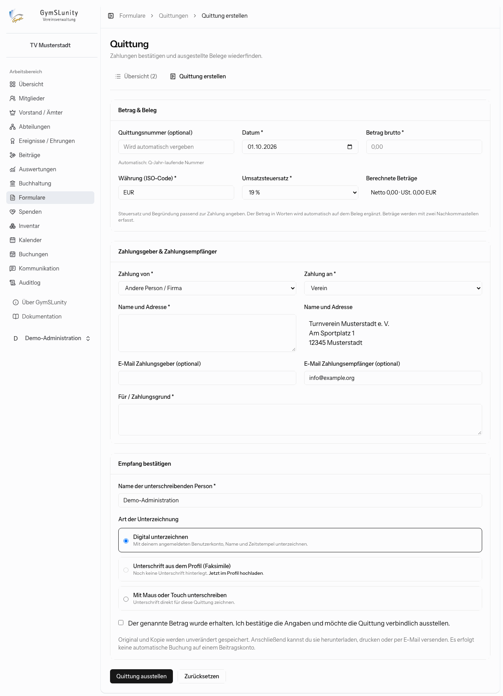
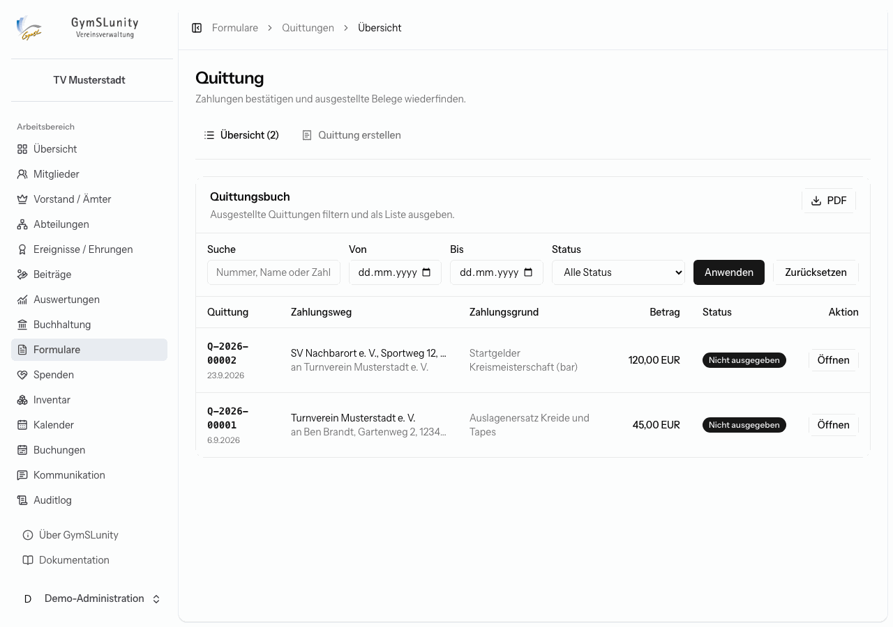
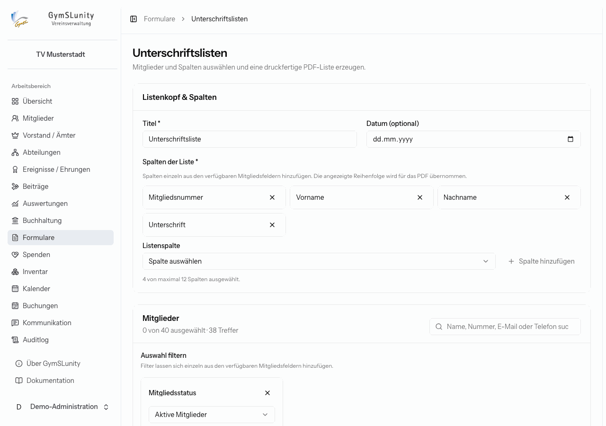
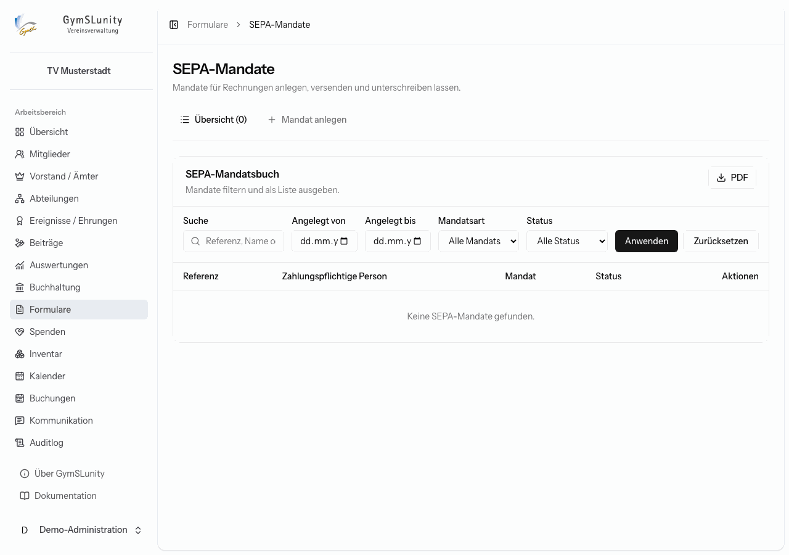

# Formulare

Das Modul **Formulare** bündelt drei Vereinsformulare.

## Quittungen

Mit einer Quittung bestätigst du den Empfang einer Zahlung, zum Beispiel einer Barzahlung am Vereinsfest oder eines Auslagenersatzes an ein Mitglied.

1. **Betrag und Beleg:** Datum, Bruttobetrag, Währung und Umsatzsteuersatz. Netto und Umsatzsteuer rechnet GymSLunity aus. Bei 0 % oder einem ermäßigten Satz gibst du den Grund an. Die Quittungsnummer wird automatisch vergeben (`Q-Jahr-Nummer`), wenn du keine eigene einträgst.
2. **Zahlungsgeber und Zahlungsempfänger:** jeweils **Verein** oder **Andere Person / Firma** mit Name und Adresse. Optional die E-Mail-Adressen für den Versand.
3. **Für / Zahlungsgrund.**
4. **Empfang bestätigen:** Name der unterschreibenden Person und Art der Unterzeichnung:
    - **Digital unterzeichnen** mit deinem angemeldeten Benutzerkonto, Namen und Zeitstempel,
    - **Unterschrift aus dem Profil (Faksimile)**,
    - **Mit Maus oder Touch unterschreiben**.
5. Bestätige, dass der Betrag erhalten wurde, und klicke auf **Quittung ausstellen**.

Original und Kopie werden unverändert gespeichert. Danach kannst du die Quittung herunterladen, drucken oder per E-Mail versenden. Eine Quittung bucht nichts automatisch auf ein Beitragskonto. Dafür gibt es [Manuell buchen](beitraege.md#manuell-buchen).

**Stornieren** ist nur möglich, solange die Quittung weder heruntergeladen, gedruckt noch versendet wurde. Die Stornierung braucht eine Begründung und wird dauerhaft protokolliert.

### Quittungsbuch

Unter **Übersicht** stehen alle Quittungen, filterbar nach Zeitraum und Status (nicht ausgegeben, ausgegeben, storniert). **PDF** gibt das Quittungsbuch als Liste aus. **Öffnen** zeigt eine einzelne Quittung mit ihrem Versandprotokoll.

## Unterschriftslisten

Erzeugt eine druckfertige PDF-Liste, etwa als Anwesenheitsliste für die Mitgliederversammlung oder als Teilnehmerliste.

1. **Titel** und optional ein Datum eingeben.
2. **Spalten** einzeln aus den Mitgliedsfeldern hinzufügen, etwa Mitgliedsnummer, Vorname, Nachname und eine leere Spalte **Unterschrift**. Die Reihenfolge wird ins PDF übernommen, höchstens 12 Spalten sind möglich.
3. **Mitglieder** auswählen: Standardmäßig sind die aktiven Mitglieder gefiltert. Über weitere Filter grenzt du ein, etwa auf eine Abteilung. **Alle Treffer auswählen** übernimmt die ganze Trefferliste.
4. **PDF erstellen.**

## SEPA-Mandate

Hier legst du SEPA-Lastschriftmandate für [Rechnungen der Buchhaltung](buchhaltung.md) an, zum Beispiel für einen Sponsor, der seine Bandenwerbung per Lastschrift bezahlt. Mandate für **Mitgliedsbeiträge** gehören dagegen in die Mitgliedsakte oder werden im [Mitgliederbereich](mitgliederbereich.md) erteilt.

1. **Mandat anlegen:** zahlungspflichtige Person mit Anschrift, IBAN und Mandatsart (wiederkehrend oder einmalig). Die Mandatsreferenz vergibt GymSLunity.
2. **Unterschreiben lassen**, auf einem dieser Wege:
    - **Mail**: Die Person erhält das Mandat als PDF und einen persönlichen Link, über den sie es digital unterzeichnet.
    - **Digital unterschreiben** direkt am Gerät, etwa im Vereinsheim auf dem Tablet.
    - **Papier bestätigen**, wenn das unterschriebene Original vorliegt.
3. Erst danach lässt sich das Mandat bei einer Rechnung auswählen.

Ein Mandat lässt sich **widerrufen**. Es kann danach weder unterzeichnet noch für neue Rechnungen verwendet werden. Das bisherige PDF bleibt als Nachweis erhalten.

Das **SEPA-Mandatsbuch** listet alle Mandate, filterbar nach Zeitraum, Mandatsart und Status, und gibt sie als PDF aus.

Voraussetzung sind Vereinsname, Anschrift, Land und Gläubiger-ID unter [Konfiguration → Vereinsdaten](konfiguration.md#vereinsdaten). Den Mandatstext legst du unter [Konfiguration → Buchhaltung](konfiguration.md#buchhaltung) fest.
