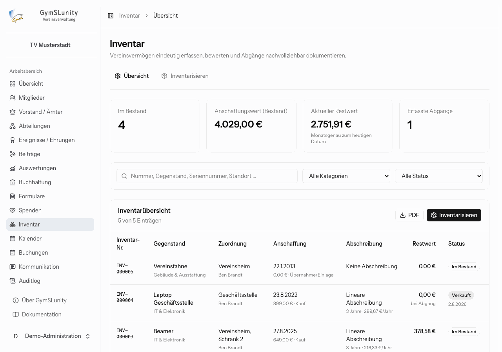
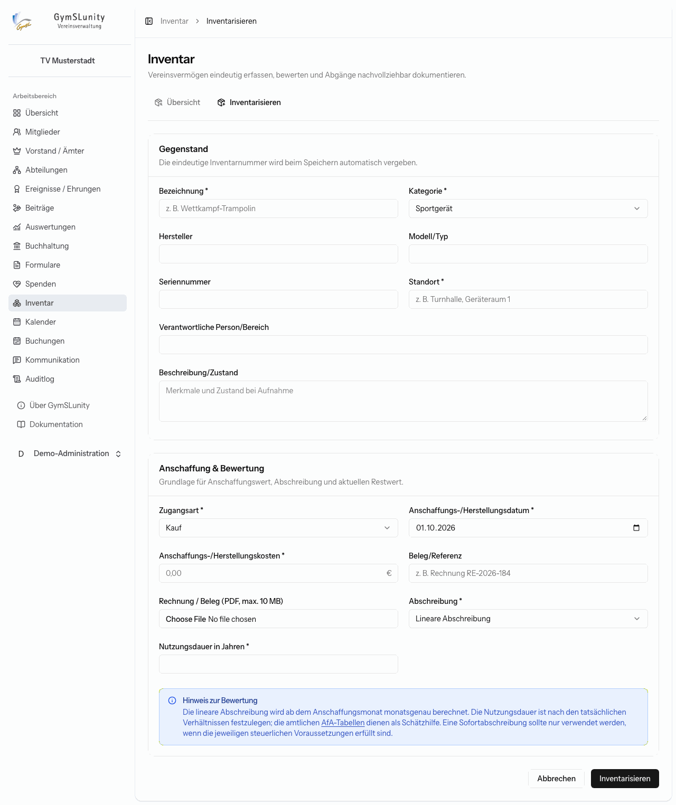
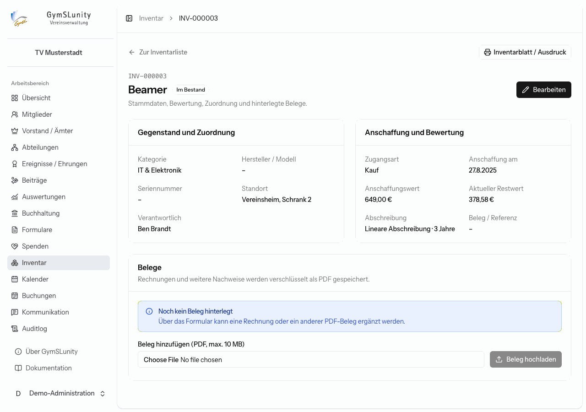

# Inventar

Das Modul **Inventar** dokumentiert das Vereinsvermögen: was der Verein besitzt, wo es steht, wer verantwortlich ist, was es gekostet hat, was es heute noch wert ist und wann es den Verein verlassen hat.

Oben stehen die Zahl der Gegenstände im Bestand, ihr Anschaffungswert, der aktuelle Restwert (monatsgenau zum heutigen Tag) und die Zahl der erfassten Abgänge. Die Liste lässt sich nach Inventarnummer, Bezeichnung, Seriennummer oder Standort durchsuchen und nach Kategorie und Status filtern. **PDF** gibt die gefilterte Inventarliste aus.

## Gegenstand inventarisieren

1. **Gegenstand:** Bezeichnung, Kategorie (Sportgerät, IT & Elektronik, Büroausstattung, Gebäude & Ausstattung, Veranstaltungsausstattung, Fahrzeug, Sonstiges), Hersteller, Modell, Seriennummer, Standort, verantwortliche Person und eine Beschreibung des Zustands bei Aufnahme.
2. **Anschaffung und Bewertung:**
    - **Zugangsart:** Kauf, Sachspende, Herstellung, Übernahme/Einlage oder sonstiger Zugang,
    - Datum und Kosten der Anschaffung oder Herstellung,
    - Belegreferenz und optional die Rechnung als PDF,
    - **Abschreibung:** linear über eine Nutzungsdauer in Jahren, sofort oder keine.
3. **Inventarisieren.** GymSLunity vergibt die nächste Inventarnummer (`INV-000001` und so weiter).

Die lineare Abschreibung wird ab dem Anschaffungsmonat monatsgenau berechnet. Die Nutzungsdauer richtet sich nach den tatsächlichen Verhältnissen. Die amtlichen AfA-Tabellen dienen als Schätzhilfe.

## Inventarblatt

**Details** in der Liste öffnet das Inventarblatt mit Stammdaten, Bewertung, Restwert und Belegen.

- **Bearbeiten** ändert nur Standort und Verantwortlichkeit. Anschaffungswert, Anschaffungsdatum und Abschreibung bleiben bewusst unveränderlich, damit die Bewertung nachvollziehbar bleibt.
- Unter **Belege** ergänzt du Rechnungen und weitere Nachweise als PDF. Sie werden verschlüsselt gespeichert.
- **Inventarblatt / Ausdruck** erzeugt ein PDF des Gegenstands.

## Abgang erfassen

Verlässt ein Gegenstand den Verein, klickst du in der Liste auf **Abgang** und wählst die Art:

- **Verkauft**, mit Verkaufserlös,
- **Verlust**, zum Beispiel nach Diebstahl,
- **Entsorgt**.

Dazu kommen das Abgangsdatum und ein Vermerk, etwa der Käufer, der Schadenshergang oder ein Entsorgungsnachweis. Der Gegenstand bleibt mit seinem Restwert zum Abgangstag in der Liste und lässt sich über den Statusfilter wiederfinden.

## Inventar und Buchungen

Gegenstände, die Mitglieder ausleihen dürfen, etwa ein Beamer, lassen sich als [buchbare Ressource](buchungen.md#ressourcen) anlegen. Die Angaben aus dem Inventar werden dabei übernommen.
