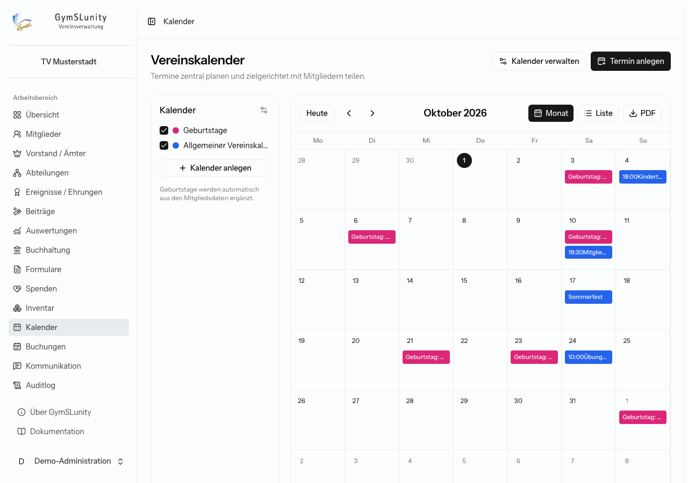
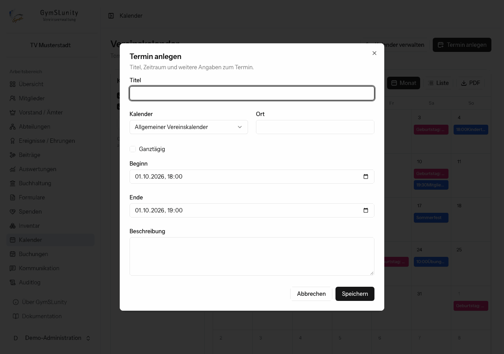
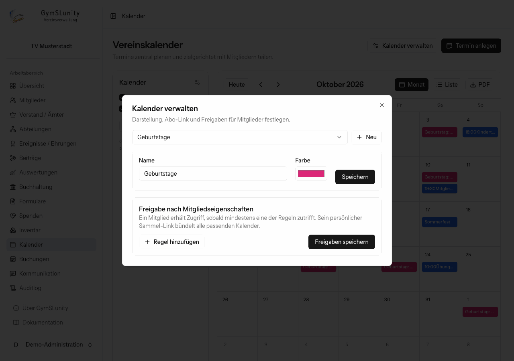

# Kalender

Das Modul **Kalender** plant Vereinstermine zentral und teilt sie gezielt mit Mitgliedern. Es kann mehrere farblich unterschiedene Kalender geben, etwa einen allgemeinen Vereinskalender und je einen Kalender pro Abteilung.

- Links wählst du aus, welche Kalender angezeigt werden. Der Kalender **Geburtstage** füllt sich automatisch aus den Geburtsdaten der Mitglieder.
- **Monat** zeigt die Monatsansicht, **Liste** alle Termine eines frei wählbaren Zeitraums.
- **PDF** gibt eine Terminliste aus, etwa für den Aushang.
- Ein Klick auf einen Termin öffnet ihn zum Bearbeiten oder Löschen.

## Termin anlegen

**Termin anlegen** öffnet das Formular: Titel, Kalender, Ort, Beginn und Ende oder **Ganztägig** sowie eine Beschreibung. Mehrtägige Termine sind möglich.

## Kalender verwalten

**Kalender anlegen** erstellt einen neuen Kalender. **Kalender verwalten** legt für jeden Kalender fest:

- **Name und Farbe.**
- **Öffentlicher Abo-Link:** ein iCal-Link, den jede Person mit dem Link in ihrer Kalender-App abonnieren kann, etwa für den öffentlichen Terminkalender auf der Vereinswebsite. **Neu erzeugen** macht den bisherigen Link ungültig, **Deaktivieren** schaltet ihn ganz ab.
- **Freigabe nach Mitgliedseigenschaften:** Regeln wie „Abteilung = Turnen“ oder „Mitgliedschaft = Aktiv“. Ein Mitglied erhält Zugriff, sobald mindestens eine Regel zutrifft.

Mitglieder abonnieren alle für sie freigegebenen Kalender über einen persönlichen **Sammel-Link** im [Mitgliederbereich](mitgliederbereich.md#kalender-abonnieren). Ändert sich etwa die Abteilung eines Mitglieds, passt sich sein Abo automatisch an.
