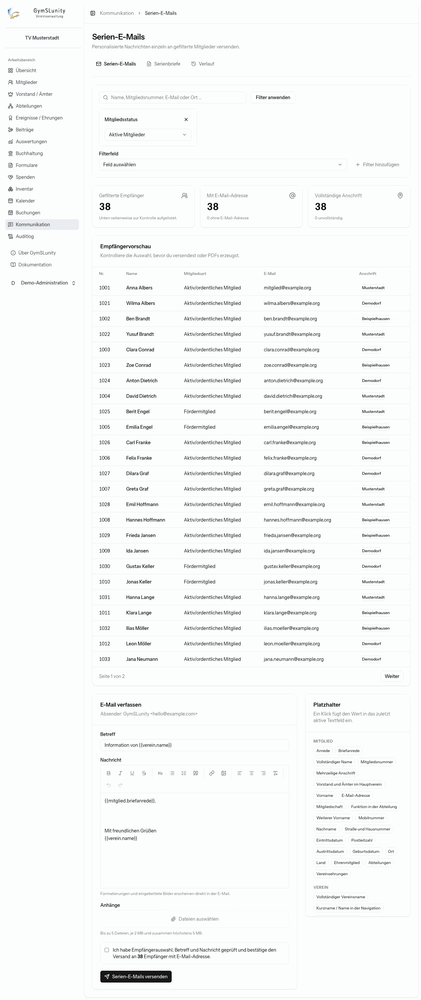
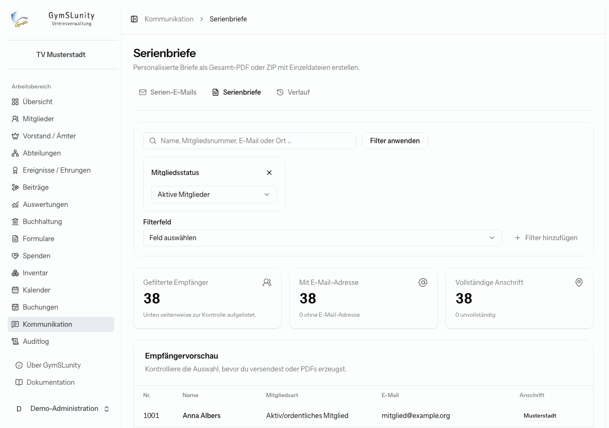
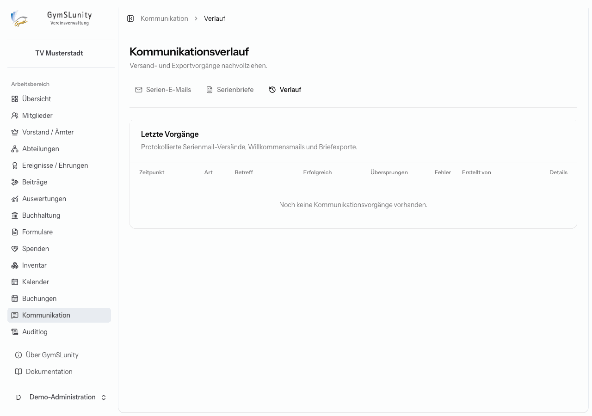

# Kommunikation

Das Modul **Kommunikation** erzeugt personalisierte Serien-E-Mails und Serienbriefe für gefilterte Mitgliedergruppen und protokolliert jeden Versand.

## Empfänger auswählen

Serien-E-Mails und Serienbriefe beginnen mit derselben Empfängerauswahl:

- **Suche** nach Name, Mitgliedsnummer, E-Mail oder Ort,
- **Mitgliedsstatus**, standardmäßig nur aktive Mitglieder,
- beliebige weitere **Filterfelder** aus den Mitgliedsfeldern, etwa Abteilung, Amt oder Zahlungsart.

Nach **Filter anwenden** zeigen die Kacheln, wie viele Empfänger gefiltert sind, wie viele davon eine E-Mail-Adresse und wie viele eine vollständige Anschrift haben. Die **Empfängervorschau** listet sie zur Kontrolle seitenweise auf.

## Serien-E-Mails

1. Empfänger filtern und in der Vorschau prüfen.
2. **Betreff** und **Nachricht** schreiben. Der Editor kann fett, kursiv, Überschriften, Listen, Zitate, Links, Ausrichtung und eingebettete Bilder (bis 1 MB). Die Formatierung erscheint so in der E-Mail.
3. Optional **Anhänge**: bis zu 5 Dateien, je höchstens 2 MB und zusammen höchstens 5 MB. Erlaubt sind PDF, DOCX, XLSX, CSV, TXT, PNG, JPEG und WebP.
4. **[Platzhalter](platzhalter.md)** aus der Liste rechts einfügen, etwa `{{mitglied.briefanrede}}`. Ein Klick fügt den Platzhalter in das zuletzt aktive Feld ein, auch in den Betreff.
5. Das Bestätigungskästchen anhaken und senden.

Jedes Mitglied erhält eine eigene E-Mail. Andere Empfänger sieht es nicht. Mitglieder ohne E-Mail-Adresse werden übersprungen. Absender ist die unter [Konfiguration → E-Mail-Versand](konfiguration.md#e-mail-versand) eingestellte Adresse.

> [!NOTE]
> Steht der Mailtransport auf **Log**, weist ein Hinweis darauf hin: Die Nachrichten werden dann nur protokolliert und nicht zugestellt.

## Serienbriefe

Für Mitglieder ohne E-Mail oder für förmliche Schreiben wie die Einladung zur Mitgliederversammlung:

1. Empfänger filtern.
2. **Brieftext** schreiben, mit Platzhaltern wie `{{mitglied.adresse}}` für das Anschriftfeld und `{{mitglied.briefanrede}}` für die Anrede.
3. **Downloadformat** wählen:
    - **Ein Gesamt-PDF**: alle Briefe hintereinander, jeder beginnt auf einer eigenen A4-Seite, praktisch zum Drucken.
    - **ZIP mit Einzel-PDFs**: eine benannte Datei pro Mitglied.
4. Bestätigen und **Serienbriefe herunterladen**.

## Verlauf

Der **Verlauf** listet alle Serienmail-Versände, Willkommensmails und Briefexporte mit Zeitpunkt, Betreff, Zahl der erfolgreichen, übersprungenen und fehlgeschlagenen Empfänger und der auslösenden Person.

**Anzeigen** öffnet die Details mit allen Empfängern und ihrem Status. Von dort lässt sich ein Vorgang **als Vorlage verwenden**, etwa für die Einladung im nächsten Jahr, oder als **PDF-Bericht** ausgeben.
