# Konfiguration

Die Konfiguration ist nur für **Administratoren** sichtbar. Hier richtest du GymSLunity für deinen Verein ein. Technische Einstellungen wie Datenbank, Zugangsdaten und Domain werden dagegen auf dem Server in der Datei `.env` gepflegt (siehe [technische Konfiguration](https://github.com/Abiturientia-am-GymSL-e-V/GymSLunity/blob/main/docs/konfiguration.md)).

> [!TIP]
> Für eine neue Installation empfiehlt sich diese Reihenfolge: [Vereinsdaten](#vereinsdaten), [Softwaremodule](#softwaremodule), [Mitgliedsfelder](#mitgliedsfelder), [E-Mail-Versand](#e-mail-versand), [Benutzer und Rechte](#benutzer-und-rechte), danach je nach Bedarf [Selfservice](#selfservice-und-formulare), [Spenden](#spenden) und [Buchhaltung](#buchhaltung). Erst dann Mitglieder [importieren](mitglieder.md#mitglieder-importieren).

## Startseite

Texte der öffentlichen Seiten und der automatisch versendeten E-Mails.

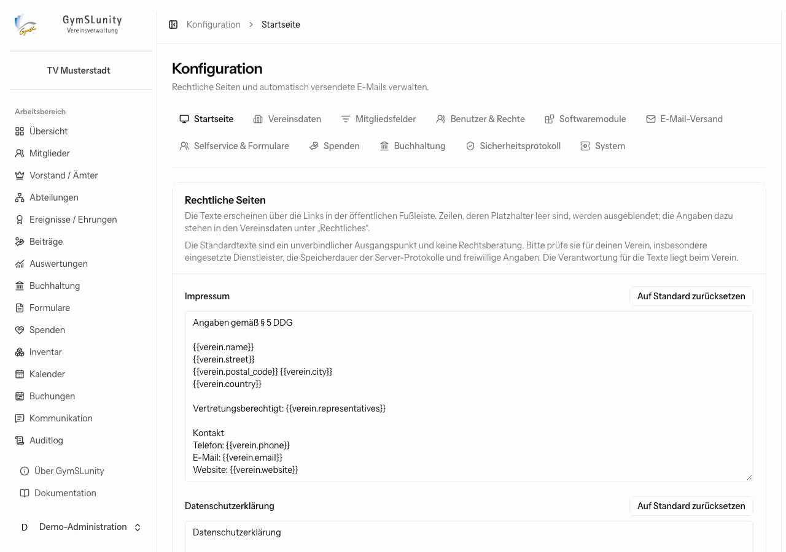

- **Rechtliche Seiten:** Impressum und Datenschutzerklärung, erreichbar über die Fußleiste. Die Standardtexte sind mit [Platzhaltern](platzhalter.md) aus den Vereinsdaten aufgebaut. Zeilen, deren Platzhalter leer sind, blendet GymSLunity aus. Die Standardtexte sind ein Ausgangspunkt, keine Rechtsberatung. Prüfe sie für deinen Verein. **Auf Standard zurücksetzen** stellt den mitgelieferten Text wieder her.
- **E-Mail-Texte:** Betreff und Text der automatischen Mails, zum Beispiel der Antragsbestätigung nach dem Online-Beitritt, der Willkommensmail und der Beitragsrechnung. Logo, Vereinsname und bei Zugangsmails die Schaltfläche mit Gültigkeit und Zugangscode ergänzt GymSLunity selbst. In der Willkommensmail sind zusätzlich die Mitglieds-Platzhalter verfügbar.

## Vereinsdaten

Die Stammdaten des Vereins. Sie erscheinen in der Navigation, auf Rechnungen, Mandaten, Zuwendungsbestätigungen und in den rechtlichen Seiten.

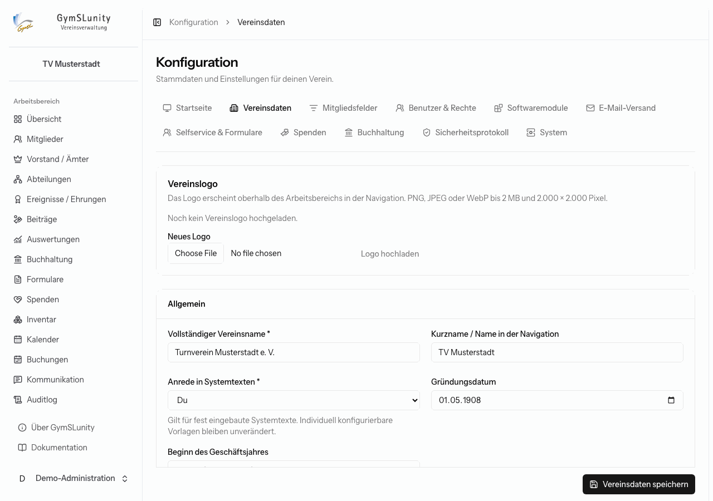

- **Vereinslogo:** PNG, JPEG oder WebP bis 2 MB. Es erscheint in der Navigation und in den E-Mails des Vereins.
- **Allgemein:** Vereinsname, Kurzname für die Navigation, Gründungsdatum, Beginn des Geschäftsjahres und die **Anrede in Systemtexten**. Mit „Du“ oder „Sie“ sprechen alle fest eingebauten Texte Benutzer und Mitglieder an. Selbst konfigurierte Texte bleiben unverändert.
- **Adresse und Kontakt.**
- **Register und Steuern:** Vereinsregister, Steuernummer, Finanzamt, Umsatzsteuer-ID und Gemeinnützigkeit.
- **Rechtliches:** vertretungsberechtigter Vorstand und weitere Angaben für Impressum und Datenschutzerklärung.
- **Bankverbindung:** Kontoinhaber, IBAN, BIC, Kreditinstitut und **SEPA-Gläubiger-ID**. Ohne IBAN und Gläubiger-ID sind keine Lastschriften möglich.
- **Buchungssystem:** die **Stornierungsfrist** für [Buchungen](buchungen.md#buchungsanfragen).

## Mitgliedsfelder

Legt fest, welche Angaben zu Mitgliedern gespeichert werden, in welchen Gruppen sie stehen und was Mitglieder im Mitgliederbereich sehen oder ändern dürfen.

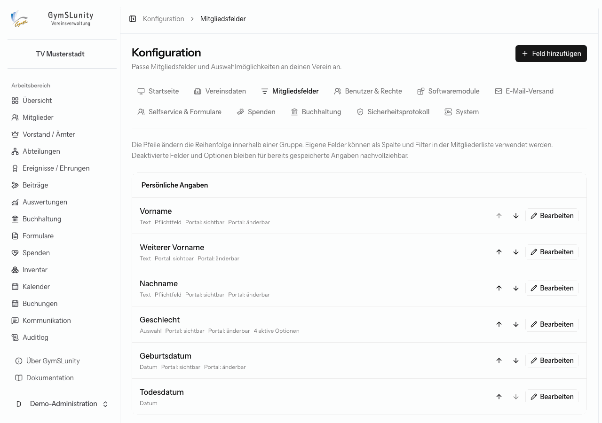

Die Pfeile ändern die Reihenfolge innerhalb einer Gruppe. Kennzeichen unter jedem Feld zeigen die Einstellungen: Pflichtfeld, Zusatzfeld, Filter, **Portal: sichtbar** und **Portal: änderbar**. **Feld hinzufügen** legt ein eigenes Feld an, etwa „T-Shirt-Größe“ oder „Lizenznummer“.

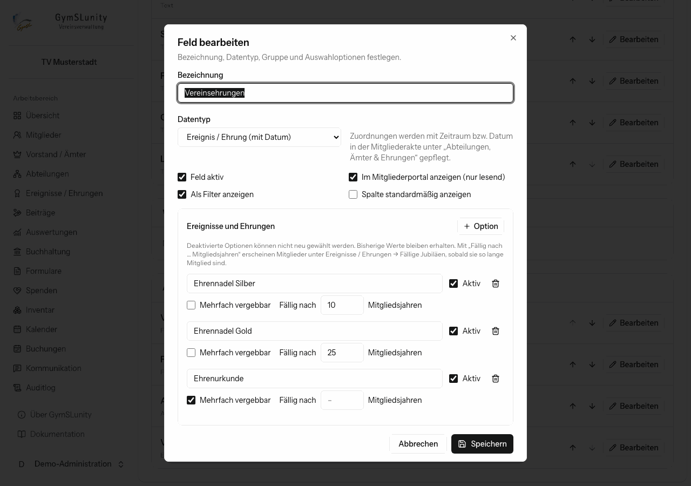

Beim Bearbeiten legst du fest:

- **Bezeichnung**, **Datentyp** (zum Beispiel Text, Zahl, Datum, Ja/Nein oder Auswahl) und **Gruppe**,
- **Feld aktiv**, **Als Filter anzeigen**, **Spalte standardmäßig anzeigen**,
- ob das Feld im Mitgliederbereich angezeigt und ob es dort vom Mitglied geändert werden darf,
- bei Auswahlfeldern die **Optionen**. Deaktivierte Optionen lassen sich nicht neu wählen, bisherige Werte bleiben erhalten.

### Abteilungen, Ämter und Ehrungen

Drei Datentypen haben einen Zeitbezug und speisen die Bereiche [Vorstand, Abteilungen und Ehrungen](aemter-abteilungen-ehrungen.md):

- **Funktion / Amt (mit Zeitraum):** Je Option legst du fest, ob es ein **Vorstandsamt** und ob es ein **Pflichtamt** ist, und wie viele Personen es **höchstens gleichzeitig** innehaben dürfen. Mit **Mehrere Ämter gleichzeitig** darf eine Person mehrere Optionen des Felds zugleich haben.
- **Abteilung (mit Zeitraum).**
- **Ereignis / Ehrung (mit Datum):** Je Option, ob sie **mehrfach vergebbar** ist und ob sie **fällig nach … Mitgliedsjahren** ist. Fällige Mitglieder erscheinen dann unter [Fällige Jubiläen](aemter-abteilungen-ehrungen.md#fällige-jubiläen).

Felder und Optionen werden nicht gelöscht, sondern deaktiviert. So bleiben ältere Angaben nachvollziehbar.

## Benutzer und Rechte

Alle Zugänge zur Verwaltung.

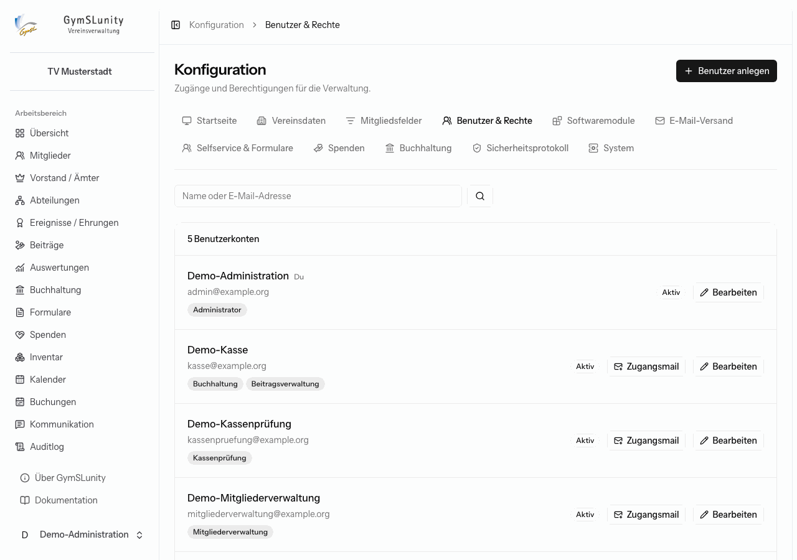

**Benutzer anlegen** öffnet das Formular mit Name, E-Mail-Adresse und den [Rollen](rollen-und-rechte.md). Zu jeder Rolle steht, welche Bereiche sie freischaltet.

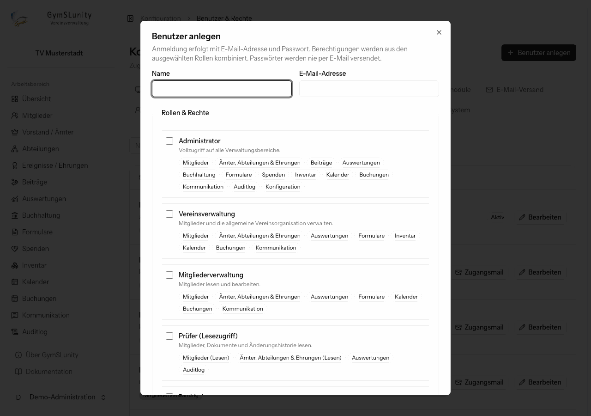

- **Zugangsmail senden:** Die Person erhält eine E-Mail mit ihren Rollen und einem zeitlich begrenzten Link, über den sie ihr Passwort selbst festlegt. Alternativ vergibst du ein Passwort und teilst es auf sicherem Weg mit.
- **Konto aktiv:** Deaktivierte Konten können sich nicht mehr anmelden, bleiben aber in Belegen und Protokollen erhalten.
- **E-Mail-Adresse administrativ bestätigt:** überspringt die Bestätigung per Link.

Bei bestehenden Konten verschickt **Zugangsmail** einen neuen Link, etwa wenn jemand sein Passwort vergessen hat.

## Softwaremodule

Schaltet optionale Bereiche ein oder aus. Übersicht und Mitgliederverwaltung sind immer aktiv.

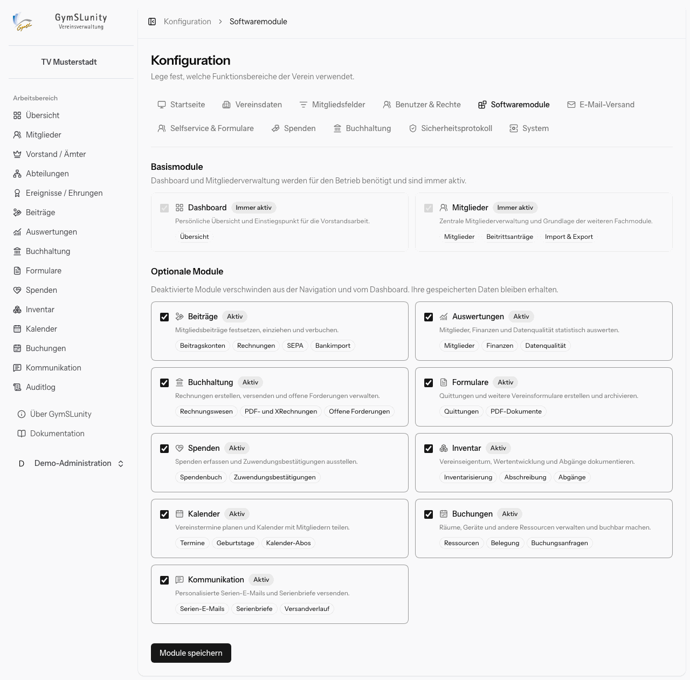

Abgeschaltete Module verschwinden aus Navigation und Übersicht. Ihre gespeicherten Daten bleiben erhalten und sind nach dem Einschalten wieder da. Ein Verein ohne Inventar oder Buchungssystem hält die Oberfläche so übersichtlich.

## E-Mail-Versand

Absender und Versandweg für alle E-Mails: Rechnungen, Zugangslinks, Serien-E-Mails und Systemnachrichten.

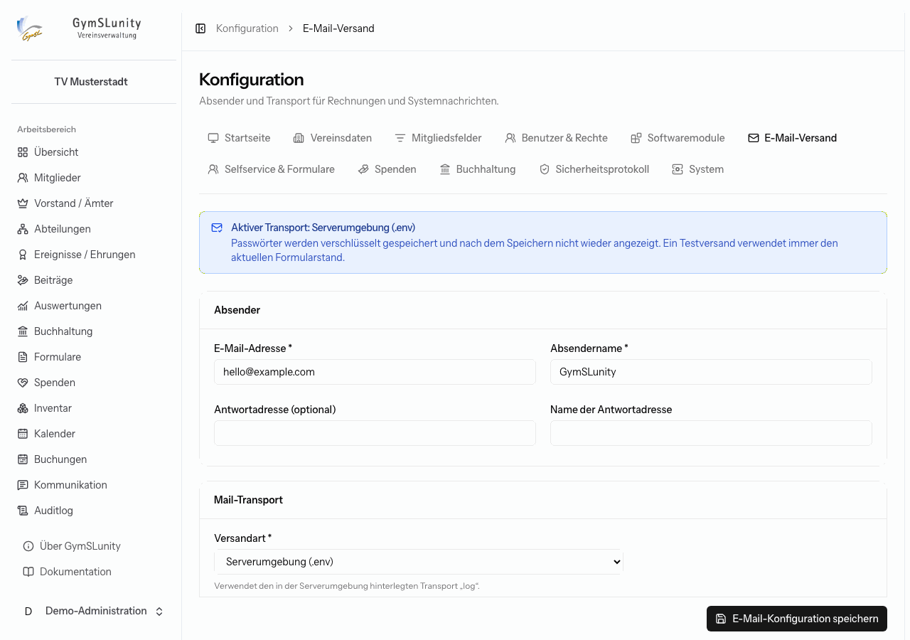

- **Absender:** E-Mail-Adresse und Name, optional eine abweichende Antwortadresse.
- **Versandart:**
    - **Serverumgebung (.env):** verwendet den auf dem Server eingestellten Versandweg,
    - **SMTP:** Server, Port, Verschlüsselung, Benutzername und Passwort deines Mailanbieters,
    - **Sendmail:** das lokale Mailprogramm des Servers,
    - **Log:** schreibt Nachrichten nur ins Protokoll, etwa zum Testen.
- **Testversand:** prüft die aktuell eingegebenen Werte, auch vor dem Speichern.

Passwörter werden verschlüsselt gespeichert und nach dem Speichern nicht wieder angezeigt.

## Selfservice und Formulare

Steuert den [Mitgliederbereich](mitgliederbereich.md) und den Online-Beitritt.

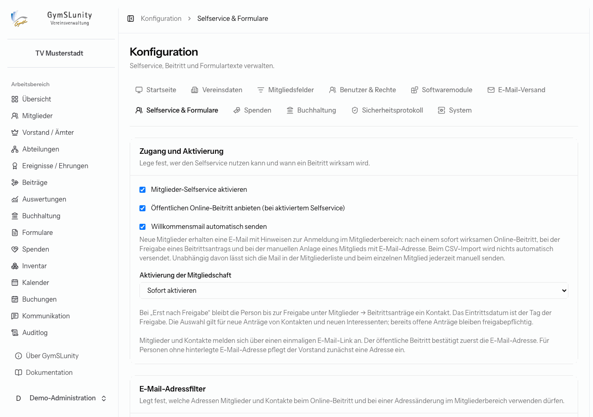

- **Mitglieder-Selfservice aktivieren:** schaltet den Mitgliederbereich ein.
- **Öffentlichen Online-Beitritt anbieten:** zeigt **Mitglied werden** auf der Startseite.
- **Willkommensmail automatisch senden:** nach einem sofort wirksamen Online-Beitritt, bei der Freigabe eines Beitrittsantrags und beim manuellen Anlegen eines Mitglieds mit E-Mail-Adresse. Beim CSV-Import wird nichts automatisch versendet.
- **Aktivierung der Mitgliedschaft:** **Sofort aktivieren** oder **Erst nach Freigabe**. Bei Freigabe bleibt die Person zunächst Kontakt und erscheint unter [Beitrittsanträge](mitglieder.md#beitrittsanträge).
- **E-Mail-Adressfilter:** legt fest, welche Adressen beim Online-Beitritt und bei Adressänderungen im Mitgliederbereich erlaubt sind. Als **Allowlist** sind nur passende Adressen erlaubt, als **Blocklist** werden passende abgewiesen. Ein Eintrag pro Zeile, `*` steht für beliebige Zeichen außer `@`. Beispiele: `*@gymsl.de` (alle Adressen dieser Domain), `*@*.gymsl.de` (alle Unterdomains), `m.mustermann@*` (dieser Name bei jeder Domain). Die Verwaltung darf weiterhin jede Adresse speichern. Ist eine gespeicherte Adresse nicht zugelassen, fordert der Mitgliederbereich das Mitglied bei der Anmeldung zur Änderung auf.
- **Formulartexte:** die Erklärungen, die Mitglieder vor der Unterschrift sehen, etwa Mitgliedsantrag, SEPA-Mandat und Zustimmung der Sorgeberechtigten, sowie die allgemeinen Quittungshinweise. Sie werden unverändert ins jeweilige PDF übernommen. Ist der Verein gemeinnützig, wird Quittungen zusätzlich der vereinfachte Spendennachweis angehängt.

## Spenden

Die steuerlichen Grundlagen für [Zuwendungsbestätigungen](spenden.md).

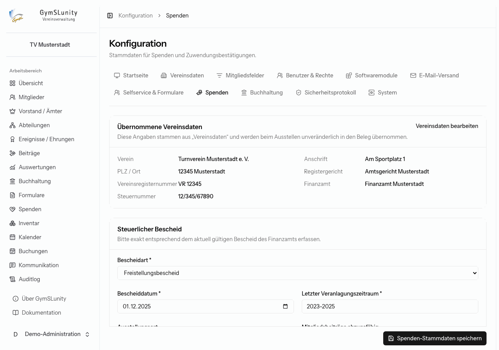

- **Übernommene Vereinsdaten:** Name, Anschrift, Register und Steuernummer kommen aus den Vereinsdaten.
- **Steuerlicher Bescheid:** Art (Freistellungsbescheid, Anlage zum Körperschaftsteuerbescheid oder Feststellungsbescheid nach § 60a AO), Datum und letzter Veranlagungszeitraum, exakt wie im aktuellen Bescheid.
- **Mitgliedsbeiträge abzugsfähig:** Bei Sport, freizeitnaher Kultur, Heimatpflege und Zwecken nach § 52 Abs. 2 Satz 1 Nr. 23 AO sind Mitgliedsbeiträge regelmäßig nicht abziehbar.
- **Verfahren für maschinell erstellte Bestätigungen wurde dem Finanzamt angezeigt:** Erst dann sind Bestätigungen ohne eigenhändige Unterschrift und ihr Versand per E-Mail möglich.
- **Steuerbegünstigte Zwecke:** nur die im Bescheid bzw. in der Satzung bestätigten.

## Buchhaltung

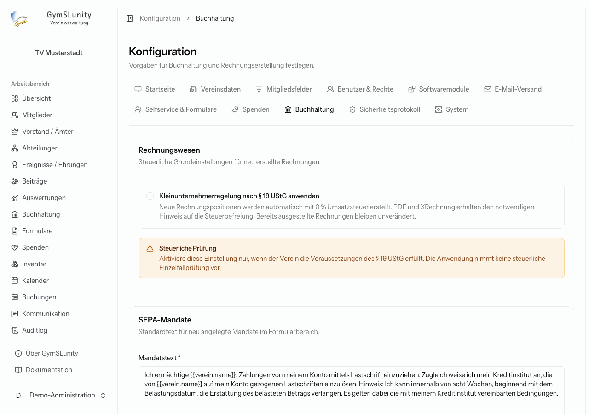

- **Kleinunternehmerregelung nach § 19 UStG:** Neue Rechnungspositionen erhalten 0 % Umsatzsteuer, PDF und XRechnung den nötigen Hinweis. Schalte das nur ein, wenn der Verein die Voraussetzungen erfüllt. GymSLunity prüft das nicht.
- **SEPA-Mandatstext:** Standardtext für neue [SEPA-Mandate](formulare.md#sepa-mandate) im Formularbereich, angelehnt an das SEPA-Basislastschriftmandat. Änderungen gelten nur für neue Mandate.

## Sicherheitsprotokoll

Sicherheitsrelevante Vorgänge wie Anmeldungen, Passwortänderungen und gesperrte Zugriffe, ohne Passwörter, Tokens oder Dokumentinhalte. Filterbar nach Ereignis und Ergebnis (erfolgreich, fehlgeschlagen, begrenzt). Pseudonymisierte IP- und Gerätekennungen werden nach einer kürzeren Frist entfernt als die Ereignisse selbst.

## System

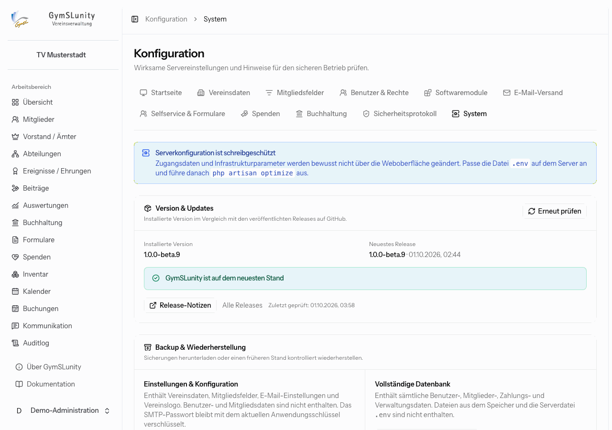

- **Version und Updates:** installierte Version und neuestes Release auf GitHub mit Link zu den Release-Notizen. Das Update selbst führt der Betreiber auf dem Server durch.
- **Backup und Wiederherstellung:**
    - **Einstellungen und Konfiguration:** Vereinsdaten, Mitgliedsfelder, E-Mail-Einstellungen und Logo, ohne Benutzer- und Mitgliedsdaten. Praktisch, um eine zweite Instanz gleich einzurichten.
    - **Vollständige Datenbank:** alle Benutzer-, Mitglieder-, Zahlungs- und Verwaltungsdaten. Hochgeladene Dateien und die `.env` sind nicht enthalten.
    - Zum Wiederherstellen tippst du `WIEDERHERSTELLEN` zur Bestätigung ein. Bei der Datenbank schaltet GymSLunity vorübergehend in den Wartungsmodus und legt direkt davor automatisch eine Sicherheitssicherung an.
- **Aktive Laufzeitkonfiguration** und **Prüfung für den Produktivbetrieb:** zeigen die wirksamen Servereinstellungen und Hinweise für den sicheren Betrieb. Ändern lassen sie sich nur auf dem Server.

> [!WARNING]
> Eine Datenbanksicherung aus der Weboberfläche ersetzt keine regelmäßige, automatische Sicherung auf dem Server. Wie diese eingerichtet wird, beschreibt die [Installationsanleitung](https://github.com/Abiturientia-am-GymSL-e-V/GymSLunity/blob/main/docs/installation.md).
