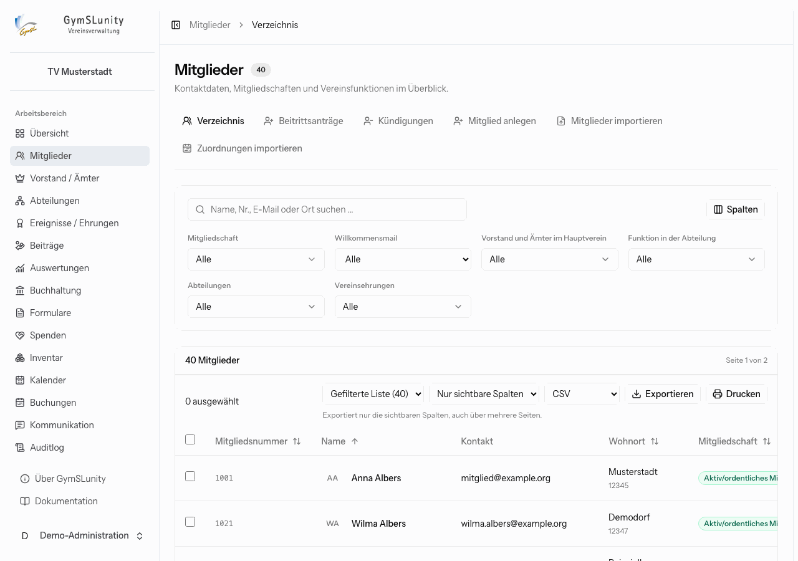
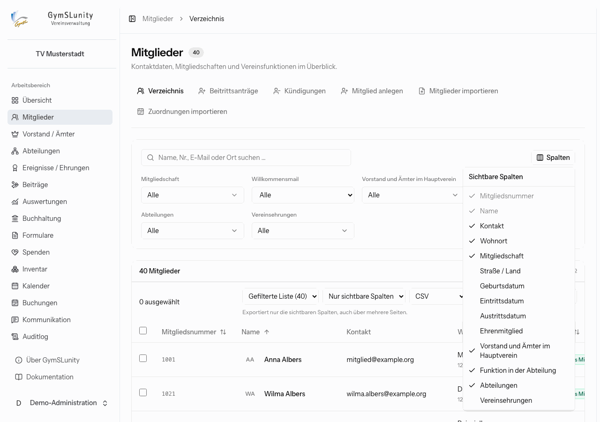
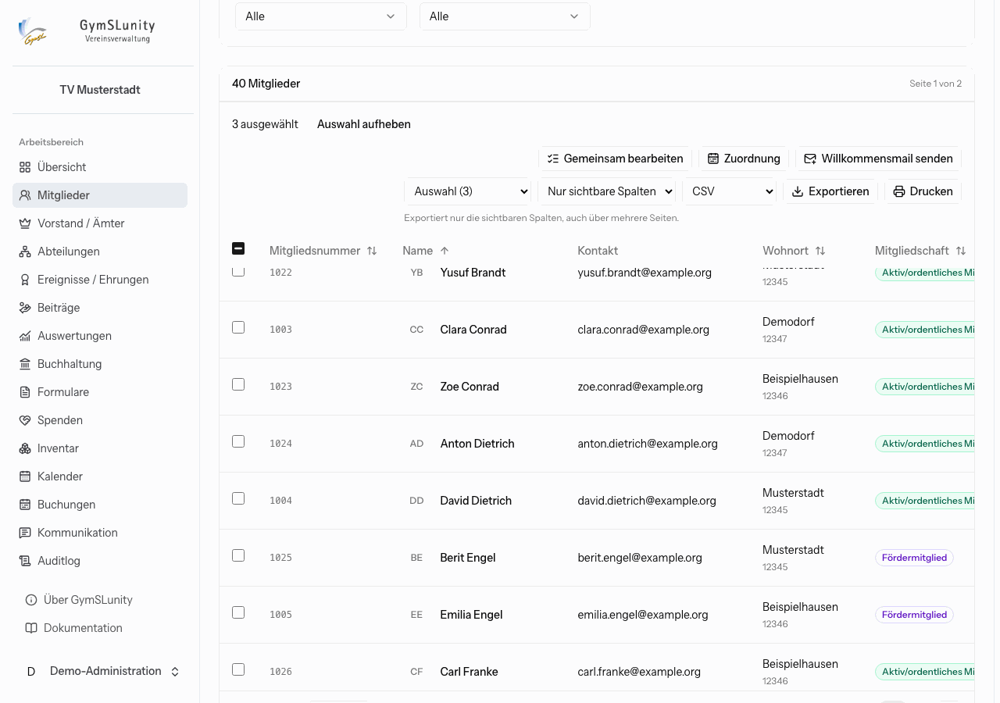
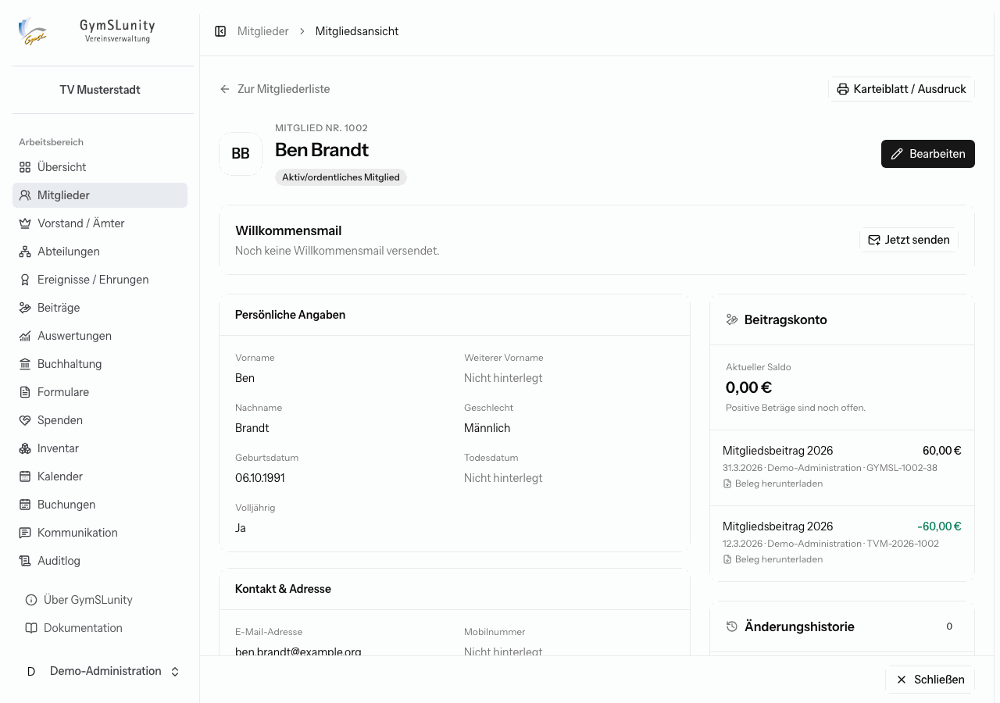
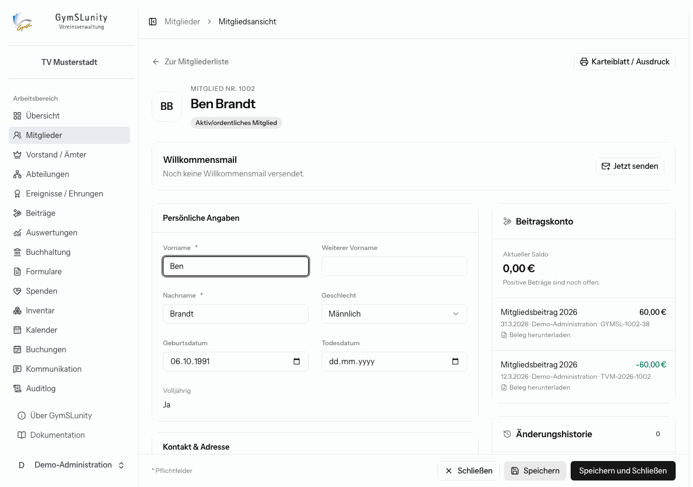
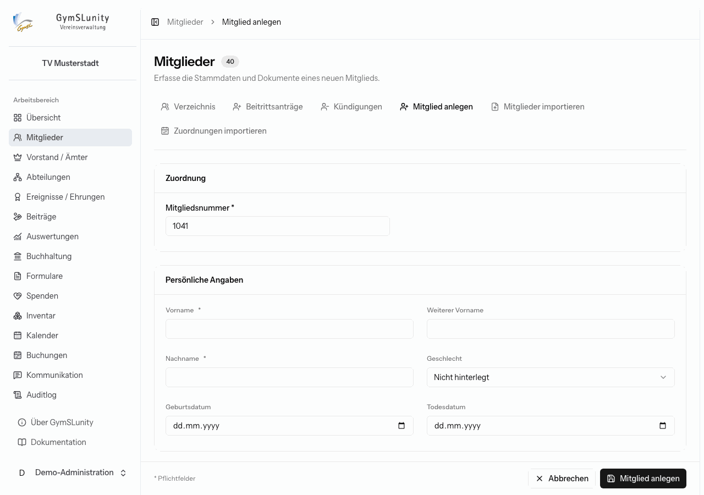
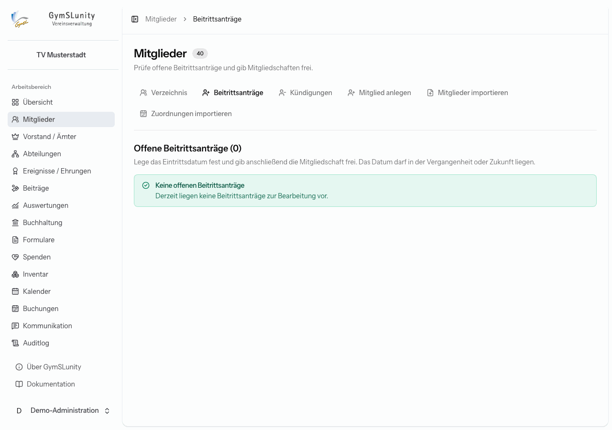
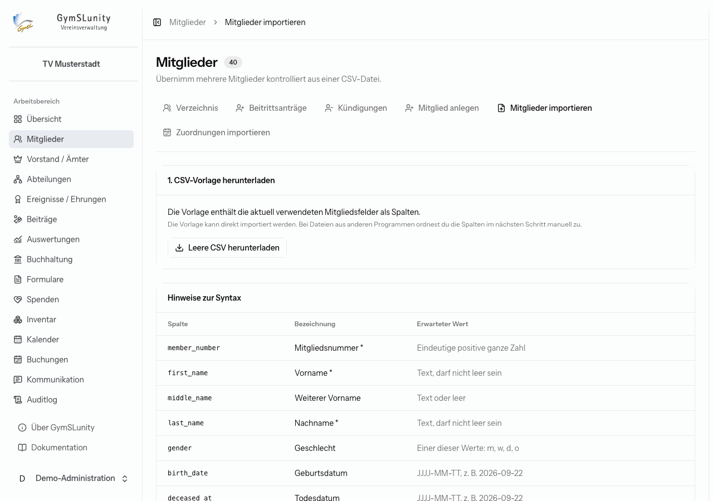
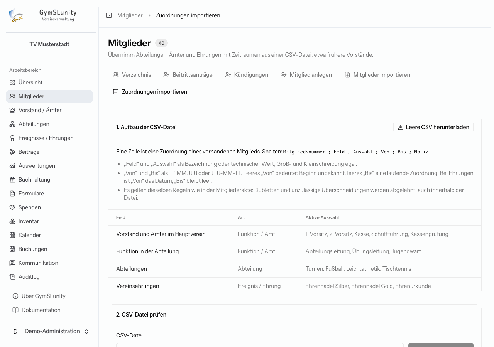

# Mitglieder

Die Mitgliederverwaltung ist der Kern von GymSLunity und immer eingeschaltet. Sie enthält das Verzeichnis aller Mitglieder und Kontakte, die einzelnen Mitgliedsakten, die Bearbeitung von Beitrittsanträgen und Kündigungen sowie den Import aus CSV-Dateien.

Welche Felder es gibt, legt die Administration unter [Konfiguration → Mitgliedsfelder](konfiguration.md#mitgliedsfelder) fest. Die Beispiele hier zeigen die Felder des Demo-Vereins.

## Verzeichnis

- **Suche:** findet Mitglieder nach Name, Mitgliedsnummer, E-Mail-Adresse oder Ort.
- **Filter:** Unter dem Suchfeld stehen die als Filter freigegebenen Felder, zum Beispiel Mitgliedschaft, Abteilung oder Amt. Mit **Willkommensmail: Noch nicht erhalten** findest du alle, die noch keine Zugangsinfo zum Mitgliederbereich bekommen haben.
- **Sortieren:** Ein Klick auf eine Spaltenüberschrift mit Pfeilen sortiert die Liste.
- **Spalten:** Über **Spalten** blendest du Felder ein und aus. Die Auswahl gilt auch für Export und Druck.

Ein Klick auf eine Zeile öffnet die [Mitgliedsakte](#mitgliedsakte).

### Mehrere Mitglieder auf einmal

Über die Kästchen am Zeilenanfang wählst du Mitglieder aus. Das Kästchen im Tabellenkopf wählt alle Mitglieder der aktuellen Seite. Für die Auswahl erscheinen zusätzliche Aktionen:

- **Gemeinsam bearbeiten:** Füge die Felder hinzu, die du für alle Ausgewählten ändern willst, zum Beispiel Zahlungsart oder Mitgliedschaft. Nur die hinzugefügten Felder werden überschrieben. Ein leerer Wert entfernt die bisherige Angabe. Pro Vorgang sind höchstens 250 Mitglieder möglich.
- **Zuordnung:** ordnet allen Ausgewählten eine Abteilung, ein Amt oder eine Ehrung zu oder beendet eine laufende Zuordnung (siehe [Vorstand, Abteilungen und Ehrungen](aemter-abteilungen-ehrungen.md)).
- **Willkommensmail senden:** verschickt die Zugangsinfo zum [Mitgliederbereich](mitgliederbereich.md). Mitglieder ohne gültige Adresse werden übersprungen, ebenso Mitglieder, die schon eine Willkommensmail erhalten haben, sofern du das nicht ausdrücklich anders wählst. Voraussetzung ist der eingeschaltete Selfservice.

### Exportieren und drucken

Über der Tabelle wählst du:

1. **Umfang:** die Auswahl oder die gesamte gefilterte Liste,
2. **Spalten:** nur die sichtbaren oder alle,
3. **Format:** CSV, JSON, Excel, PDF oder Word.

**Exportieren** lädt die Datei herunter, **Drucken** öffnet eine Druckansicht. Exporte enthalten personenbezogene Daten. GymSLunity fragt deshalb gegebenenfalls dein Passwort erneut ab und protokolliert jeden Export im [Auditlog](auditlog.md).

## Mitgliedsakte

Die Mitgliedsakte zeigt alle Angaben eines Mitglieds, gruppiert wie in der Feldkonfiguration. Rechts stehen das Beitragskonto und die Änderungshistorie.

- **Bearbeiten** schaltet die Akte in den Bearbeitungsmodus. Speichere mit **Speichern** oder **Speichern und Schließen**. Ungespeicherte Änderungen sind oben markiert.
- **Karteiblatt / Ausdruck** erzeugt ein PDF mit dem gespeicherten Datenstand, etwa für die Papierakte.
- **Willkommensmail** zeigt, wann und an welche Adresse die Zugangsinfo zuletzt verschickt wurde, und kann sie erneut senden.
- **Beitragskonto:** Saldo und Buchungen des Mitglieds. Positive Beträge sind offen. Zu jeder Buchung lässt sich ein Beleg herunterladen. Details im Kapitel [Beiträge](beitraege.md).
- **Änderungshistorie:** jede Änderung mit Zeitpunkt, Benutzer sowie altem und neuem Wert.

### Bankverbindung und SEPA-Mandat

Bei der Zahlungsart **SEPA-Lastschrift** gehören IBAN, Mandatsreferenz, Erteilungsdatum und Mandatsart zum Mitglied. Ändert sich die Bankverbindung, widerruft GymSLunity das bisherige Mandat beim Speichern. Das alte PDF bleibt in der **SEPA-Mandatshistorie** erhalten. Unter der Historie lädst du ein neues, unterschriebenes Mandat als PDF hoch.

Weicht der Kontoinhaber vom Mitglied ab, etwa bei Kindern, trägst du ihn unter **Abweichender Kontoinhaber** ein.

### Abteilungen, Ämter und Ehrungen

Zuordnungen haben immer einen Zeitraum (Abteilungen, Ämter) oder ein Datum (Ehrungen). So bleibt nachvollziehbar, wer wann welches Amt hatte.

- **Hinzufügen:** neue Zuordnung mit Beginn und optionalem Ende und einer Notiz, zum Beispiel „Wahl in der Mitgliederversammlung“.
- **Beenden:** setzt das Ende einer laufenden Zuordnung, etwa nach Ablauf der Amtszeit.
- **Wechseln:** beendet die bisherige Zuordnung am gewählten Tag und beginnt die neue am Folgetag, etwa beim Wechsel von „Übungsleitung“ zu „Abteilungsleitung“.
- **Bearbeiten (Stift):** korrigiert eine falsch erfasste Zuordnung.
- **Löschen (Papierkorb):** nur für Erfassungsfehler. Endet eine Zuordnung regulär, nutze **Beenden**.

Zuordnungen bearbeitest du erst, wenn die Stammdaten gespeichert oder verworfen sind.

### Dokumente

Unter **Dokumente** liegen der schriftliche Mitgliedsantrag und weitere PDFs. Online gestellte Anträge legt GymSLunity automatisch ab.

## Mitglied anlegen

Unter **Mitglied anlegen** erfasst du ein neues Mitglied. GymSLunity schlägt die nächste freie Mitgliedsnummer vor. Pflicht sind Mitgliedsnummer, Vor- und Nachname und Mitgliedschaft. Unten kannst du gleich den schriftlichen Antrag und das SEPA-Mandat als PDF anhängen.

Ist die automatische Willkommensmail eingeschaltet und hat das Mitglied eine E-Mail-Adresse, erhält es nach dem Anlegen die Zugangsinfo zum Mitgliederbereich.

## Beitrittsanträge

Online-Beitritte landen hier, wenn der Verein unter [Selfservice](konfiguration.md#selfservice-und-formulare) die Aktivierung **Erst nach Freigabe** gewählt hat. Bis zur Freigabe ist die Person ein Kontakt.

Lade den Antrag herunter und prüfe ihn. Lege dann das **Eintrittsdatum** fest und klicke auf **Beitritt freigeben**. Das Datum darf in der Vergangenheit oder Zukunft liegen.

## Kündigungen

Kündigungen, die Mitglieder im Mitgliederbereich einreichen, erscheinen unter **Kündigungen** mit dem Eingangsdatum. Lege das **Austrittsdatum** fest und klicke auf **Kündigung bestätigen**. Das Mitglied erhält eine Bestätigungsmail.

Ein Austritt ohne Online-Kündigung, etwa nach einem Brief, trägst du direkt in der Mitgliedsakte im Feld **Austrittsdatum** ein. Ausgetretene Mitglieder bleiben im Verzeichnis und sind dort als ausgetreten gekennzeichnet.

## Mitglieder importieren

Für die Übernahme aus einer Tabelle oder einem anderen Programm:

1. **CSV-Vorlage herunterladen:** Die Vorlage enthält alle aktuell verwendeten Felder als Spalten. Die Tabelle **Hinweise zur Syntax** erklärt für jede Spalte den erwarteten Wert, zum Beispiel Datumsangaben als `JJJJ-MM-TT` oder Auswahlwerte.
2. **CSV-Datei auswählen** und **Vorschau erstellen**: bis 2 MB und 1.000 Zeilen, UTF-8-kodiert. Semikolon, Komma und Tabulator werden automatisch erkannt.
3. **Spalten zuordnen:** Stammt die Datei nicht aus der Vorlage, ordnest du jeder CSV-Spalte ein GymSLunity-Feld zu oder wählst **Nicht importieren**.
4. **Prüfen:** Die Vorschau zeigt jede Zeile mit dem Prüfergebnis. Importiert wird erst, wenn alle Zeilen gültig sind. Behebe Fehler in der Datei und erstelle eine neue Vorschau.

Leere Werte bleiben ungesetzt. Beim Import verschickt GymSLunity keine Willkommensmails. Das kannst du danach gezielt über die [Sammelaktion](#mehrere-mitglieder-auf-einmal) nachholen.

### Zuordnungen importieren

Frühere Vorstände, Abteilungszugehörigkeiten und Ehrungen übernimmst du über **Zuordnungen importieren**. Jede Zeile ist eine Zuordnung eines bereits vorhandenen Mitglieds mit den Spalten `Mitgliedsnummer`, `Feld`, `Auswahl`, `Von`, `Bis` und `Notiz`.

- **Feld** und **Auswahl** dürfen als Bezeichnung oder als technischer Wert angegeben werden, Groß- und Kleinschreibung spielt keine Rolle. Die Tabelle auf der Seite listet alle gültigen Werte.
- **Von** und **Bis** als `TT.MM.JJJJ` oder `JJJJ-MM-TT`. Ein leeres „Von“ bedeutet „Beginn unbekannt“, ein leeres „Bis“ eine laufende Zuordnung. Bei Ehrungen ist „Von“ das Datum.
- Es gelten dieselben Regeln wie in der Mitgliedsakte: Dubletten und unzulässige Überschneidungen werden abgelehnt, und importiert wird nur, wenn die ganze Datei fehlerfrei ist.
