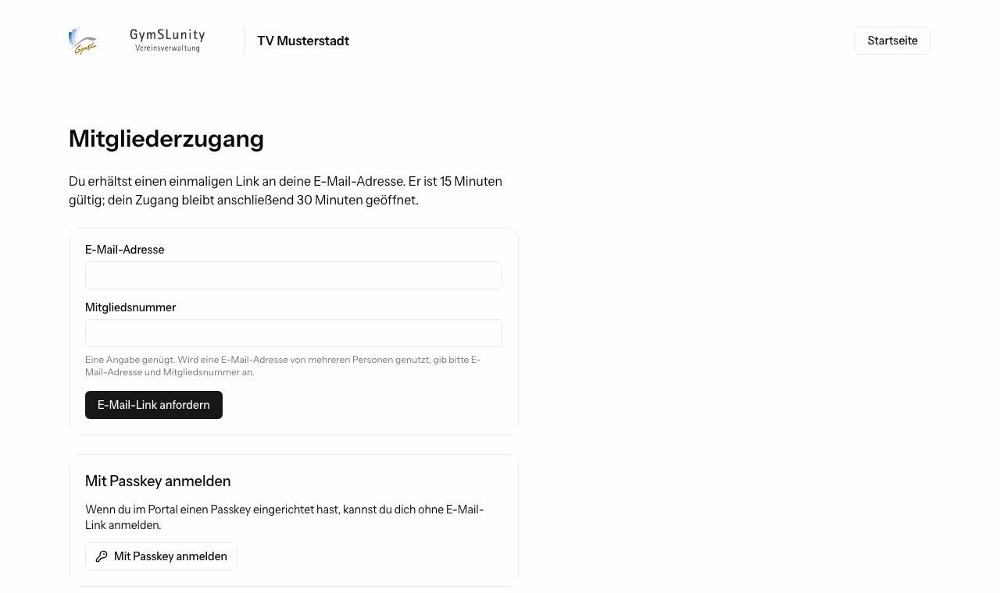
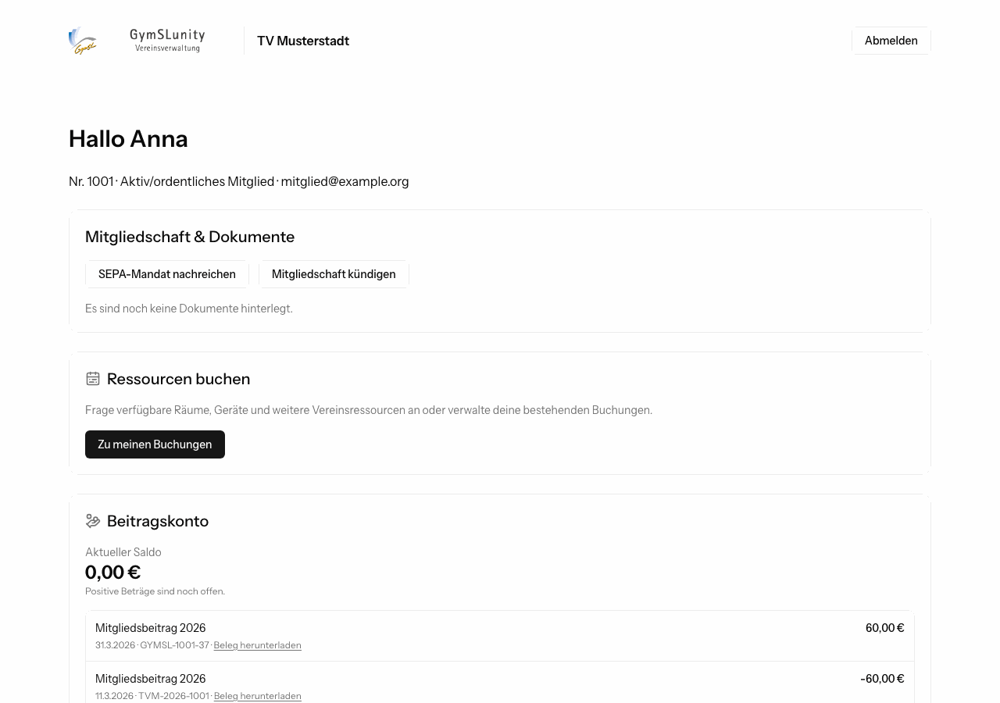
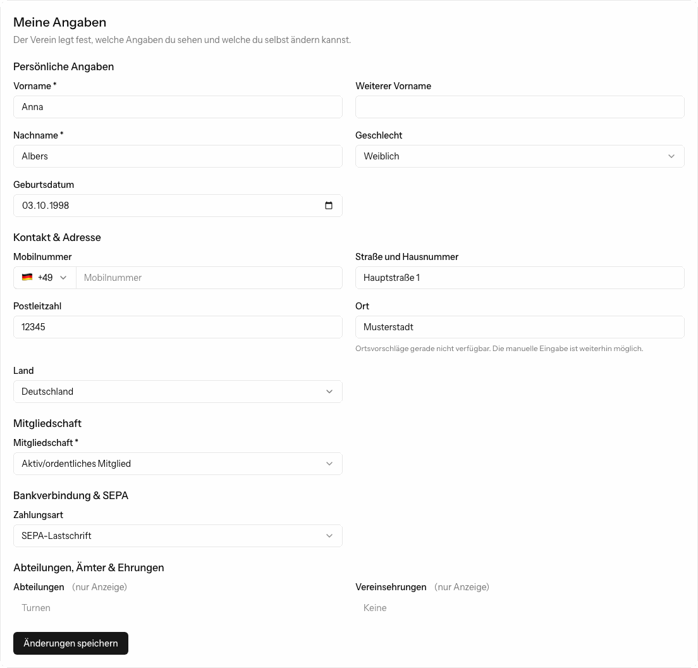
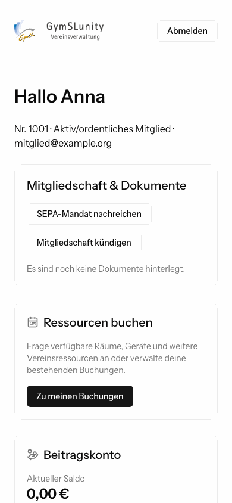
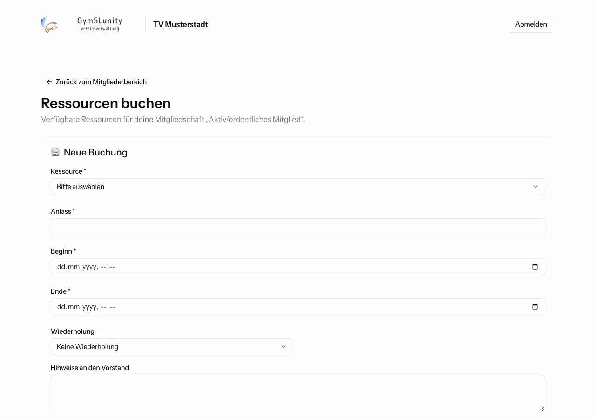
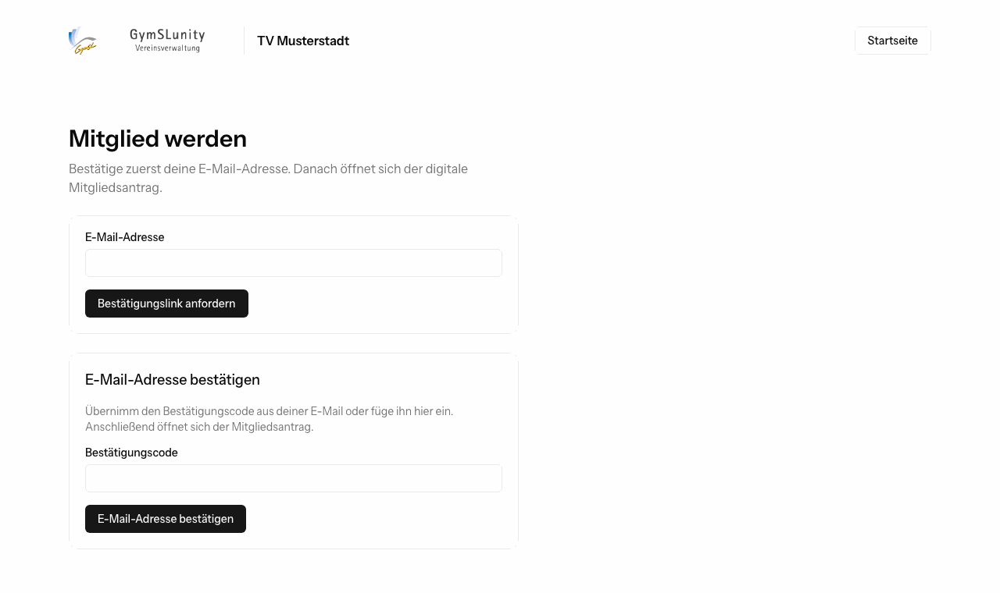

# Mitgliederbereich

Im Mitgliederbereich sehen Mitglieder ihre eigenen Daten und pflegen sie, laden Dokumente herunter, sehen ihr Beitragskonto, buchen Vereinsressourcen und abonnieren die Vereinskalender. Ein Passwort brauchen sie dafür nicht.

Diese Seite richtet sich an Mitglieder und an alle im Vorstand, die Mitgliedern bei Fragen helfen. Ob der Mitgliederbereich verfügbar ist und was Mitglieder dort sehen und ändern dürfen, legt der Verein unter [Konfiguration](konfiguration.md#selfservice-und-formulare) fest.

## Anmelden

1. Öffne auf der Startseite des Vereins **Mitgliederportal**.
2. Gib deine E-Mail-Adresse ein. Nutzen mehrere Personen dieselbe Adresse, etwa Geschwister, gib zusätzlich deine Mitgliedsnummer an.
3. Klicke auf **E-Mail-Link anfordern**. Du erhältst einen einmaligen Anmeldelink. Er ist 15 Minuten gültig.
4. Öffne den Link. Dein Zugang bleibt danach 30 Minuten geöffnet.

Statt den Link zu öffnen, kannst du auch den Zugangscode aus der E-Mail in das Feld **Zugangscode** kopieren.

> [!TIP]
> Richte nach der ersten Anmeldung einen **Passkey** ein, etwa mit Fingerabdruck oder Gesichtserkennung deines Smartphones. Dann meldest du dich künftig mit **Mit Passkey anmelden** an, ganz ohne E-Mail.

Kommt keine E-Mail an, prüfe den Spamordner. Ist im Verein keine oder eine veraltete Adresse hinterlegt, bitte den Vorstand, sie zu korrigieren.

## Übersicht

### Mitgliedschaft und Dokumente

- Deine Dokumente, etwa der Mitgliedsantrag und das SEPA-Mandat, zum Herunterladen.
- **SEPA-Mandat nachreichen** oder **ändern:** Bankverbindung eingeben und digital unterschreiben. Ein neues Mandat ersetzt das bisherige.
- **Mitgliedschaft kündigen:** Die Kündigung geht an den Vorstand, der sie bestätigt und das Austrittsdatum festlegt. Bis dahin steht hier **Kündigung wird bearbeitet**, und du kannst sie zurücknehmen.

### Beitragskonto

Der aktuelle Saldo und alle Buchungen. Positive Beträge sind noch offen. Zu jeder Buchung kannst du einen Beleg herunterladen. Bei einem offenen Betrag zeigt **Girocode für Überweisung anzeigen** einen QR-Code, den du mit deiner Banking-App scannst. Empfänger, IBAN, Betrag und Verwendungszweck stehen dann schon richtig drin.

### Kalender abonnieren

Hat der Verein Kalender für dich freigegeben, etwa den deiner Abteilung, erhältst du einen persönlichen **Sammel-Link**. Füge ihn in deiner Kalender-App (Apple Kalender, Google Kalender, Outlook und andere) als Abo hinzu. Neue Termine erscheinen dann automatisch.

Der Link ist persönlich. Gib ihn nicht weiter. Ist er doch bekannt geworden, erzeugt **Link erneuern** einen neuen, der alte funktioniert danach nicht mehr.

### Meine Angaben

Hier siehst du deine gespeicherten Daten und änderst die, die der Verein dafür freigegeben hat, zum Beispiel Adresse oder Mobilnummer. Felder mit **(nur Anzeige)** kann nur der Vorstand ändern.

Änderst du die Bankverbindung, wird dein bisheriges SEPA-Mandat beim Speichern widerrufen, und du unterschreibst ein neues.

Eine neue **E-Mail-Adresse** bestätigst du über einen Link, der an die neue Adresse geht. Öffne ihn im selben Browser, solange du angemeldet bist. Bis dahin bleibt die alte Adresse gültig.

### Auf dem Smartphone

Der Mitgliederbereich funktioniert auch auf kleinen Bildschirmen.

## Ressourcen buchen

Über **Zu meinen Buchungen** fragst du Räume, Geräte und andere Ressourcen des Vereins an.

1. Ressource, Anlass, Beginn und Ende wählen.
2. Optional eine Wiederholung, etwa wöchentlich für vier Termine.
3. Hinweise an den Vorstand eintragen und **Buchung absenden**.

Je nach Ressource ist die Buchung sofort bestätigt oder wartet auf die Entscheidung des Vorstands. Unter **Meine Termine** siehst du den Status und den Preis jedes Termins. Bis zum Ablauf der Stornierungsfrist kannst du einzelne Termine selbst stornieren. Danach wird ein kostenpflichtiger Termin deinem Beitragskonto belastet.

Welche Ressourcen du buchen darfst, hängt von den Regeln des Vereins ab, etwa von deiner Mitgliedschaft oder Abteilung.

## Mitglied werden

Bietet der Verein den Online-Beitritt an, steht auf der Startseite **Mitglied werden**.

1. Gib deine E-Mail-Adresse ein und bestätige sie über den Link oder Code aus der E-Mail.
2. Fülle den Mitgliedsantrag aus: persönliche Angaben, Mitgliedschaft, gegebenenfalls Förderbeitrag und Zahlungsart.
3. Bei Zahlung per Lastschrift erteilst du das SEPA-Mandat und unterschreibst mit Finger oder Maus.
4. Bist du noch nicht volljährig, unterschreibt zusätzlich eine sorgeberechtigte Person.
5. Lies die Erklärung, stimme zu und sende den Antrag ab.

Deine Angaben, die bestätigten Texte und die Unterschriften werden in einem PDF festgehalten, das du herunterladen kannst. Du erhältst außerdem eine Bestätigung per E-Mail. Je nach Verein ist die Mitgliedschaft sofort wirksam oder wird vom Vorstand freigegeben.
