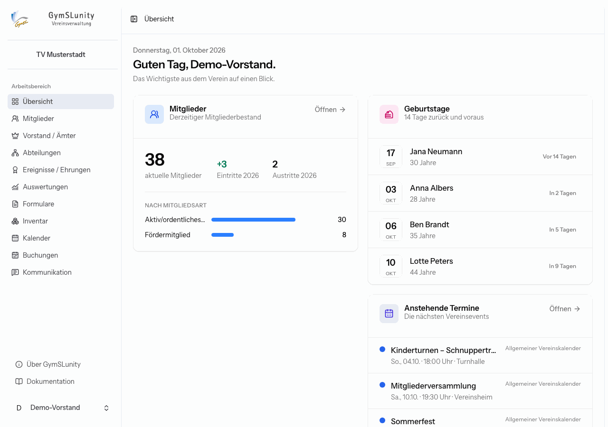

# Rollen und Rechte

Jedes Benutzerkonto der Verwaltung erhält eine oder mehrere Rollen. Die Rechte mehrerer Rollen werden addiert. Die Kasse im Demo-Verein hat zum Beispiel die Rollen **Buchhaltung** und **Beitragsverwaltung** und sieht damit Beiträge, Buchhaltung, Spenden und Auswertungen.

| Rolle                    | Gedacht für                        | Bereiche                                                                                                      |
| ------------------------ | ---------------------------------- | ------------------------------------------------------------------------------------------------------------- |
| **Administrator**        | technische Verantwortung, Vorsitz  | alle Bereiche einschließlich Auditlog und Konfiguration                                                       |
| **Vereinsverwaltung**    | Vorstand, Geschäftsstelle          | Mitglieder, Ämter/Abteilungen/Ehrungen, Auswertungen, Formulare, Inventar, Kalender, Buchungen, Kommunikation |
| **Mitgliederverwaltung** | Mitgliederbetreuung                | Mitglieder, Ämter/Abteilungen/Ehrungen, Auswertungen, Formulare, Kalender, Buchungen, Kommunikation           |
| **Prüfer (Lesezugriff)** | Datenschutz- oder Revisionsprüfung | Mitglieder und Ämter/Abteilungen/Ehrungen nur lesend, Auswertungen, Auditlog                                  |
| **Buchhaltung**          | Kasse, Schatzmeisterei             | Auswertungen, Buchhaltung, Spenden                                                                            |
| **Beitragsverwaltung**   | Beitragseinzug                     | Beiträge, Auswertungen                                                                                        |
| **Kassenprüfung**        | gewählte Kassenprüfer              | Auswertungen, Buchhaltung, Auditlog                                                                           |

Zusätzlich gilt: Ein Bereich erscheint nur, wenn das zugehörige [Softwaremodul](konfiguration.md#softwaremodule) eingeschaltet ist.

Mit der Rolle **Vereinsverwaltung** sieht die Navigation zum Beispiel so aus: Beiträge, Buchhaltung, Spenden, Auditlog und Konfiguration fehlen.

## Rollen vergeben

Rollen vergibt die Administration unter [Konfiguration → Benutzer und Rechte](konfiguration.md#benutzer-und-rechte). Beim Bearbeiten eines Kontos steht zu jeder Rolle, welche Bereiche sie freischaltet.

Empfehlungen:

- Vergib nur die Rollen, die eine Person für ihre Aufgabe braucht. Für die Kassenprüfung reicht **Kassenprüfung**, sie braucht keine Buchhaltung mit Schreibrechten.
- Halte die Zahl der **Administratoren** klein, aber größer als eins, damit der Verein bei Ausfall einer Person handlungsfähig bleibt.
- Deaktiviere Konten ausgeschiedener Vorstandsmitglieder über **Konto aktiv**, statt das Passwort weiterzugeben. Ihr Name bleibt so in Belegen und Protokollen nachvollziehbar.

## Benutzer und Mitglieder sind getrennt

Ein Benutzerkonto ist kein Mitglied und umgekehrt. Ein Vorstandsmitglied hat typischerweise beides: einen Mitgliedsdatensatz unter **Mitglieder** und ein eigenes Benutzerkonto für die Verwaltung. Mitglieder ohne Verwaltungsaufgaben brauchen kein Benutzerkonto. Sie nutzen den [Mitgliederbereich](mitgliederbereich.md), der ohne Passwort auskommt.
