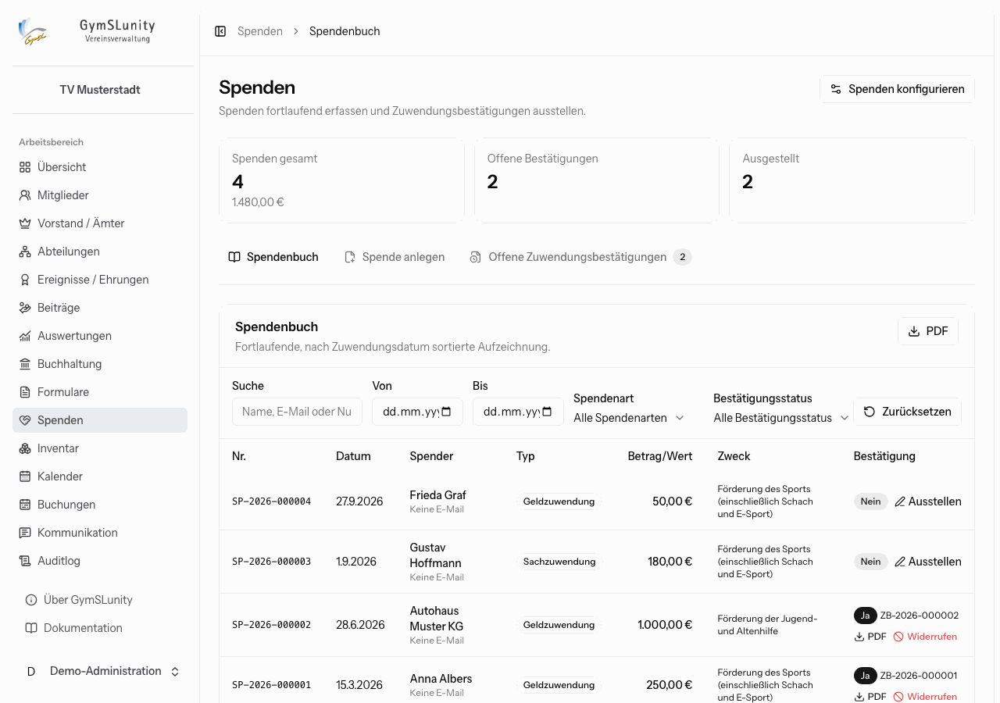
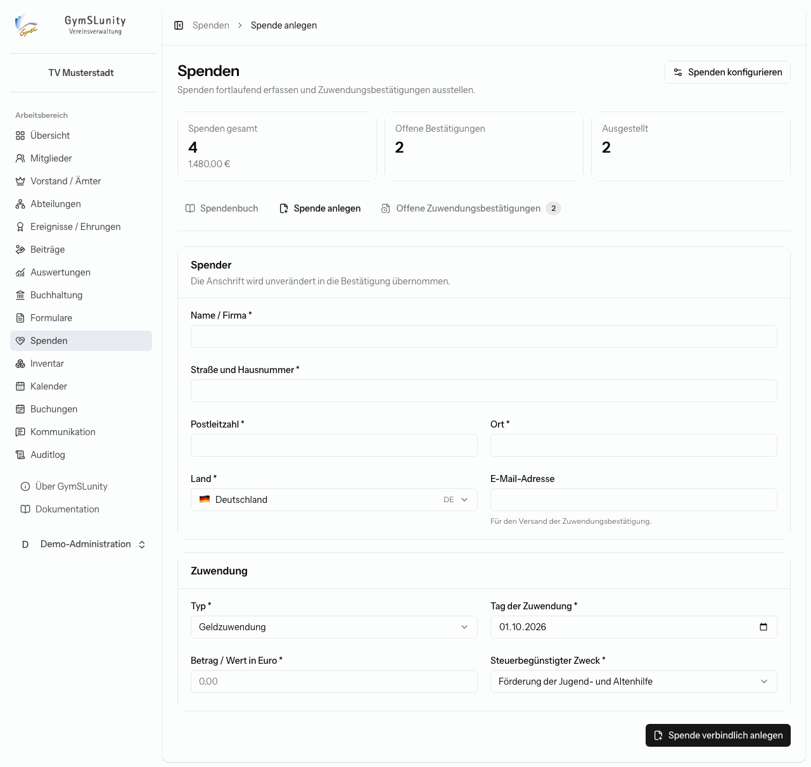

# Spenden

Das Modul **Spenden** führt ein fortlaufendes Spendenbuch und stellt Zuwendungsbestätigungen nach amtlichem Muster aus, für Geld- und Sachzuwendungen.

> [!IMPORTANT]
> Vor der ersten Bestätigung müssen unter [Konfiguration → Spenden](konfiguration.md#spenden) der Freistellungsbescheid und die steuerbegünstigten Zwecke hinterlegt sein. Bis dahin weist die Seite oben darauf hin.

Oben stehen die Gesamtzahl und -summe der Spenden, die offenen Bestätigungen und die ausgestellten Bestätigungen.

## Spende anlegen

1. **Spender:** Name oder Firma und vollständige Anschrift. Die Anschrift wird unverändert in die Bestätigung übernommen. Die E-Mail-Adresse brauchst du nur für den Versand per E-Mail.
2. **Zuwendung:**
    - **Typ:** Geldzuwendung, Sachzuwendung oder Aufwandsspende. Sind Mitgliedsbeiträge laut [Konfiguration](konfiguration.md#spenden) abzugsfähig, gibt es zusätzlich den Typ Mitgliedsbeitrag.
    - **Tag der Zuwendung** und **Betrag / Wert**.
    - **Steuerbegünstigter Zweck** aus den konfigurierten Zwecken.
    - Bei Sachzuwendungen zusätzlich die genaue Bezeichnung mit Alter, Zustand und Kaufpreis, die **Herkunft** (Privatvermögen, Betriebsvermögen oder keine Angabe trotz Aufforderung) und die Unterlagen zur Wertermittlung.
    - Eine Aufwandsspende setzt einen vorab eingeräumten Erstattungsanspruch voraus, der nicht schon unter der Bedingung des Verzichts stand. Die Bestätigung kennzeichnet den Verzicht dann mit „Ja“.
3. **Spende verbindlich anlegen.** Die Spende erhält eine fortlaufende Nummer (`SP-Jahr-Nummer`) und lässt sich danach nicht mehr ändern.

## Zuwendungsbestätigung ausstellen

Spenden ohne Bestätigung stehen unter **Offene Zuwendungsbestätigungen** und im Spendenbuch mit der Schaltfläche **Ausstellen**. Beim Ausstellen wählst du die Unterschriftsart:

- **Digitale Signatur**: digitale Freigabe mit prüfbarem Signaturcode,
- **Unterschrift aus dem Profil**: die in deinem [Profil](erste-schritte.md#profil) hinterlegte Unterschriftsgrafik,
- **Mit Maus oder Touch unterschreiben**: direkt für dieses Dokument.

Danach ist die Bestätigung unveränderlich ausgestellt. Im Spendenbuch lädst du sie als **PDF** herunter oder versendest sie per E-Mail.

> [!NOTE]
> Solange in der Konfiguration nicht bestätigt ist, dass das maschinelle Verfahren dem Finanzamt angezeigt wurde, erstellt GymSLunity Bestätigungen nur zum Ausdrucken mit freiem Feld für die eigenhändige Unterschrift. Der Versand per E-Mail ist dann gesperrt.

## Bestätigung widerrufen

Stellt sich eine Bestätigung als falsch heraus:

1. Fordere alle ausgegebenen Originale und Kopien vom Spender zurück und informiere ihn, dass er die Bestätigung nicht mehr steuerlich verwenden darf.
2. Klicke im Spendenbuch auf **Widerrufen**, gib den Grund an und bestätige, dass die Originale zurückgefordert wurden.

Der Widerruf ist endgültig und wird protokolliert. Jeder spätere Abruf der PDF trägt ein deutliches Wasserzeichen „WIDERRUFEN“.

## Spendenbuch

Das Spendenbuch ist nach Zuwendungsdatum sortiert und filterbar nach Zeitraum, Spendenart und Bestätigungsstatus. **PDF** gibt die gefilterte Liste aus, etwa als Nachweis für das Finanzamt oder die Kassenprüfung. Jede Anlage, Ausstellung und jeder Widerruf steht zusätzlich im [Auditlog](auditlog.md).
