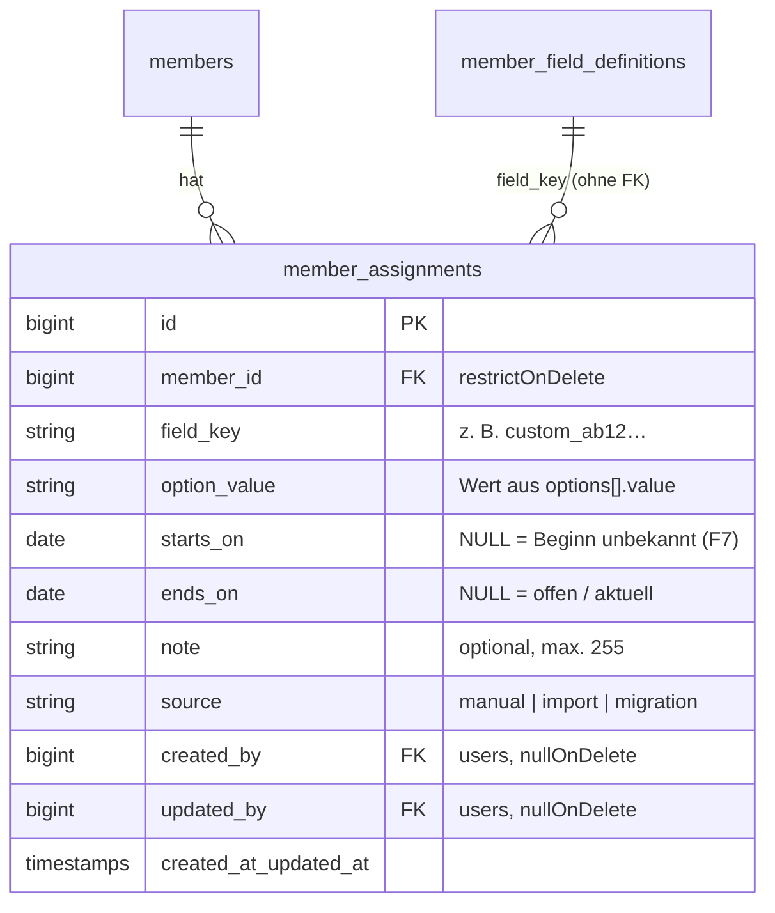

# Planung: Zeitliche Zuordnungen zu Abteilungen, Funktionen/Ämtern und Ereignissen/Ehrungen

Stand: 30.09.2026 · Status: **Alle fachlichen Fragen F1–F17 am 30.09.2026 entschieden (siehe Abschnitt 6.2); Umsetzung am 30.09.2026 freigegeben; Phasen 1 bis 6 vollständig umgesetzt, Altspalten mit v1.0.0-beta.7 entfernt**

Kennzeichnung im Dokument:

- **[A]** bestätigte Anforderung aus `TODO.md`
- **[B]** Beobachtung im Codebestand (mit Fundstelle)
- **[V]** Vorschlag; soweit er einer Entscheidung aus Abschnitt 6.2 entspricht, ist er bestätigt

---

## 1. Bestehende Architektur und Datenflüsse

### 1.1 Mitgliedsfelder und Konfiguration

- **[B]** Alle Mitgliedsfelder sind in `member_field_definitions` beschrieben ([MemberFieldDefinition.php](../app/Models/MemberFieldDefinition.php)). Jede Definition hat `key`, `label`, `type`, `section`, `position`, `required`, `is_active`, `is_custom`, `filterable`, `show_in_table`, `selfservice_visible` und `selfservice_editable`. Die Optionen liegen als JSON-Liste `[{value, label, active}]` vor.
- **[B]** Die Standardfelder stammen aus [member-fields-v1.json](../database/data/member-fields-v1.json). Eingebaute Felder sind eigene Spalten in `members`. Benutzerdefinierte Felder (`custom_<random>`) liegen in `members.custom_values` (JSON).
- **[B]** Verfügbare Typen sind in der Konfiguration `text`, `number`, `decimal`, `date`, `boolean` und `select` ([MemberFieldController.php:34](../app/Http/Controllers/Configuration/MemberFieldController.php#L34), [MemberFieldRequest.php:23](../app/Http/Requests/Configuration/MemberFieldRequest.php#L23)). Eingebaute Felder kennen zusätzlich `email` und `tel`. Einen Mehrfachauswahl-Typ gibt es nicht.
- **[B]** Schutzmechanismen der Feldkonfiguration:
    - Optimistic Locking über `club_settings.fields_version`.
    - Nur Administratoren dürfen die Konfiguration ändern.
    - Entfernte Optionen werden deaktiviert statt gelöscht. Echtes Löschen ist nur möglich, wenn die Option weder bei Mitgliedern noch in der Historie vorkommt (`optionIsInUse`).
    - Ein Typwechsel ist gesperrt, sobald Werte existieren (`hasValues`).
    - Jede Änderung wird über `ConfigurationAudit` protokolliert.
- **[B]** [MemberFields.php](../app/Members/MemberFields.php) baut aus den Definitionen die Abschnitte (`SECTIONS`, darunter `roles` = „Funktionen“), Deskriptoren fürs Frontend und die Self-Service-Sicht. Deaktivierte Felder mit vorhandenen Werten erscheinen im Abschnitt „Archivierte Angaben“.

### 1.2 Bisherige Funktionen und Ehrenmitgliedschaft

- **[B]** `members.department_role` („Funktion in der Abteilung“) und `members.club_role` („Funktion im Hauptverein“) sind einzelne `string(100)`-Spalten mit Select-Optionen, zum Beispiel „1. Vorsitzender“, „Kassierer“ oder „Kassenprüfer“ ([create_members_table.php:29-30](../database/migrations/2026_09_21_230500_create_members_table.php#L29-L30)).
- **[B]** Damit gibt es pro Mitglied und Ebene genau **eine** Funktion, ohne Zeitraum und ohne Bezug zu einer konkreten Abteilung. Ein Abteilungskonzept selbst existiert nicht.
- **[B]** Diese beiden Spalten sind an vielen Stellen hart verdrahtet:

| Bereich                  | Fundstelle                                                                                                                                                                                                                                                                                                                              |
| ------------------------ | --------------------------------------------------------------------------------------------------------------------------------------------------------------------------------------------------------------------------------------------------------------------------------------------------------------------------------------- |
| Mitgliederliste, Filter  | [MemberDirectory.php:41](../app/Members/MemberDirectory.php#L41), [IndexMembersRequest.php:28](../app/Http/Requests/Members/IndexMembersRequest.php#L28), [MemberIndexController.php:52](../app/Http/Controllers/Members/MemberIndexController.php#L52), [members/Index.vue:435-458](../resources/js/pages/members/Index.vue#L435-L458) |
| Tabelle, Spalten, Export | [MemberTable.vue:332-344](../resources/js/components/members/MemberTable.vue#L332-L344), [columns.ts:81](../resources/js/components/members/columns.ts#L81), [MemberExport.vue:40](../resources/js/components/members/MemberExport.vue#L40), [types/members.ts](../resources/js/types/members.ts)                                       |
| Kommunikation            | [CommunicationRequest.php:39](../app/Http/Requests/CommunicationRequest.php#L39), [CommunicationRecipients.php:23](../app/Communication/CommunicationRecipients.php#L23), Platzhalter `{{mitglied.department_role}}` und `{{mitglied.club_role}}` in [CommunicationTemplate.php:23](../app/Communication/CommunicationTemplate.php#L23) |
| CSV-Import               | Spaltenaliasse in [MemberCsvImport.php:40-41](../app/Members/MemberCsvImport.php#L40-L41)                                                                                                                                                                                                                                               |
| Self-Service             | in `SELFSERVICE_PROTECTED` ([MemberFields.php:14](../app/Members/MemberFields.php#L14))                                                                                                                                                                                                                                                 |
| Konfigurationsseite      | Sonderbehandlung in [MemberFields.vue:85](../resources/js/pages/configuration/MemberFields.vue#L85)                                                                                                                                                                                                                                     |
| Demo-Daten               | [DemoData.php:117](../app/Demo/DemoData.php#L117), [DemoMembersSeeder.php:44](../database/seeders/DemoMembersSeeder.php#L44)                                                                                                                                                                                                            |
| Tests                    | u. a. [FormModulesTest.php:48](../tests/Feature/Forms/FormModulesTest.php#L48)                                                                                                                                                                                                                                                          |

- **[B]** `members.is_honorary` ist ein Boolean und **beitragsrelevant**: Beim Festsetzen von Beiträgen kann man Ehrenmitglieder ausschließen oder ausschließlich sie auswählen ([CreateContributions.php:51-54](../app/Payments/CreateContributions.php#L51-L54)). Es wird außerdem in Kommunikation, Export und Tabelle verwendet.
- **[B]** Der vertretungsberechtigte Vorstand ist zusätzlich als Freitext in den Vereinsdaten hinterlegt (`representatives`, [ClubData.php:36](../app/Configuration/ClubData.php#L36)). Er wird in Impressum und Datenschutz verwendet ([PublicPageTemplates.php:24](../app/PublicSite/PublicPageTemplates.php#L24)).

### 1.3 Speichern und Änderungsverlauf

- **[B]** [UpdateMember.php](../app/Members/UpdateMember.php) speichert Mitgliedsänderungen so:
    1. Sperre auf die Konfiguration, danach `lockForUpdate` auf das Mitglied.
    2. Prüfung von `lock_version` (Optimistic Locking).
    3. Erneute Validierung.
    4. Vorher-/Nachher-Snapshot (`MemberFields::snapshot`) und ein unveränderlicher Eintrag in `member_changes` mit `before`, `after`, `changed_fields` und `field_schema`. `member_changes` lässt sich weder ändern noch löschen ([MemberChange.php](../app/Models/MemberChange.php)).
- **[B]** Snapshot und Historie arbeiten mit **skalaren** Werten pro Feld (`array<string, scalar|null>`). Listenwerte sind dort bisher nicht vorgesehen.

### 1.4 Suche, Filter und Auswertungen

- **[B]** [MemberDirectory.php](../app/Members/MemberDirectory.php) übernimmt Volltextsuche, Filter auf Custom-Felder über `custom_values->key` sowie die Sonderfilter für die beiden Rollen-Spalten (`__none__`, `__any__`).
- **[B]** [MemberFieldFilter.php](../app/Members/MemberFieldFilter.php) filtert generisch Feld für Feld für Unterschriftenlisten und Beitragsläufe. Es unterstützt die Typen text, select, date, number und boolean.
- **[B]** [StatisticsReport.php](../app/Statistics/StatisticsReport.php) lädt alle Mitglieder in den Speicher und rechnet Stichtags- und Zeitraumstatistiken in PHP (`isActiveAt`, `dateInPeriod`). Es gibt bisher keine Auswertung nach Funktion oder Abteilung.
- **[B]** „Heute“ kommt aus [Clock.php](../app/Support/Clock.php) (`Clock::today()`).

### 1.5 Berechtigungen, Module und Navigation

- **[B]** Rollen sind in [UserRoles.php](../app/Configuration/UserRoles.php) definiert: admin, vereinsverwaltung, mv, auditor, bh, bv, kp. Die Gates stehen in [AppServiceProvider.php:55-65](../app/Providers/AppServiceProvider.php#L55-L65), die Mitgliederrechte in [MemberPolicy.php](../app/Policies/MemberPolicy.php):
    - Lesen: admin, vereinsverwaltung, mv, auditor.
    - Schreiben: admin, vereinsverwaltung, mv.
- **[B]** Optionale Module lassen sich über [SoftwareModules.php](../app/Configuration/SoftwareModules.php) abschalten, abgesichert mit der Middleware `module:<key>`.
- **[B]** Die Sidebar ([AppSidebar.vue](../resources/js/components/AppSidebar.vue)) zeigt Einträge anhand von `page.props.can.*`.
- **[B]** Exporte laufen über `throttle:sensitive`, `reconfirm` und `audit:data_export` ([routes/web.php](../routes/web.php)).

### 1.6 Backup

- **[B]** Die Konfigurationssicherung stellt `member_field_definitions` per **delete + insert** wieder her ([ConfigurationBackup.php:124-125](../app/Backup/ConfigurationBackup.php#L124-L125)). Fremdschlüssel von neuen Tabellen auf Felddefinitionen würden die Wiederherstellung deshalb brechen oder verwaiste Daten erzeugen.
- **[B]** Die Vollsicherung ist ein DB-Dump und nimmt neue Tabellen automatisch mit.

---

## 2. Erkenntnisse aus den Vergleichs-Repositories

Die drei Repos wurden am 30.09.2026 als flache Kopie geklont und gelesen.

### 2.1 lsverein7 ([vauteer/lsverein7](https://github.com/vauteer/lsverein7), Laravel + Inertia/Vue, Commit `177b308`)

- **Datenmodell:** Stammdatentabellen `sections` (Abteilungen), `roles` (Funktionen) und `events` (Ehrungen). Dazu kommen Pivot-Tabellen mit Zeitraum:
    - `member_section(member_id, section_id, from date NOT NULL, to date NULL, memo)`
    - `member_role(member_id, role_id, from, to NULL, memo)`
    - `event_member(member_id, event_id, date, memo)`: Ehrungen sind **Zeitpunkte, keine Zeiträume**.

    Quellen: `database/migrations/2022_08_19_0634*_create_member_section_table.php`, `…_create_member_role_table.php`, `…_create_event_member_table.php`.

- **Vorbelegung:** Funktionen wie „1. Vorstand“, „Kassier“ und „Kassenprüfer“ sowie Ehrungen wie „25 Jahre“, „30 Jahre“ oder „Ehrenvorstand“ werden per Migration angelegt (`…insert_roles_defaults.php`, `…insert_events_defaults.php`).
- **Stichtagslogik:** `Member::currentSections()`, `currentRoles()`, `scopeHasRole()` und `scopeEverRole()` (`app/Models/Member.php:205-235, 385-410`) arbeiten mit einem globalen Stichtag (`getKeyDate()`). „Jemals“ und „zum Stichtag“ sind getrennte Scopes. Diese Idee übernehmen wir.
- **Validierung:** `to` ist optional und muss nach `from` liegen (`app/Http/Requests/MemberRoleRequest.php:28-29`). Es gibt **keine** Prüfung auf Überlappungen oder Dubletten.
- **Warnsignal:** Die Grenzsemantik ist inkonsistent. Der PHP-Helper `inRange()` zählt den Starttag mit, der SQL-Scope nutzt `from < keyDate` und `to > keyDate` (`app/helpers.php:54`, `Member.php:390-393`). Je nach Codepfad ist ein Mitglied am ersten oder letzten Tag also dabei oder nicht. Wir brauchen **eine** zentral definierte Semantik.
- **Austritt:** `MemberController::resign()` beendet offene Abteilungszuordnungen, aber keine Funktionen (`MemberController.php:185-190`).
- **Einschätzung:** Das Datenmodell „Zuordnung mit von/bis/Notiz“ ist gut übertragbar. Nicht übertragbar sind die festen Stammdatentabellen pro Art: Die Anforderung verlangt beliebig viele konfigurierbare Felder je Typ. Ebenso wenig der globale Stichtag in der Session und die fehlende Dublettenprüfung.

### 2.2 dms_verein ([saschafo/dms_verein](https://github.com/saschafo/dms_verein), Frappe-16-App, Commit `0b9b5e6`)

- **Datenmodell** (Doctypes unter `dms_verein/vereinsverwaltung/doctype/`):
    - `Vorstandsposition(bezeichnung, rang, pflichtposition, aktiv)`
    - `Vorstandsmitglied(mitglied, position, amtsperiode_von (Pflicht), amtsperiode_bis, aktiv, telefon/email_dienstlich)`
    - `Sparte(… spartenleiter, stellvertreter, mitglieder: Tabelle Spartenmitglied)`
    - `Spartenmitglied(mitglied, funktion (Freitext), von, bis, aktiv)`
    - Ein Ehrungskonzept gibt es nicht.
- **Gute Ideen:**
    - **Rang** für die Sortierung von Ämtern.
    - **Pflichtposition**: Unbesetzte Pflichtämter lassen sich als Vakanz anzeigen.
    - Dienstliche Kontaktdaten je Amt.
    - Die Ansicht trennt „Im Amt“ und „Ehemalige“ (`frontend/src/views/admin/VorstandView.vue`).
- **Warnsignal:** Das Häkchen `aktiv` wird **zusätzlich** zu `bis` von Hand gepflegt (`api/verein.py:2593-2612`, sortiert nach `aktiv desc`). Die beiden Werte können auseinanderlaufen. Den Status „aktuell“ sollten wir deshalb immer aus den Daten ableiten und nie speichern. Die Funktion innerhalb einer Sparte ist Freitext, also nicht auswertbar. Spartenleiter und Stellvertreter hängen als feste Verweise an der Sparte und haben damit keine Historie.
- **Einschätzung:** Rang, Pflichtamt und Vakanzanzeige sind übertragbar. Das manuelle Aktiv-Flag und Freitext-Funktionen sind es nicht.

### 2.3 ClubSuite für Nextcloud ([ClubSuite-for-Nextcloud/clubsuite-core](https://github.com/ClubSuite-for-Nextcloud/clubsuite-core), Commit `abdbd2d`)

- Die README verspricht „Gruppen & Abteilungen: Flexible Organisationsstruktur“. Im Code (`lib/Migration`, `lib/Db`, `lib/Service`) gibt es aber nur eine Mitgliedertabelle mit `status` (active, passive, honorary …).
- Der „Vorstand“ ist lediglich eine Nextcloud-Benutzergruppe, die als **Berechtigung** geprüft wird (`lib/Controller/MemberApiController.php:40`). Auch in `clubsuite-training` und `clubsuite-stats` gibt es keine Abteilungs-, Amts- oder Ehrungszeiträume.
- **Einschätzung:** Für das Datenmodell gibt es nichts zu übernehmen. Eine Lehre daraus: Die Rolle im Verein, also das Amt als Fachdatum, und die Berechtigung in der Software sollten getrennt bleiben. So ist es in GymSLunity bereits (`users.roles` ≠ Mitgliedsfunktion). Die Trennung sollte bestehen bleiben.

---

## 3. Datenmodell, Konfiguration, Zeiträume und Migration

### 3.1 Neue Feldtypen in der bestehenden Feldkonfiguration **[V]**

**[A]** In der Konfiguration sollen typisierte, benannte Felder mit eigenen Optionen angelegt werden können, mehrere pro Typ. Generische Auswahlfelder bleiben erhalten.

**[V]** Dafür erweitern wir `member_field_definitions` um drei Typen, statt ein paralleles Konfigurationssystem zu bauen:

| Typ          | Bezeichnung in der UI | Zuordnung                                                    | Beispiel                                               |
| ------------ | --------------------- | ------------------------------------------------------------ | ------------------------------------------------------ |
| `department` | Abteilung             | Zeitraum (von–bis), mehrere gleichzeitig                     | „Abteilungsgruppe A“ mit „Fußball“ und „Turnen“        |
| `office`     | Funktion / Amt        | Zeitraum (von–bis)                                           | „Vorstand Hauptverein“ mit „1. Vorsitz“ und „Kasse“    |
| `honor`      | Ereignis / Ehrung     | Zeitpunkt (Datum), optional mit Ende oder Widerruf, siehe F6 | „Vereinsehrungen“ mit „25 Jahre“ und „Ehrennadel Gold“ |

Begründung: Label, Optionen mit deaktivieren statt löschen, Reihenfolge, Audit, `fields_version`, Konfigurationsbackup und die Konfigurationsseite existieren bereits und passen direkt. Auch die Platzhalterlogik (`{{mitglied.<key>}}`) bleibt systemweit einheitlich, wie AGENTS.md es verlangt.

Anpassungen im Detail:

- **Keine Werte in `members`:** Typisierte Felder schreiben nichts in `members` oder `custom_values`. Ihre Werte stehen ausschließlich in der neuen Zuordnungstabelle.
- **Eigener Abschnitt:** Diese Felder stehen in einem neuen Abschnitt `assignments` („Abteilungen, Ämter & Ehrungen“). `required` und `max_length` sind für sie ohne Bedeutung und werden in der UI ausgeblendet.
- **Einstellung pro Amtsfeld** (`office`): `allow_multiple`, also „mehrere Ämter gleichzeitig erlaubt“ (F3). Gespeichert wird sie als neue boolesche Spalte in `member_field_definitions`.
- **Zusatzattribute pro Option** (JSON bleibt abwärtskompatibel):
    - `office`: `board` (zählt zum Vorstand, siehe F2), `mandatory` (Pflichtamt → Vakanzanzeige), `max_holders` (höchstens so viele gleichzeitig, siehe F4).
    - `honor`: `repeatable` (mehrfach vergebbar, siehe F5) und optional `jubilee_years`, eine Regel für fällige Jubiläen (F13, Phase 6).
    - Die Reihenfolge der Optionen dient als **Rang** für die Sortierung, ohne eigenes Feld.
- **Anpassungen in der Konfiguration:**
    - `MemberFieldRequest` und `MemberFieldController` bekommen die neuen Typen und Attribute.
    - Ein Typwechsel von oder zu einem typisierten Feld ist gesperrt, sobald Zuordnungen existieren.
    - `optionIsInUse` prüft zusätzlich `member_assignments`.
    - `ConfigurationBackup::assertSafeField` kennt die neuen Typen.
- **Deaktivierte Felder und Optionen:** Bestehende Zuordnungen bleiben lesbar (archiviert) und erscheinen weiter in historischen Auswertungen. Neue Zuordnungen auf deaktivierte Optionen sind nicht möglich.

### 3.2 Tabelle `member_assignments` **[V]**

- **Kein Fremdschlüssel auf `member_field_definitions`**, sondern Verweis über `field_key` und `option_value` als Zeichenketten. Genau so verweisen heute schon `members` und `member_changes` auf Optionswerte. Das bleibt mit der Konfigurations-Wiederherstellung per delete + insert verträglich. Die Anwendungslogik stellt die Referenzen sicher. Die Wiederherstellung muss zusätzlich prüfen, dass kein Feld mit vorhandenen Zuordnungen wegfällt, sonst bricht sie ab (siehe Risiken).
- **Indizes:** `(member_id, field_key)` und `(field_key, option_value, starts_on, ends_on)` für die Stichtagsabfragen der Übersichten.
- **Zeitpunkt-Ehrungen** (`honor`) verwenden `starts_on` als Ehrungsdatum und lassen `ends_on` leer, sofern F6 nichts anderes ergibt.
- **Kein gespeichertes `aktiv`-Flag.** „Aktuell“ wird immer berechnet. Das ist die Lehre aus dms_verein.

### 3.3 Zeitraumsemantik **[V]**

- **Tagesgenaue, geschlossene Intervalle:** Eine Zuordnung gilt an Tag _D_ genau dann, wenn `(starts_on IS NULL OR starts_on <= D) AND (ends_on IS NULL OR ends_on >= D)`. Beginn und Ende zählen also beide mit. Eine Person, die am 31.12. aus dem Amt geht, ist am 31.12. noch im Amt. Die Nachfolge beginnt am 01.01.
- Die Regel wird **einmal** zentral implementiert, als Eloquent-Scope `activeOn(date)` und PHP-Methode `isActiveOn(date)`. Beide Varianten werden mit denselben Grenzfällen getestet. So vermeiden wir die Inkonsistenz, die in lsverein7 auftritt.
- **Weitere Abfragen:** `overlapping(from, to)` für Zeitraumauswertungen („wer war 2015–2020 im Vorstand“) und `ever()` für „jemals“.
- **„Heute“** kommt aus `Clock::today()`. Zukünftige Zuordnungen, zum Beispiel ein ab 01.01. gewähltes Amt, sind erlaubt und gelten bis dahin nicht als aktuell.
- **Validierung:** `ends_on >= starts_on`. Bei Ehrungen liegt das Datum nicht in der Zukunft, siehe F6.

### 3.4 Überlappungen, Dubletten und Änderungen **[V]**

| Fall                                                                                                 | Vorschlag                                                                                                                                                                 |
| ---------------------------------------------------------------------------------------------------- | ------------------------------------------------------------------------------------------------------------------------------------------------------------------------- |
| Gleiches Mitglied, gleiches Feld, **gleiche Option**, Zeiträume überlappen oder grenzen lückenlos an | **Blockieren** (Dublette). Angebot in der UI: bestehende Zuordnung verlängern oder zusammenführen.                                                                        |
| Gleiches Mitglied, gleiches Feld, **verschiedene** Optionen gleichzeitig                             | Abteilungen: immer erlaubt. Ämter: nur wenn das Amtsfeld `allow_multiple` hat (F3), sonst blockieren und „Wechseln“ anbieten. In verschiedenen Amtsfeldern immer erlaubt. |
| Mehrere Mitglieder haben dasselbe Amt gleichzeitig                                                   | Erlaubt. Bei Überschreiten von `max_holders` erscheint eine Warnung, gespeichert werden kann trotzdem (F4).                                                               |
| Gleiche Ehrung mehrfach für ein Mitglied                                                             | Nur bei `repeatable`, sonst blockieren, siehe F5.                                                                                                                         |
| Zuordnung außerhalb der Mitgliedschaft (`joined_at` bis `left_at`)                                   | Warnung, kein Fehler, siehe F8.                                                                                                                                           |

Bedienaktionen in der Mitgliederakte:

1. **Hinzufügen:** Option, Beginn, optional Ende und Notiz.
2. **Beenden:** Enddatum setzen, vorbelegt mit heute.
3. **Wechseln:** Alte Zuordnung zum Datum X beenden und neue Option ab X+1 anlegen, zum Beispiel vom 2. zum 1. Vorsitz. Das passiert in einer Transaktion und einem Historieneintrag.
4. **Korrigieren:** Datum, Option oder Notiz ändern. Gedacht für Erfassungsfehler, wird in der Historie mit vorher und nachher gezeigt.
5. **Löschen:** Nur als Korrektur, mit Bestätigung. Bleibt in der Historie sichtbar.

**Austritt oder Tod:** Beim Bestätigen einer Kündigung und beim Setzen von `left_at` oder `deceased_at` zeigt die Oberfläche die offenen Zuordnungen an. Ein vorausgewähltes Häkchen bietet an, sie zum Austrittsdatum zu beenden. Nichts wird stillschweigend beendet, siehe F9.

### 3.5 Änderungsverlauf **[V]**

- Jede Zuordnungsaktion läuft wie `UpdateMember`:
    - Sperre auf Konfiguration und Mitglied, Prüfung von `lock_version`.
    - Neuer Eintrag in `member_changes`. `changed_fields` enthält den `field_key`. `before` und `after` enthalten den **kompletten Zuordnungsstand dieses Felds** als Liste `[{option, starts_on, ends_on, note}]`.
    - `field_schema` enthält den Deskriptor mit den Optionslabels.
- So bleibt es bei **einem** unveränderlichen Verlauf je Mitglied, und parallele Bearbeitung der Stammdaten und der Zuordnungen wird durch dieselbe `lock_version` erkannt.
- **Nötige Anpassungen:**
    - PHPDoc-Typen von `MemberChange`.
    - `MemberFields::snapshot` bleibt skalar. Die Zuordnungen bekommen einen eigenen Snapshot-Baustein.
    - [MemberHistory.vue](../resources/js/components/members/MemberHistory.vue) muss Listenwerte zeilenweise darstellen, etwa „Kassierer (01.01.2020 – 31.12.2023)“.
- **Alternative:** eine eigene Tabelle `member_assignment_changes`. Das hält `member_changes` sauber, zerteilt aber den Verlauf. Nicht empfohlen, siehe F10.

### 3.6 Migration der bisherigen Funktionen **[V]**

Das ist nur ein Vorschlag. Die Migration wird erst nach Freigabe gebaut und ausgeführt.

1. **Feldumwandlung:** Die Definitionen `department_role` und `club_role` werden zu typisierten Feldern vom Typ `office`. **Die Schlüssel bleiben erhalten.** Dadurch funktionieren vorhandene Platzhalter `{{mitglied.department_role}}` und `{{mitglied.club_role}}` in gespeicherten Vorlagen weiter und liefern künftig die _aktuellen_ Ämter, kommagetrennt. Label und Optionen werden übernommen.
2. **Datenübernahme:** Für jedes Mitglied mit gesetztem Wert entsteht eine Zuordnung mit `starts_on = NULL` („Beginn unbekannt“), `ends_on = NULL` oder `left_at` bei Ausgetretenen (siehe F11), `source = 'migration'` und der Notiz „Aus Altdaten übernommen“.
3. **Protokoll:** Pro Mitglied wird ein Historieneintrag mit dem Akteur „System (Migration)“ geschrieben, damit die Umstellung nachvollziehbar ist.
4. **Alte Spalten:** `members.department_role` und `members.club_role` bleiben **ein Release lang** unverändert als Rückfallebene erhalten, werden aber nicht mehr beschrieben. Die Entfernung folgt in einem späteren Release mit eigener Migration.
5. **Hart verdrahtete Stellen** aus Abschnitt 1.2 werden auf die generische Logik für typisierte Felder umgestellt. Dazu gehören Filter, Tabelle, Export, Kommunikation, Import, Demo-Daten und die Sonderbehandlung in `MemberFields.vue`.
6. **Ehrenmitgliedschaft:** `is_honorary` bleibt **unverändert**, weil es beitragsrelevant ist. Ob es später aus einer Ehrung abgeleitet wird, ist in F12 offen.
7. **Mehrere Abteilungen:** Das bisherige Feld „Funktion in der Abteilung“ lässt nicht erkennen, _welche_ Abteilung gemeint ist. Eine automatische Zuordnung zu Abteilungen ist deshalb nicht möglich (siehe F1).

### 3.7 Historische Daten

- Nachträgliches Erfassen historischer Amtszeiten, etwa Vorstände seit Gründung, ist ausdrücklich vorgesehen: Beginn und Ende dürfen in der Vergangenheit liegen.
- Für längere Listen ist ein CSV-Import „Zuordnungen“ sinnvoll (Phase 6), getrennt vom Mitgliederimport. Die Spalten wären Mitgliedsnummer, Feld, Option, von, bis und Notiz. Vorher gibt es wie beim bestehenden Import eine Vorschau mit Prüfung.
- Ehemalige Mitglieder bleiben zuordenbar. Mitglieder werden nicht gelöscht, weil `member_changes` das per `restrictOnDelete` verhindert.

---

## 4. UI-, Sidebar-, Berechtigungs- und Auswertungskonzept

Alle Ansichten folgen [STYLE.md](../STYLE.md):

- Seitenrahmen `max-w-[1200px] … p-4 sm:p-6`, Mobile First.
- Vorhandene Komponenten wie `SearchableDropdown` (Optionsauswahl durchsuchbar gemäß AGENTS.md), `StatusAlert`, `InputError`, `Button` und Tab-Navigator.
- Nur semantische Farb-Tokens.
- Neue wiederkehrende Muster wie die Zeitraum-Badge oder die Zuordnungsliste werden als gemeinsame Komponente angelegt und in `STYLE.md` ergänzt.

### 4.1 Konfiguration (Mitgliedsfelder)

- Im Typ-Dropdown stehen zusätzlich „Abteilung (mit Zeitraum)“, „Funktion / Amt (mit Zeitraum)“ und „Ereignis / Ehrung (mit Datum)“. Amtsfelder haben zusätzlich den Schalter „mehrere Ämter gleichzeitig erlaubt“.
- Je nach Typ gibt es pro Option passende Zusatzschalter: Vorstand, Pflichtamt, max. gleichzeitig, mehrfach vergebbar. Irrelevante Einstellungen wie Pflichtfeld, Länge und Self-Service-Bearbeitung werden ausgeblendet.

### 4.2 Mitgliederakte ([members/Show.vue](../resources/js/pages/members/Show.vue))

- Ein neuer Abschnitt „Abteilungen, Ämter & Ehrungen“ zeigt je typisiertem Feld eine Karte.
- Oben stehen die aktuellen Zuordnungen mit „seit …“. Darunter lässt sich „Frühere anzeigen“ aufklappen.
- Aktionen laut 3.4 öffnen sich im Dialog. Auf Mobilgeräten sind die Aktionen untereinander angeordnet.
- Nur mit Schreibrecht sichtbar sind Hinzufügen, Beenden, Wechseln, Korrigieren und Löschen.

### 4.3 Neue Sidebar-Einträge

Die Einträge stehen direkt unter „Mitglieder“ in dieser Reihenfolge (F17). Die Routen sind deutsch wie im Bestand:

| Menüpunkt                 | Route          | Inhalt                                                                                                                                                                                                                        |
| ------------------------- | -------------- | ----------------------------------------------------------------------------------------------------------------------------------------------------------------------------------------------------------------------------- |
| **Vorstand / Ämter**      | `/aemter`      | Tabs **Aktuell** (nach Feld gruppiert, sortiert nach Rang, Vakanzen bei Pflichtämtern markiert), **Verlauf** (je Amt die Amtsinhaber mit Zeiträumen, optional als Zeitstrahl), **Stichtag** („Wer war am TT.MM.JJJJ im Amt?“) |
| **Abteilungen**           | `/abteilungen` | Übersicht je Abteilung mit aktueller Mitgliederzahl, Eintritten und Austritten im Zeitraum. Detailliste je Abteilung zum Stichtag oder Zeitraum.                                                                              |
| **Ereignisse / Ehrungen** | `/ehrungen`    | Chronologische Liste aller Ehrungen, Filter nach Feld, Option und Jahr. Optional ein Tab „Fällige Jubiläen“ (F13).                                                                                                            |

- **Gemeinsame Filter:** Feld (bei mehreren desselben Typs), Option, Stichtag _oder_ Zeitraum, „nur aktuelle / auch ehemalige Mitglieder“ und „nur Vorstand“ (bei Ämtern).
- Der Filterzustand steht in der URL, wie bei der Mitgliederliste.
- **Sichtbarkeit:** Ein Eintrag erscheint nur, wenn die Person Mitglieder lesen darf **und** mindestens ein aktives Feld des Typs existiert (siehe F14).
- **Export:** CSV und PDF je Ansicht über die bestehende Exportabsicherung (`throttle:sensitive`, `reconfirm`, `audit:data_export`).

### 4.4 Integration in bestehende Funktionen

| Bereich                                                   | Vorschlag                                                                                                                                                                                                                                                                     |
| --------------------------------------------------------- | ----------------------------------------------------------------------------------------------------------------------------------------------------------------------------------------------------------------------------------------------------------------------------- |
| Mitgliederliste                                           | Die festen Filter „Abteilung“ und „Hauptverein“ fallen weg. Stattdessen gibt es je typisiertem Feld einen Filter: „aktuell: Option X“, „irgendeine“, „keine“, optional „jemals“. Als Tabellenspalte werden die aktuellen Zuordnungen gezeigt.                                 |
| `MemberFieldFilter` (Unterschriftenlisten, Beitragsläufe) | Typisierte Felder bekommen einen Filter per `whereExists` mit `activeOn(Stichtag = heute)`.                                                                                                                                                                                   |
| Kommunikation                                             | Empfängerfilter wie in der Mitgliederliste. Der Platzhalter `{{mitglied.<key>}}` liefert die aktuellen Optionslabels mit „, “ getrennt.                                                                                                                                       |
| Vereinsplatzhalter                                        | Neuer Platzhalter `{{verein.vorstand}}` mit den aktuellen Vorstandsämtern im Format „Name (Amt)“, sortiert nach Rang (F16). Er steht überall zur Verfügung, wo `{{verein.*}}` erlaubt ist, auch in Impressum und Datenschutz. Der Freitext `representatives` bleibt erhalten. |
| Export                                                    | Die Spalte je typisiertem Feld enthält die aktuellen Zuordnungen. Optional gibt es einen eigenen Export „Zuordnungen mit Zeiträumen“.                                                                                                                                         |
| CSV-Mitgliederimport                                      | Ein Wert in einer typisierten Spalte erzeugt eine Zuordnung ab Importdatum. Die bisherigen Spaltenaliasse bleiben erhalten.                                                                                                                                                   |
| Self-Service                                              | Standardmäßig nicht sichtbar. Wenn freigegeben, nur lesend mit aktuellen Zuordnungen. Typisierte Felder sind nie im Portal bearbeitbar.                                                                                                                                       |
| Auswertungen                                              | Mitgliederstatistik je Abteilung zum Stichtag. Ein Diagramm der Abteilungsentwicklung ist optional und kommt in Phase 6.                                                                                                                                                      |
| Massenbearbeitung                                         | „Zuordnung hinzufügen oder beenden“ für ausgewählte Mitglieder, etwa eine Ehrung für alle Jubilare (Phase 6).                                                                                                                                                                 |

### 4.5 Berechtigungen **[V]**

- **Lesen:** wie `MemberPolicy::viewAny`, also admin, vereinsverwaltung, mv und auditor.
- **Schreiben:** wie `MemberPolicy::updateAny`, also admin, vereinsverwaltung und mv.
- **Konfigurieren:** nur admin (`manage-configuration`).
- **Umsetzung:** Neue Gates `view-assignments` und `manage-assignments`, die vorerst an die Mitgliederrechte delegieren. So lassen sie sich später unabhängig anpassen, etwa für eine Rolle „Abteilungsleitung“ (siehe F15). Die Werte in `UserRoles::AREAS` werden ergänzt.
- Das Amt im Verein vergibt **keine** Software-Rechte. Das bleibt bewusst getrennt, siehe die Lehre aus ClubSuite.

---

## 5. Umsetzungsphasen

Jede Phase ist ein eigener PR mit grünem `composer ci:check`. Wayfinder-Routen werden nach Routenänderungen neu generiert.

| Phase                                      | Inhalt                                                                                                                                                                                                                                                                                                   | Betroffene Komponenten                                                                                                                                                     | Tests                                                                                                                                                                                                                                                                                                                                                   |
| ------------------------------------------ | -------------------------------------------------------------------------------------------------------------------------------------------------------------------------------------------------------------------------------------------------------------------------------------------------------- | -------------------------------------------------------------------------------------------------------------------------------------------------------------------------- | ------------------------------------------------------------------------------------------------------------------------------------------------------------------------------------------------------------------------------------------------------------------------------------------------------------------------------------------------------- |
| **0 – Entscheidungen**                     | Offene Fragen aus Abschnitt 6 klären, Plan anpassen                                                                                                                                                                                                                                                      | –                                                                                                                                                                          | –                                                                                                                                                                                                                                                                                                                                                       |
| **1 – Datenmodell & Domäne**               | Migration `member_assignments`, Modell `MemberAssignment` mit Scopes `activeOn`, `overlapping` und `ever`, Service `MemberAssignments` (hinzufügen, beenden, wechseln, korrigieren, löschen mit Locking, Validierung, Historie), neue Feldtypen samt Optionsattributen in Request, Controller und Backup | `app/Models`, `app/Members`, `MemberFieldController`, `MemberFieldRequest`, `ConfigurationBackup`, `MemberChange`                                                          | Unit: Grenzfälle der Zeitraumsemantik (Start- und Endtag, offen, unbekannter Beginn, Zukunft), identische Ergebnisse von SQL- und PHP-Pfad auf SQLite und MariaDB-Syntax. Feature: Dubletten- und Überlappungsregeln, `max_holders`, `repeatable`, `lock_version`-Konflikte, Berechtigungen, Typwechsel- und Optionslöschsperre, Backup mit neuen Typen |
| **2 – Konfigurations-UI & Mitgliederakte** | Typen in `configuration/MemberFields.vue`, Zuordnungsabschnitt in `members/Show.vue`, Dialoge, Darstellung in `MemberHistory.vue`, gemeinsame Komponenten plus Ergänzung in STYLE.md                                                                                                                     | `resources/js/pages/configuration`, `resources/js/pages/members/Show.vue`, `resources/js/components/members`                                                               | Feature-Tests für die Inertia-Props. Sichtprüfung mit Webshot auf Mobil und Desktop, hell und dunkel                                                                                                                                                                                                                                                    |
| **3 – Integration Bestand**                | Filter, Tabelle, Export, Kommunikation mit Platzhaltern, Import, `MemberFieldFilter`, Self-Service nur lesend                                                                                                                                                                                            | `MemberDirectory`, `IndexMembersRequest`, `MemberIndexController`, `MemberTable.vue`, `columns.ts`, `MemberExport.vue`, `Communication*`, `MemberCsvImport`, `SelfService` | Filtertests für aktuell, keine, irgendeine und jemals. Platzhalterauflösung. Import erzeugt Zuordnungen. Self-Service ohne Schreibzugriff                                                                                                                                                                                                               |
| **4 – Übersichten**                        | Seiten und Routen `/aemter`, `/abteilungen` und `/ehrungen`, Sidebar, Gates, Exporte, Platzhalter `{{verein.vorstand}}`                                                                                                                                                                                  | `routes/web.php`, neue Controller unter `app/Http/Controllers/Members/`, `AppSidebar.vue`, neue Seiten unter `resources/js/pages/`                                         | Zugriffsschutz je Rolle, Stichtags- und Zeitraumfilter, Vakanzanzeige, Export mit Audit-Eintrag                                                                                                                                                                                                                                                         |
| **5 – Migration Altfunktionen**            | Datenmigration `department_role` und `club_role` → Zuordnungen, Umstellung der Feldtypen, Entfernen der Sonderlogik, Demo-Daten und Seeder                                                                                                                                                               | Migration, `DemoData`, `DemoMembersSeeder`, bestehende Tests                                                                                                               | Migration auf Beispieldaten inklusive Ausgetretener. Idempotenz und Rollback-Pfad. Platzhalter in vorhandenen Vorlagen funktionieren weiter                                                                                                                                                                                                             |
| **6 – Ausbau (optional)**                  | Zuordnungsimport, Massenbearbeitung, Abteilungsstatistik, fällige Jubiläen, spätere Entfernung der Altspalten                                                                                                                                                                                            | `BulkUpdateMembers`, `StatisticsReport`, Importseiten                                                                                                                      | Jeweils Feature-Tests                                                                                                                                                                                                                                                                                                                                   |

Anmerkungen zur Umsetzung von Phase 3:

- Filterwerte typisierter Felder: Optionswert = aktuell, `__any__` / `__none__` = aktuell beliebige / keine, `__ever__` = jemals beliebige, `__ever__:<Option>` = jemals diese Option. Bei Ehrungen entfallen die „Jemals“-Varianten, weil Ehrungen kein Ende haben.
- Die festen Filter „Funktion in der Abteilung“ und „Funktion im Hauptverein“ bleiben bis zur Migration in Phase 5 bestehen.
- Die Massenbearbeitung bietet typisierte Felder nicht an; „Zuordnung hinzufügen oder beenden“ für mehrere Mitglieder folgt in Phase 6.
- Die Karteikarte zeigt die Zuordnungen mit Zeiträumen und in der Änderungshistorie.

Anmerkungen zur Umsetzung von Phase 4:

- Die Seiten stehen unter `/aemter` (Tabs Aktuell, Verlauf, Stichtag), `/abteilungen` und `/ehrungen`, die Exporte unter `…/export?format=csv|pdf` mit denselben Filtern.
- Abteilungen: Ein Zeitraum (Standard: Jahresbeginn bis heute) liefert Mitglieder am Ende des Zeitraums, Eintritte und Austritte. Für einen Stichtag werden Beginn und Ende gleich gewählt. Ein Klick auf eine Abteilung zeigt ihre Mitglieder im Zeitraum.
- Gates `view-assignments` und `manage-assignments` delegieren an `MemberPolicy::viewAny` und `updateAny`; die Schreibrouten der Mitgliederakte prüfen zusätzlich `manage-assignments`.
- `{{verein.vorstand}}` liefert „Name (Amt)“, mit „, “ getrennt, in der Reihenfolge der Felder und Optionen. Der Tab „Fällige Jubiläen“ (F13) und die Zeitstrahl-Darstellung im Verlauf kamen in Phase 6 hinzu.

Anmerkungen zur Umsetzung von Phase 5:

- Die Migration `2026_09_30_040000_migrate_legacy_roles_to_assignments` stellt `department_role` und `club_role` auf den Typ `office` um. Die Felder gelten danach als gewöhnliche Zusatzfelder (`is_custom`), sind filterbar und in der Tabelle sichtbar. „Mehrere Ämter gleichzeitig“ ist aus, „Vorstand“, „Pflichtamt“ und „höchstens“ sind bei keiner Option gesetzt; das legt der Verein selbst fest.
- Gespeicherte Werte ohne passende Option werden als deaktivierte Option übernommen, damit ihre Bezeichnung erhalten bleibt.
- Pro Mitglied mit Altwert entsteht genau ein Historieneintrag von „System (Migration)“: vorher der Einzelwert, nachher die Zuordnungsliste. Die Historie stellt beides lesbar dar.
- Die Migration ist idempotent (bereits umgestellte Felder werden übersprungen). Der Rückweg stellt die Auswahlfelder wieder her, solange nach der Umstellung keine Zuordnungen erfasst oder geändert wurden; sonst bricht er mit einer Meldung ab. Die Spalten in `members` bleiben unverändert und werden nicht mehr beschrieben.
- Alte Links der Mitgliederliste mit `department_role=` oder `club_role=` werden auf den Filter des Amtsfelds übertragen; gespeicherte Kommunikationsfilter funktionieren unverändert weiter. Beide beziehen sich jetzt auf die _aktuellen_ Ämter.
- Kalender- und Buchungsfreigaben können Abteilungen, Ämter und Ehrungen als Bedingung nutzen; es zählen die heute gültigen Zuordnungen. Beitragsläufe filtern typisierte Felder ebenso über die aktuellen Zuordnungen.
- Die Demo enthält Vorstand mit Vorgänger und unbesetztem Pflichtamt, Abteilungen mit Wechseln und einige Ehrungen.

Anmerkungen zur Umsetzung von Phase 6 (Teil 1: Massenbearbeitung und Jubiläen):

- In der Mitgliederliste fügt „Zuordnung“ für die ausgewählten Mitglieder (höchstens 250) eine Abteilung, ein Amt oder eine Ehrung hinzu oder beendet laufende Zuordnungen zu einem Datum, wahlweise nur einer Auswahl. Jedes Mitglied erhält einen eigenen Historieneintrag. Bei einem Konflikt, etwa einer schon vergebenen Ehrung, wird nichts gespeichert und das betroffene Mitglied genannt. Gleiche Warnungen mehrerer Mitglieder werden zusammengefasst. Route: `POST /mitglieder/massenzuordnung` mit `manage-assignments`.
- Ehrungsoptionen haben die optionale Regel „Fällig nach … Mitgliedsjahren“ (`jubilee_years`, 1–100). Der Tab „Fällige Jubiläen“ unter `/ehrungen/jubilaeen` listet je Option aktuelle Mitglieder, deren Mitgliedschaft laut `joined_at` die Jahre bis zum gewählten Datum (Standard: Jahresende) erreicht und die diese Ehrung noch nicht haben; noch nicht erreichte Jubiläen sind als „Bevorstehend“ markiert. Unterbrechungen der Mitgliedschaft werden nicht berücksichtigt. Ausgewählte Mitglieder erhalten die Ehrung gemeinsam; der Export steht wie bei den anderen Übersichten zur Verfügung.

Anmerkungen zur Umsetzung von Phase 6 (Teil 2: Zuordnungsimport und Abteilungsstatistik):

- Unter Mitglieder → „Zuordnungen importieren“ (`/mitglieder/importieren/zuordnungen`, `manage-assignments`) werden Zuordnungen vorhandener Mitglieder aus einer CSV-Datei übernommen. Spalten: Mitgliedsnummer, Feld, Auswahl, Von, Bis, Notiz (mit gängigen Aliassen). Feld und Auswahl werden über Bezeichnung oder Wert erkannt, Datumsangaben als TT.MM.JJJJ oder JJJJ-MM-TT. Die Vorschau führt jede Zeile in einer zurückgerollten Transaktion über `MemberAssignments` aus und zeigt dadurch Dubletten und Überschneidungen – auch innerhalb der Datei – sowie Warnungen. Importiert wird nur fehlerfrei und vollständig (`source = import`, ein Historieneintrag je Zeile).
- Das Lesen der CSV-Datei (Kodierung, Trennzeichen, Kopfzeile) teilen sich Mitglieder- und Zuordnungsimport in `App\Support\CsvUpload`.
- Auswertungen → Mitglieder zeigt je aktivem Abteilungsfeld den aktiven Bestand je Abteilung zum Stichtag (Mehrfachzugehörigkeit möglich, dazu „Ohne Abteilung“). Die Bestandsstruktur nach Geburtsjahr lässt sich auf eine Abteilung einschränken, etwa für Meldungen an Fachverbände; CSV-Export und PDF-Bericht übernehmen die Auswahl.

Anmerkungen zur Umsetzung von Phase 6 (Teil 3: Abteilungsentwicklung und Zeitstrahl):

- Auswertungen → Mitglieder zeigt je aktivem Abteilungsfeld die „Abteilungsentwicklung“: je Abteilung eine Linie mit den aktiven Mitgliedern am Monatsende im gewählten Zeitraum. Es zählen Mitglieder, die an dem Tag Mitglied des Vereins sind und der Abteilung angehören; Mehrfachzugehörigkeit zählt in jeder Abteilung. Abteilungen ohne Mitglieder im ganzen Zeitraum entfallen. Die Legende nennt den Endstand und die Veränderung seit Zeitraumbeginn, die Werte stehen zusätzlich als Tabelle bereit.
- Der Tab „Verlauf“ unter `/aemter` lässt sich zwischen „Liste“ und „Zeitstrahl“ umschalten (`view=timeline` in der URL, Daten und Export unverändert). Der Zeitstrahl zeigt je Amt die Amtszeiten als Balken auf einer gemeinsamen Achse: der Filterzeitraum oder, ohne Filter, vom frühesten bekannten Beginn bis heute. Überschneidende Amtszeiten liegen in eigenen Zeilen, ein Klick öffnet die Mitgliederakte. Auf schmalen Bildschirmen scrollt die Achse innerhalb der Karte und beginnt am aktuellen Ende.

Anmerkungen zur Umsetzung von Phase 6 (Teil 4: Entfernung der Altspalten):

- Nach v1.0.0-beta.6, dem ersten Release mit der Umstellung, entfernt die Migration `2026_09_30_050000_drop_legacy_role_columns_from_members` die Spalten `members.department_role` und `members.club_role` samt Indizes (Release v1.0.0-beta.7).
- Der Rückweg legt die Spalten wieder an und füllt sie aus den übernommenen Zuordnungen (`source = migration`), soweit diese noch existieren. Danach lässt sich auch die Umstellung aus Phase 5 unter ihren Bedingungen zurücknehmen.

---

## 6. Risiken, Kompatibilität und offene Fragen

### 6.1 Risiken und Kompatibilität

- **Konfigurations-Backup:** Eine Wiederherstellung könnte typisierte Felder entfernen, zu denen Zuordnungen existieren. Das würde verwaiste Daten erzeugen. → Die Wiederherstellung prüft das und bricht mit einer verständlichen Meldung ab. Alternativ werden solche Felder deaktiviert übernommen.
- **Gespeicherte Vorlagen und Platzhalter:** Weil die Schlüssel `department_role` und `club_role` erhalten bleiben, funktionieren sie weiter. Die Bedeutung ändert sich dabei leicht: Ein Platzhalter kann jetzt mehrere Ämter liefern.
- **Semantikwechsel beim Filter:** „Funktion = Kassierer“ bedeutet künftig „_aktuell_ Kassierer“. Gespeicherte Filterlinks mit `department_role=` oder `club_role=` in der URL werden auf das neue Format umgeleitet oder ignoriert.
- **Datenbankunterschiede:** Datumsvergleiche verhalten sich in SQLite (Tests) und MariaDB (Produktion) unterschiedlich. → Datumswerte werden konsequent als `Y-m-d`-Strings gebunden, und die Tests prüfen beide Varianten.
- **Performance:** `StatisticsReport` lädt alle Mitglieder in den Speicher. Für die Abteilungsstatistik werden Zuordnungen gebündelt nachgeladen und nicht pro Mitglied abgefragt. Die Indizes laut 3.2 unterstützen die Übersichten.
- **Parallele Bearbeitung:** Die Zuordnungsaktionen nutzen dieselbe `lock_version` wie die Stammdaten. Wer gleichzeitig Stammdaten bearbeitet, bekommt deshalb einen Konflikthinweis. Das ist gewollt, sollte aber freundlich formuliert sein.
- **`is_honorary` und Beiträge:** Solange F12 offen ist, bleibt die Beitragslogik unberührt. Es besteht kein Risiko für laufende Beitragsläufe.
- **Datenschutz:** Die neuen Übersichten zeigen personenbezogene Daten gebündelt. Deshalb gelten die Leserechte wie bei Mitgliedern, und Exporte werden nur mit Audit erlaubt.

### 6.2 Fachliche Entscheidungen

Alle Fragen sind am 30.09.2026 entschieden. Die letzte Spalte ist verbindlich für die Umsetzung, spätere Änderungen werden hier nachgetragen.

| Nr.     | Frage                                                                                                          | Optionen                                                                                                                             | Entscheidung                                                                                                                                                           |
| ------- | -------------------------------------------------------------------------------------------------------------- | ------------------------------------------------------------------------------------------------------------------------------------ | ---------------------------------------------------------------------------------------------------------------------------------------------------------------------- |
| **F1**  | Müssen Ämter an eine konkrete Abteilung gebunden sein, etwa „Leitung _Fußball_“?                               | a) Nein, getrennte Amtsfelder je Gremium oder Abteilung. b) Optionaler Bezug einer Amtszuordnung auf eine Abteilungsoption.          | ✅ Entschieden 30.09.2026: **a** für den Start, weil es einfacher ist und die Anforderungen abdeckt. b ist später ohne Umbau ergänzbar (zusätzliche nullable Spalte).  |
| **F2**  | Wie wird „Vorstand“ bestimmt?                                                                                  | a) Schalter „Vorstand“ pro Amtsoption. b) Ein ganzes Amtsfeld gilt als Gremium „Vorstand“. c) Beides.                                | ✅ Entschieden 30.09.2026: **a**: Das bestehende `club_role` mischt Vorstandsämter und Kassenprüfer.                                                                   |
| **F3**  | Darf ein Mitglied mehrere Ämter gleichzeitig haben (auch im selben Feld)?                                      | a) Ja. b) Pro Feld nur eines.                                                                                                        | ✅ Entschieden 30.09.2026: **Pro Amtsfeld einstellbar**: Schalter „mehrere Ämter gleichzeitig erlaubt“ in der Feldkonfiguration.                                       |
| **F4**  | Was passiert, wenn mehr Personen ein Amt haben als `max_holders` erlaubt?                                      | a) Warnung, speichern möglich. b) Sperre.                                                                                            | ✅ Entschieden 30.09.2026: **a**, Warnung, Speichern bleibt möglich.                                                                                                   |
| **F5**  | Darf dieselbe Ehrung ein Mitglied mehrfach erhalten?                                                           | a) Pro Option konfigurierbar (`repeatable`). b) Immer. c) Nie.                                                                       | ✅ Entschieden 30.09.2026: **a**, Schalter „mehrfach vergebbar“ pro Ehrungsoption.                                                                                     |
| **F6**  | Brauchen Ehrungen ein Ende, etwa bei Widerruf oder Aberkennung, oder reicht ein Datum?                         | a) Nur Datum und Notiz. b) Datum plus optionaler Widerruf mit Datum und Grund.                                                       | ✅ Entschieden 30.09.2026: **a**, nur Datum und Notiz.                                                                                                                 |
| **F7**  | Darf der Beginn unbekannt sein? Das wird für Altdaten gebraucht.                                               | a) Ja, `starts_on` nullable mit Anzeige „unbekannt“. b) Pflicht; bei der Migration `joined_at` oder das Migrationsdatum verwenden.   | ✅ Entschieden 30.09.2026: **a**, weil erfundene Daten Auswertungen verfälschen.                                                                                       |
| **F8**  | Sind Zuordnungen außerhalb der Mitgliedschaft erlaubt, etwa externe Kassenprüfer oder Ämter nach dem Austritt? | a) Warnung. b) Sperre.                                                                                                               | ✅ Entschieden 30.09.2026: **a**, Warnung.                                                                                                                             |
| **F9**  | Sollen offene Zuordnungen beim Austritt oder Tod automatisch enden?                                            | a) Vorschlag mit vorausgewähltem Häkchen. b) Automatisch. c) Gar nicht.                                                              | ✅ Entschieden 30.09.2026: **a**, Vorschlag mit vorausgewähltem Häkchen.                                                                                               |
| **F10** | Wo wird die Historie der Zuordnungen geführt?                                                                  | a) In `member_changes` (ein Verlauf). b) In einer eigenen Tabelle.                                                                   | ✅ Entschieden 30.09.2026: **a**                                                                                                                                       |
| **F11** | Welches Ende bekommen migrierte Funktionen bei bereits ausgetretenen Mitgliedern?                              | a) `left_at` bzw. `deceased_at`. b) Offen lassen. c) Solche Werte nicht migrieren.                                                   | ✅ Entschieden 30.09.2026: **a**, Ende = `left_at` bzw. `deceased_at`.                                                                                                 |
| **F12** | Soll „Ehrenmitglied“ (`is_honorary`) künftig aus einer Ehrung abgeleitet werden?                               | a) Nein, bleibt ein eigenes Feld. b) Später abgeleitet, zum Beispiel über die Option „Ehrenmitglied“ mit Schalter „beitragsbefreit“. | ✅ Entschieden 30.09.2026: **a**, `is_honorary` bleibt ein eigenes Feld.                                                                                               |
| **F13** | Sollen fällige Jubiläen (z. B. 25 Jahre Mitgliedschaft laut `joined_at`) als Vorschlag erscheinen?             | a) Ja, in Phase 6. b) Nein.                                                                                                          | ✅ Entschieden 30.09.2026: **a**, in Phase 6, mit optionaler Regel je Ehrungsoption (z. B. „ab 25 Mitgliedsjahren“).                                                   |
| **F14** | Sollen die neuen Bereiche als abschaltbares Softwaremodul erscheinen?                                          | a) Sichtbar, sobald ein Feld des Typs existiert. b) Eigenes Modul in `SoftwareModules`.                                              | ✅ Entschieden 30.09.2026: **a**, automatisch sichtbar, sobald ein aktives Feld des Typs existiert.                                                                    |
| **F15** | Brauchen wir eine eingeschränkte Rolle, etwa „Abteilungsleitung sieht nur die eigene Abteilung“?               | a) Vorerst nicht. b) Ja, dann zeilenbasierte Rechte.                                                                                 | ✅ Entschieden 30.09.2026: **a**, vorerst keine eingeschränkte Rolle.                                                                                                  |
| **F16** | Soll der vertretungsberechtigte Vorstand im Impressum (`representatives`) aus den Ämtern erzeugt werden?       | a) Nein, bleibt Freitext. b) Optionaler Platzhalter, etwa `{{verein.vorstand}}`.                                                     | ✅ Entschieden 30.09.2026: **b**, Platzhalter `{{verein.vorstand}}` mit den aktuellen Vorstandsämtern. Der Freitext `representatives` bleibt als Alternative erhalten. |
| **F17** | Welche Bezeichnungen sollen die Sidebar-Einträge exakt tragen, und in welcher Reihenfolge?                     | Laut TODO: „Vorstand / Ämter“, „Ereignisse / Ehrungen“, „Abteilungen“                                                                | ✅ Entschieden 30.09.2026: Direkt unter „Mitglieder“ in der Reihenfolge Vorstand / Ämter → Abteilungen → Ereignisse / Ehrungen.                                        |
